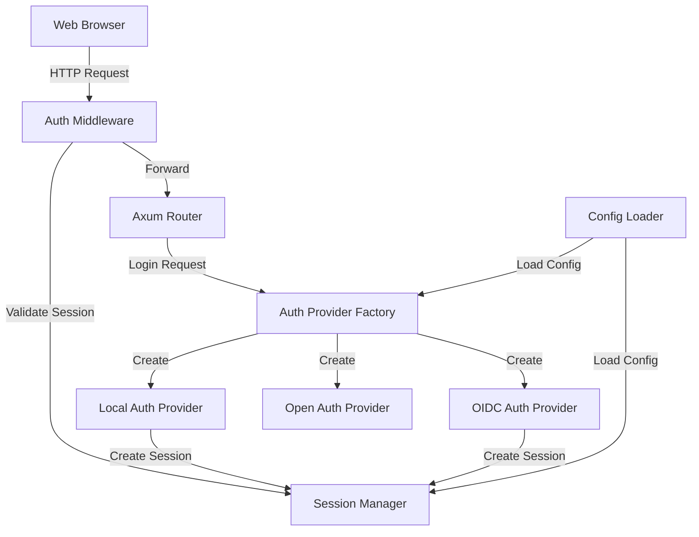
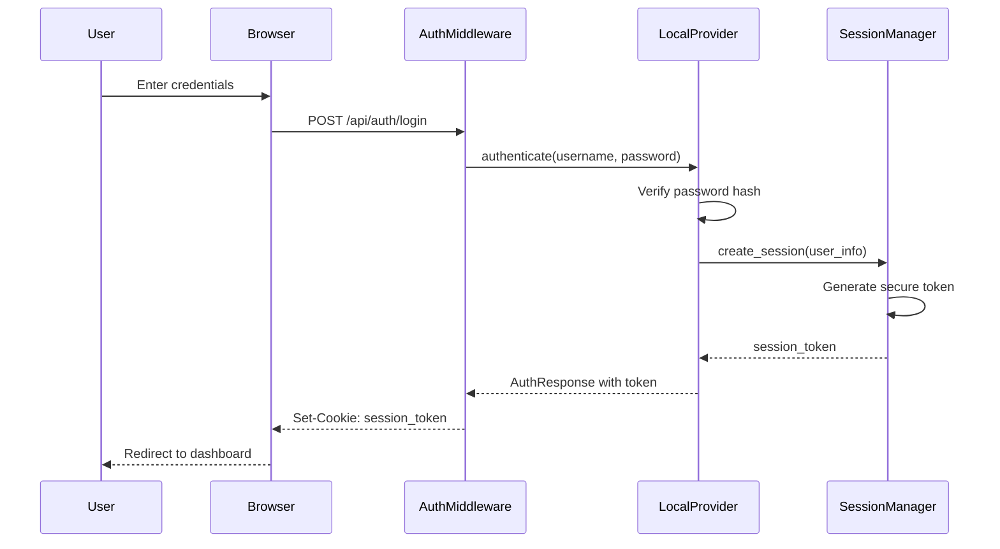
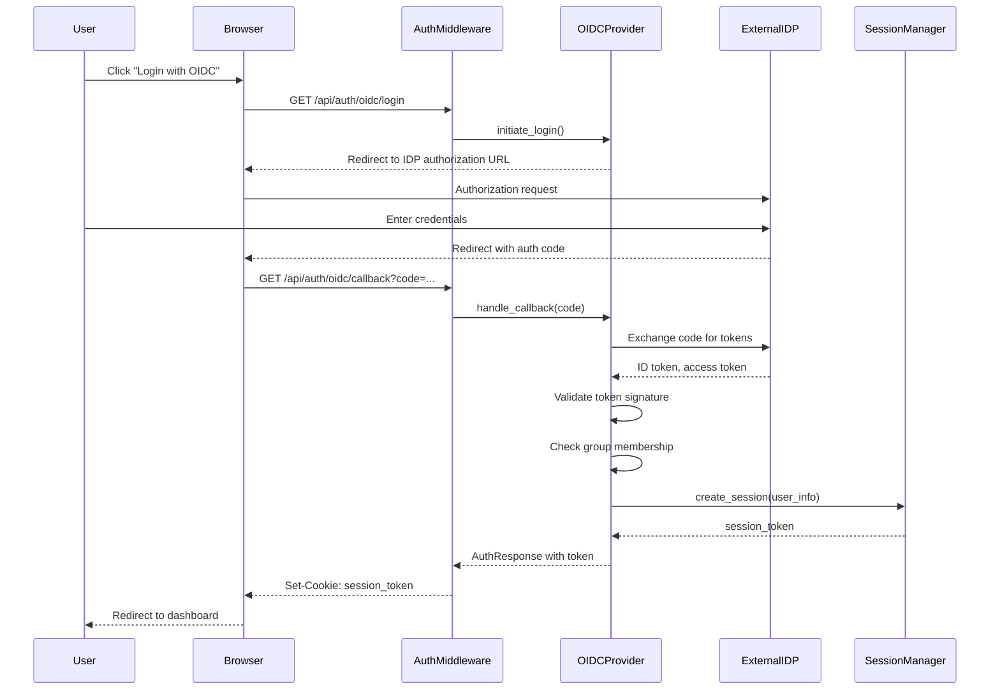

# Design Document: Application Authentication

## Overview

The Cerebro authentication system provides flexible authentication mechanisms supporting local users, OpenID Connect (OIDC), and an open development mode. The design follows a provider-based architecture where different authentication strategies implement a common interface, allowing runtime selection based on configuration.

The system consists of four main components:
1. **Configuration Management**: Loads and validates authentication settings from files and environment variables
2. **Authentication Providers**: Implements different authentication strategies (local, OIDC, open)
3. **Session Management**: Handles session creation, validation, renewal, and expiration
4. **Middleware Integration**: Integrates authentication into the Axum web framework

## Architecture

### High-Level Architecture



### Component Interaction Flow

**Local Authentication Flow:**


**OIDC Authentication Flow:**


## Components and Interfaces

### 1. Configuration Management

**Configuration Structure:**

```rust
#[derive(Debug, Clone, Deserialize)]
pub struct AuthConfig {
    pub mode: AuthMode,
    pub local: Option<LocalAuthConfig>,
    pub oidc: Option<OidcConfig>,
    pub session: SessionConfig,
    pub security: SecurityConfig,
}

#[derive(Debug, Clone, Deserialize, PartialEq)]
#[serde(rename_all = "lowercase")]
pub enum AuthMode {
    Local,
    Oidc,
    Open,
}

#[derive(Debug, Clone, Deserialize)]
pub struct LocalAuthConfig {
    pub users: Vec<LocalUser>,
}

#[derive(Debug, Clone, Deserialize)]
pub struct LocalUser {
    pub username: String,
    pub password_hash: String,
    pub hash_algorithm: HashAlgorithm,
    pub roles: Vec<String>,
}

#[derive(Debug, Clone, Deserialize, PartialEq)]
#[serde(rename_all = "lowercase")]
pub enum HashAlgorithm {
    Bcrypt,
    Argon2,
}

#[derive(Debug, Clone, Deserialize)]
pub struct OidcConfig {
    pub client_id: String,
    pub client_secret: String,
    pub redirect_uri: String,
    pub discovery_url: Option<String>,
    pub authorization_endpoint: Option<String>,
    pub token_endpoint: Option<String>,
    pub userinfo_endpoint: Option<String>,
    pub jwks_uri: Option<String>,
    pub group_claim_key: Option<String>,
    pub required_groups: Vec<String>,
}

#[derive(Debug, Clone, Deserialize)]
pub struct SessionConfig {
    pub timeout_seconds: u64,
    pub renewal_mode: RenewalMode,
    pub cookie_name: String,
    pub secure_only: bool,
}

#[derive(Debug, Clone, Deserialize, PartialEq)]
#[serde(rename_all = "snake_case")]
pub enum RenewalMode {
    SlidingWindow,
    FixedExpiration,
}

#[derive(Debug, Clone, Deserialize)]
pub struct SecurityConfig {
    pub rate_limit_attempts: u32,
    pub rate_limit_window_seconds: u64,
    pub min_password_length: usize,
    pub require_https: bool,
}
```

**Configuration Loader:**

```rust
pub struct ConfigLoader {
    file_path: PathBuf,
}

impl ConfigLoader {
    pub fn new(file_path: PathBuf) -> Self {
        Self { file_path }
    }
    
    pub fn load(&self) -> Result<AuthConfig> {
        // Load from file using config-rs
        let mut builder = Config::builder()
            .add_source(File::from(self.file_path.clone()));
        
        // Override with environment variables
        builder = builder.add_source(
            Environment::with_prefix("CEREBRO_AUTH")
                .separator("__")
        );
        
        let config = builder.build()?;
        let auth_config: AuthConfig = config.try_deserialize()?;
        
        self.validate(&auth_config)?;
        
        Ok(auth_config)
    }
    
    fn validate(&self, config: &AuthConfig) -> Result<()> {
        match config.mode {
            AuthMode::Local => {
                let local = config.local.as_ref()
                    .ok_or_else(|| anyhow!("Local auth mode requires local configuration"))?;
                
                if local.users.is_empty() {
                    return Err(anyhow!("Local auth mode requires at least one user"));
                }
                
                for user in &local.users {
                    self.validate_local_user(user)?;
                }
            }
            AuthMode::Oidc => {
                let oidc = config.oidc.as_ref()
                    .ok_or_else(|| anyhow!("OIDC auth mode requires OIDC configuration"))?;
                
                self.validate_oidc_config(oidc)?;
            }
            AuthMode::Open => {
                // No validation needed for open mode
            }
        }
        
        Ok(())
    }
    
    fn validate_local_user(&self, user: &LocalUser) -> Result<()> {
        if user.username.is_empty() {
            return Err(anyhow!("Username cannot be empty"));
        }
        
        if user.password_hash.is_empty() {
            return Err(anyhow!("Password hash cannot be empty"));
        }
        
        // Validate hash format based on algorithm
        match user.hash_algorithm {
            HashAlgorithm::Bcrypt => {
                if !user.password_hash.starts_with("$2") {
                    return Err(anyhow!("Invalid bcrypt hash format"));
                }
            }
            HashAlgorithm::Argon2 => {
                if !user.password_hash.starts_with("$argon2") {
                    return Err(anyhow!("Invalid argon2 hash format"));
                }
            }
        }
        
        Ok(())
    }
    
    fn validate_oidc_config(&self, oidc: &OidcConfig) -> Result<()> {
        if oidc.client_id.is_empty() {
            return Err(anyhow!("OIDC client_id is required"));
        }
        
        if oidc.client_secret.is_empty() {
            return Err(anyhow!("OIDC client_secret is required"));
        }
        
        if oidc.redirect_uri.is_empty() {
            return Err(anyhow!("OIDC redirect_uri is required"));
        }
        
        // Either discovery_url OR all manual endpoints must be provided
        if oidc.discovery_url.is_none() {
            if oidc.authorization_endpoint.is_none()
                || oidc.token_endpoint.is_none()
                || oidc.userinfo_endpoint.is_none()
                || oidc.jwks_uri.is_none()
            {
                return Err(anyhow!(
                    "OIDC requires either discovery_url or all manual endpoints"
                ));
            }
        }
        
        Ok(())
    }
}
```

### 2. Authentication Provider Interface

**Core Trait:**

```rust
#[async_trait]
pub trait AuthProvider: Send + Sync {
    async fn authenticate(&self, request: AuthRequest) -> Result<AuthResponse>;
    fn provider_type(&self) -> &str;
}

#[derive(Debug, Clone)]
pub enum AuthRequest {
    LocalCredentials {
        username: String,
        password: String,
    },
    OidcCallback {
        code: String,
        state: String,
    },
    Open,
}

#[derive(Debug, Clone)]
pub struct AuthResponse {
    pub user_info: UserInfo,
    pub session_token: String,
}

#[derive(Debug, Clone, Serialize, Deserialize)]
pub struct UserInfo {
    pub id: String,
    pub username: String,
    pub email: Option<String>,
    pub roles: Vec<String>,
    pub groups: Vec<String>,
}
```

**Provider Factory:**

```rust
pub struct AuthProviderFactory {
    config: AuthConfig,
    session_manager: Arc<SessionManager>,
}

impl AuthProviderFactory {
    pub fn new(config: AuthConfig, session_manager: Arc<SessionManager>) -> Self {
        Self {
            config,
            session_manager,
        }
    }
    
    pub fn create(&self) -> Result<Box<dyn AuthProvider>> {
        match self.config.mode {
            AuthMode::Local => {
                let local_config = self.config.local.as_ref()
                    .ok_or_else(|| anyhow!("Local config missing"))?;
                Ok(Box::new(LocalAuthProvider::new(
                    local_config.clone(),
                    self.session_manager.clone(),
                )))
            }
            AuthMode::Oidc => {
                let oidc_config = self.config.oidc.as_ref()
                    .ok_or_else(|| anyhow!("OIDC config missing"))?;
                Ok(Box::new(OidcAuthProvider::new(
                    oidc_config.clone(),
                    self.session_manager.clone(),
                )?))
            }
            AuthMode::Open => {
                Ok(Box::new(OpenAuthProvider::new(
                    self.session_manager.clone(),
                )))
            }
        }
    }
}
```

### 3. Local Authentication Provider

```rust
pub struct LocalAuthProvider {
    config: LocalAuthConfig,
    session_manager: Arc<SessionManager>,
    users: HashMap<String, LocalUser>,
}

impl LocalAuthProvider {
    pub fn new(config: LocalAuthConfig, session_manager: Arc<SessionManager>) -> Self {
        let users = config
            .users
            .iter()
            .map(|u| (u.username.clone(), u.clone()))
            .collect();
        
        Self {
            config,
            session_manager,
            users,
        }
    }
    
    fn verify_password(&self, user: &LocalUser, password: &str) -> Result<bool> {
        match user.hash_algorithm {
            HashAlgorithm::Bcrypt => {
                let hash = bcrypt::hash_from_str(&user.password_hash)?;
                Ok(bcrypt::verify(password, &hash)?)
            }
            HashAlgorithm::Argon2 => {
                let argon2 = Argon2::default();
                let hash = PasswordHash::new(&user.password_hash)?;
                Ok(argon2.verify_password(password.as_bytes(), &hash).is_ok())
            }
        }
    }
}

#[async_trait]
impl AuthProvider for LocalAuthProvider {
    async fn authenticate(&self, request: AuthRequest) -> Result<AuthResponse> {
        let (username, password) = match request {
            AuthRequest::LocalCredentials { username, password } => (username, password),
            _ => return Err(anyhow!("Invalid request type for local auth")),
        };
        
        let user = self.users.get(&username)
            .ok_or_else(|| anyhow!("Invalid credentials"))?;
        
        if !self.verify_password(user, &password)? {
            return Err(anyhow!("Invalid credentials"));
        }
        
        let user_info = UserInfo {
            id: username.clone(),
            username: username.clone(),
            email: None,
            roles: user.roles.clone(),
            groups: vec![],
        };
        
        let session_token = self.session_manager.create_session(user_info.clone()).await?;
        
        Ok(AuthResponse {
            user_info,
            session_token,
        })
    }
    
    fn provider_type(&self) -> &str {
        "local"
    }
}
```

### 4. OIDC Authentication Provider

```rust
pub struct OidcAuthProvider {
    config: OidcConfig,
    session_manager: Arc<SessionManager>,
    client: CoreClient,
    jwks: CoreJsonWebKeySet,
}

impl OidcAuthProvider {
    pub fn new(config: OidcConfig, session_manager: Arc<SessionManager>) -> Result<Self> {
        let (issuer_url, client) = if let Some(discovery_url) = &config.discovery_url {
            // Auto-discovery
            let provider_metadata = CoreProviderMetadata::discover(
                &IssuerUrl::new(discovery_url.clone())?,
                http_client,
            )?;
            
            let client = CoreClient::from_provider_metadata(
                provider_metadata,
                ClientId::new(config.client_id.clone()),
                Some(ClientSecret::new(config.client_secret.clone())),
            )
            .set_redirect_uri(RedirectUrl::new(config.redirect_uri.clone())?);
            
            (discovery_url.clone(), client)
        } else {
            // Manual configuration
            let client = CoreClient::new(
                ClientId::new(config.client_id.clone()),
                Some(ClientSecret::new(config.client_secret.clone())),
                AuthUrl::new(config.authorization_endpoint.clone().unwrap())?,
                Some(TokenUrl::new(config.token_endpoint.clone().unwrap())?),
            )
            .set_redirect_uri(RedirectUrl::new(config.redirect_uri.clone())?)
            .set_userinfo_uri(UserInfoUrl::new(config.userinfo_endpoint.clone().unwrap())?)
            .set_jwks_uri(JsonWebKeySetUrl::new(config.jwks_uri.clone().unwrap())?);
            
            (config.authorization_endpoint.clone().unwrap(), client)
        };
        
        // Fetch JWKS for token validation
        let jwks = fetch_jwks(&client)?;
        
        Ok(Self {
            config,
            session_manager,
            client,
            jwks,
        })
    }
    
    pub fn authorization_url(&self) -> (Url, CsrfToken) {
        self.client
            .authorize_url(CsrfToken::new_random)
            .add_scope(Scope::new("openid".to_string()))
            .add_scope(Scope::new("profile".to_string()))
            .add_scope(Scope::new("email".to_string()))
            .url()
    }
    
    fn validate_groups(&self, claims: &serde_json::Value) -> Result<Vec<String>> {
        if self.config.required_groups.is_empty() {
            // No group restrictions
            return Ok(vec![]);
        }
        
        let group_claim_key = self.config.group_claim_key.as_deref().unwrap_or("groups");
        
        let groups = claims
            .get(group_claim_key)
            .and_then(|v| v.as_array())
            .ok_or_else(|| anyhow!("Group claim '{}' not found in token", group_claim_key))?;
        
        let user_groups: Vec<String> = groups
            .iter()
            .filter_map(|g| g.as_str().map(String::from))
            .collect();
        
        // Check if user is in at least one required group
        let has_required_group = user_groups
            .iter()
            .any(|g| self.config.required_groups.contains(g));
        
        if !has_required_group {
            return Err(anyhow!(
                "User is not a member of any required groups. Required: {:?}, User has: {:?}",
                self.config.required_groups,
                user_groups
            ));
        }
        
        Ok(user_groups)
    }
}

#[async_trait]
impl AuthProvider for OidcAuthProvider {
    async fn authenticate(&self, request: AuthRequest) -> Result<AuthResponse> {
        let (code, _state) = match request {
            AuthRequest::OidcCallback { code, state } => (code, state),
            _ => return Err(anyhow!("Invalid request type for OIDC auth")),
        };
        
        // Exchange authorization code for tokens
        let token_response = self.client
            .exchange_code(AuthorizationCode::new(code))
            .request_async(async_http_client)
            .await?;
        
        let id_token = token_response
            .id_token()
            .ok_or_else(|| anyhow!("No ID token in response"))?;
        
        // Validate ID token signature
        let claims = id_token.claims(&self.jwks, &self.client.client_id())?;
        
        // Extract user information
        let user_id = claims.subject().to_string();
        let username = claims
            .preferred_username()
            .map(|u| u.to_string())
            .unwrap_or_else(|| user_id.clone());
        let email = claims.email().map(|e| e.to_string());
        
        // Validate group membership
        let groups = self.validate_groups(claims.additional_claims())?;
        
        let user_info = UserInfo {
            id: user_id,
            username,
            email,
            roles: vec![], // Roles could be mapped from groups if needed
            groups,
        };
        
        let session_token = self.session_manager.create_session(user_info.clone()).await?;
        
        Ok(AuthResponse {
            user_info,
            session_token,
        })
    }
    
    fn provider_type(&self) -> &str {
        "oidc"
    }
}
```

### 5. Open Authentication Provider

```rust
pub struct OpenAuthProvider {
    session_manager: Arc<SessionManager>,
}

impl OpenAuthProvider {
    pub fn new(session_manager: Arc<SessionManager>) -> Self {
        Self { session_manager }
    }
}

#[async_trait]
impl AuthProvider for OpenAuthProvider {
    async fn authenticate(&self, _request: AuthRequest) -> Result<AuthResponse> {
        // Open mode: create a default user session
        let user_info = UserInfo {
            id: "dev-user".to_string(),
            username: "dev-user".to_string(),
            email: Some("dev@localhost".to_string()),
            roles: vec!["admin".to_string()],
            groups: vec![],
        };
        
        let session_token = self.session_manager.create_session(user_info.clone()).await?;
        
        Ok(AuthResponse {
            user_info,
            session_token,
        })
    }
    
    fn provider_type(&self) -> &str {
        "open"
    }
}
```

### 6. Session Manager

```rust
pub struct SessionManager {
    config: SessionConfig,
    sessions: Arc<RwLock<HashMap<String, Session>>>,
    rate_limiter: Arc<RateLimiter>,
}

#[derive(Debug, Clone)]
struct Session {
    token: String,
    user_info: UserInfo,
    created_at: Instant,
    last_activity: Instant,
    expires_at: Instant,
}

impl SessionManager {
    pub fn new(config: SessionConfig, security_config: SecurityConfig) -> Self {
        let rate_limiter = Arc::new(RateLimiter::new(
            security_config.rate_limit_attempts,
            Duration::from_secs(security_config.rate_limit_window_seconds),
        ));
        
        let manager = Self {
            config,
            sessions: Arc::new(RwLock::new(HashMap::new())),
            rate_limiter,
        };
        
        // Start cleanup task
        manager.start_cleanup_task();
        
        manager
    }
    
    pub async fn create_session(&self, user_info: UserInfo) -> Result<String> {
        let token = self.generate_token();
        let now = Instant::now();
        let timeout = Duration::from_secs(self.config.timeout_seconds);
        
        let session = Session {
            token: token.clone(),
            user_info,
            created_at: now,
            last_activity: now,
            expires_at: now + timeout,
        };
        
        let mut sessions = self.sessions.write().await;
        sessions.insert(token.clone(), session);
        
        Ok(token)
    }
    
    pub async fn validate_session(&self, token: &str) -> Result<UserInfo> {
        let mut sessions = self.sessions.write().await;
        
        let session = sessions
            .get_mut(token)
            .ok_or_else(|| anyhow!("Invalid session token"))?;
        
        let now = Instant::now();
        
        // Check if session is expired
        if now > session.expires_at {
            sessions.remove(token);
            return Err(anyhow!("Session expired"));
        }
        
        // Update session activity and expiration based on renewal mode
        match self.config.renewal_mode {
            RenewalMode::SlidingWindow => {
                session.last_activity = now;
                session.expires_at = now + Duration::from_secs(self.config.timeout_seconds);
            }
            RenewalMode::FixedExpiration => {
                session.last_activity = now;
                // expires_at remains unchanged
            }
        }
        
        Ok(session.user_info.clone())
    }
    
    pub async fn delete_session(&self, token: &str) -> Result<()> {
        let mut sessions = self.sessions.write().await;
        sessions.remove(token);
        Ok(())
    }
    
    pub fn check_rate_limit(&self, identifier: &str) -> Result<()> {
        self.rate_limiter.check(identifier)
    }
    
    fn generate_token(&self) -> String {
        use rand::Rng;
        let mut rng = rand::thread_rng();
        let token_bytes: [u8; 32] = rng.gen(); // 256 bits of entropy
        base64::encode_config(token_bytes, base64::URL_SAFE_NO_PAD)
    }
    
    fn start_cleanup_task(&self) {
        let sessions = self.sessions.clone();
        let cleanup_interval = Duration::from_secs(60); // Clean up every minute
        
        tokio::spawn(async move {
            let mut interval = tokio::time::interval(cleanup_interval);
            loop {
                interval.tick().await;
                
                let mut sessions = sessions.write().await;
                let now = Instant::now();
                
                sessions.retain(|_, session| now <= session.expires_at);
            }
        });
    }
}

struct RateLimiter {
    max_attempts: u32,
    window: Duration,
    attempts: Arc<RwLock<HashMap<String, Vec<Instant>>>>,
}

impl RateLimiter {
    fn new(max_attempts: u32, window: Duration) -> Self {
        Self {
            max_attempts,
            window,
            attempts: Arc::new(RwLock::new(HashMap::new())),
        }
    }
    
    fn check(&self, identifier: &str) -> Result<()> {
        let mut attempts = self.attempts.blocking_write();
        let now = Instant::now();
        
        let entry = attempts.entry(identifier.to_string()).or_insert_with(Vec::new);
        
        // Remove old attempts outside the window
        entry.retain(|&t| now.duration_since(t) < self.window);
        
        if entry.len() >= self.max_attempts as usize {
            return Err(anyhow!("Rate limit exceeded. Try again later."));
        }
        
        entry.push(now);
        Ok(())
    }
}
```

### 7. Authentication Middleware

```rust
pub struct AuthMiddleware {
    session_manager: Arc<SessionManager>,
    config: AuthConfig,
}

impl AuthMiddleware {
    pub fn new(session_manager: Arc<SessionManager>, config: AuthConfig) -> Self {
        Self {
            session_manager,
            config,
        }
    }
    
    pub async fn authenticate<B>(
        &self,
        mut req: Request<B>,
        next: Next<B>,
    ) -> Result<Response, StatusCode> {
        // Skip authentication for open mode
        if self.config.mode == AuthMode::Open {
            return Ok(next.run(req).await);
        }
        
        // Skip authentication for login endpoints
        if self.is_public_endpoint(req.uri().path()) {
            return Ok(next.run(req).await);
        }
        
        // Extract session token from cookie
        let token = self.extract_session_token(&req)
            .ok_or(StatusCode::UNAUTHORIZED)?;
        
        // Validate session
        let user_info = self.session_manager
            .validate_session(&token)
            .await
            .map_err(|_| StatusCode::UNAUTHORIZED)?;
        
        // Add user info to request extensions
        req.extensions_mut().insert(user_info);
        
        Ok(next.run(req).await)
    }
    
    fn is_public_endpoint(&self, path: &str) -> bool {
        matches!(
            path,
            "/api/auth/login" | "/api/auth/oidc/login" | "/api/auth/oidc/callback"
        )
    }
    
    fn extract_session_token<B>(&self, req: &Request<B>) -> Option<String> {
        let cookies = req.headers().get(header::COOKIE)?;
        let cookies_str = cookies.to_str().ok()?;
        
        for cookie in cookies_str.split(';') {
            let parts: Vec<&str> = cookie.trim().splitn(2, '=').collect();
            if parts.len() == 2 && parts[0] == self.config.session.cookie_name {
                return Some(parts[1].to_string());
            }
        }
        
        None
    }
}
```

## Data Models

### User Information

```rust
#[derive(Debug, Clone, Serialize, Deserialize)]
pub struct UserInfo {
    pub id: String,
    pub username: String,
    pub email: Option<String>,
    pub roles: Vec<String>,
    pub groups: Vec<String>,
}
```

### Session Data

```rust
#[derive(Debug, Clone)]
struct Session {
    token: String,
    user_info: UserInfo,
    created_at: Instant,
    last_activity: Instant,
    expires_at: Instant,
}
```

### Authentication Requests/Responses

```rust
#[derive(Debug, Deserialize)]
pub struct LoginRequest {
    pub username: String,
    pub password: String,
}

#[derive(Debug, Serialize)]
pub struct LoginResponse {
    pub success: bool,
    pub user: Option<UserInfo>,
    pub error: Option<String>,
}

#[derive(Debug, Serialize)]
pub struct OidcLoginResponse {
    pub authorization_url: String,
}
```

## Correctness Properties

*A property is a characteristic or behavior that should hold true across all valid executions of a system—essentially, a formal statement about what the system should do. Properties serve as the bridge between human-readable specifications and machine-verifiable correctness guarantees.*


### Property 1: Configuration Mode Parsing

*For any* valid configuration with authentication mode set to "local", "oidc", or "open", the Config_Loader SHALL correctly parse and apply the mode.

**Validates: Requirements 1.1**

### Property 2: Open Mode Bypass

*For any* HTTP request when authentication mode is "open", the Auth_System SHALL allow the request without authentication checks.

**Validates: Requirements 1.2**

### Property 3: Authentication Provider Selection

*For any* authentication mode ("local", "oidc", "open"), the Auth_System SHALL use the corresponding authentication provider for all authentication attempts.

**Validates: Requirements 1.3, 1.4**

### Property 4: Invalid Mode Rejection

*For any* invalid authentication mode string, the Config_Loader SHALL return an error and prevent startup.

**Validates: Requirements 1.6**

### Property 5: Configuration Parsing Completeness

*For any* valid authentication configuration (including local users, OIDC settings, session config, security settings), the Config_Loader SHALL correctly parse all fields from both file and environment variables.

**Validates: Requirements 2.1, 2.8, 3.1, 3.3, 3.4, 4.1, 6.1, 6.2**

### Property 6: Required Field Validation

*For any* local user configuration missing username, password hash, or roles, the Config_Loader SHALL reject the configuration with an error.

**Validates: Requirements 2.2**

### Property 7: Password Hash Round Trip

*For any* password and any supported hash algorithm (bcrypt or argon2), hashing the password then verifying it against the hash SHALL return true.

**Validates: Requirements 2.3, 2.4**

### Property 8: Local Authentication Correctness

*For any* local user with valid credentials, authentication SHALL succeed and return a session token; for any invalid credentials, authentication SHALL fail with an error.

**Validates: Requirements 2.5, 2.6, 2.7**

### Property 9: Environment Variable Precedence

*For any* configuration setting defined in both file and environment variables, the Config_Loader SHALL use the environment variable value.

**Validates: Requirements 3.2**

### Property 10: Environment Variable Validation

*For any* invalid environment variable value, the Config_Loader SHALL reject the configuration with an error.

**Validates: Requirements 3.5**

### Property 11: OIDC Manual Configuration Requirement

*For any* OIDC configuration without discovery_url, the Config_Loader SHALL require all manual endpoints (authorization_endpoint, token_endpoint, userinfo_endpoint, jwks_uri) and reject incomplete configurations.

**Validates: Requirements 4.3, 4.4**

### Property 12: ID Token Signature Validation

*For any* ID token with a valid signature from the OIDC provider's JWKS, token validation SHALL succeed; for any token with an invalid or expired signature, validation SHALL fail.

**Validates: Requirements 5.3, 5.5**

### Property 13: Token Claim Extraction

*For any* valid ID token, the Auth_System SHALL correctly extract user information (id, username, email) from the token claims.

**Validates: Requirements 5.4**

### Property 14: OIDC Session Creation

*For any* successful OIDC authentication, the Auth_System SHALL create a session and return a session token.

**Validates: Requirements 5.6**

### Property 15: Group-Based Access Control

*For any* OIDC token and group configuration:
- If no groups are required, all authenticated users SHALL be allowed
- If groups are required and the token lacks the group claim, authentication SHALL fail
- If groups are required and the user is not in any required group, authentication SHALL fail
- If groups are required and the user is in at least one required group, authentication SHALL succeed

**Validates: Requirements 6.3, 6.4, 6.5, 6.6, 6.7**

### Property 16: Session Token Uniqueness and Entropy

*For any* successful authentication, the Session_Manager SHALL generate a unique session token with at least 128 bits of entropy (256 bits recommended).

**Validates: Requirements 7.1, 11.2, 11.7**

### Property 17: Session Cookie Security Attributes

*For any* session creation response, the Set-Cookie header SHALL include HttpOnly flag, SameSite attribute, and Secure flag when served over HTTPS.

**Validates: Requirements 7.2, 7.3, 7.4**

### Property 18: Session Retrieval and Validation

*For any* valid session token, the Session_Manager SHALL retrieve the associated session; for any invalid or expired token, the Session_Manager SHALL reject the request with an authentication error.

**Validates: Requirements 7.5, 7.6, 8.3, 9.5**

### Property 19: Session Timeout Configuration

*For any* configured session timeout duration, the Session_Manager SHALL apply the timeout to all sessions.

**Validates: Requirements 7.7**

### Property 20: Session Activity Tracking

*For any* session access, the Session_Manager SHALL update the session's last activity timestamp.

**Validates: Requirements 7.8**

### Property 21: Session Renewal Behavior

*For any* session accessed within the timeout period:
- In sliding window mode, the session expiration SHALL be extended
- In fixed expiration mode, the session expiration SHALL remain unchanged

**Validates: Requirements 8.1, 8.4**

### Property 22: Session Expiration

*For any* session that exceeds the timeout period without activity, the Session_Manager SHALL mark the session as expired and reject subsequent requests using that token.

**Validates: Requirements 8.2**

### Property 23: Session Cleanup

*For any* expired session, the Session_Manager SHALL eventually remove it from storage during periodic cleanup.

**Validates: Requirements 8.5**

### Property 24: Logout Session Deletion

*For any* logout request, the Session_Manager SHALL delete the user's session and clear the session cookie.

**Validates: Requirements 9.1, 9.2**

### Property 25: Logout Redirect

*For any* logout completion, the Auth_System SHALL redirect the user to the login page.

**Validates: Requirements 9.4**

### Property 26: Configuration Validation Completeness

*For any* authentication configuration, the Config_Loader SHALL validate all required fields and constraints at startup.

**Validates: Requirements 10.1**

### Property 27: Invalid Configuration Rejection

*For any* invalid configuration (invalid password hashes, incomplete OIDC config, missing required values), the Config_Loader SHALL return a descriptive error message.

**Validates: Requirements 10.2, 10.3, 10.4, 12.3**

### Property 28: Sensitive Data Protection

*For any* log output, the Auth_System SHALL never include passwords or session tokens in plain text.

**Validates: Requirements 11.1**

### Property 29: Password Complexity Enforcement

*For any* local user password below the configured minimum complexity, the Config_Loader SHALL reject the configuration.

**Validates: Requirements 11.3**

### Property 30: Rate Limiting

*For any* IP address or username, after exceeding the configured maximum authentication attempts within the time window, the Auth_System SHALL reject subsequent attempts with a rate limit error.

**Validates: Requirements 11.4**

### Property 31: Generic Authentication Error Messages

*For any* authentication failure, the Auth_System SHALL return a generic error message that does not reveal whether the username exists.

**Validates: Requirements 11.5**

### Property 32: HTTPS-Only Mode

*For any* HTTP request when HTTPS-only mode is enabled, the Auth_System SHALL reject or redirect the request according to configuration.

**Validates: Requirements 11.6**

### Property 33: Log Level Configuration

*For any* configured log level, the Auth_System SHALL respect the level and only output logs at or above that level.

**Validates: Requirements 12.6**

## Error Handling

### Configuration Errors

**Invalid Configuration Detection:**
- Configuration validation occurs at startup before any authentication operations
- All validation errors include descriptive messages indicating the specific problem
- Invalid configurations prevent the application from starting

**Error Categories:**
1. **Missing Required Fields**: "OIDC mode requires client_id, client_secret, and redirect_uri"
2. **Invalid Format**: "Invalid bcrypt hash format for user 'admin'"
3. **Logical Inconsistencies**: "OIDC requires either discovery_url or all manual endpoints"
4. **Environment Variable Errors**: "Invalid value for CEREBRO_AUTH__MODE: 'invalid_mode'"

### Authentication Errors

**Error Response Format:**
```rust
#[derive(Debug, Serialize)]
pub struct AuthError {
    pub error: String,
    pub error_description: Option<String>,
}
```

**Error Types:**
1. **Invalid Credentials**: Generic message "Invalid username or password" (prevents enumeration)
2. **Rate Limit Exceeded**: "Too many authentication attempts. Please try again later."
3. **Session Expired**: "Your session has expired. Please log in again."
4. **Insufficient Permissions**: "You do not have permission to access this resource."
5. **Group Membership Required**: "Access denied. Required group membership not found."

### OIDC-Specific Errors

**OIDC Error Handling:**
1. **Provider Communication Failures**: Log detailed error, return generic message to user
2. **Token Validation Failures**: Log reason (expired, invalid signature), return generic message
3. **Missing Claims**: Log missing claim name, return descriptive error
4. **Group Validation Failures**: Log user's groups and required groups, return access denied message

**Error Recovery:**
- Retry logic for transient OIDC provider failures (with exponential backoff)
- Fallback to cached JWKS if provider is temporarily unavailable
- Clear error messages guide users to contact administrators for access issues

### Session Errors

**Session Error Handling:**
1. **Expired Sessions**: Automatically cleaned up, user redirected to login
2. **Invalid Tokens**: Rejected immediately, no session lookup performed
3. **Concurrent Session Modifications**: Use RwLock to prevent race conditions

### Logging Strategy

**Security Event Logging:**
- All authentication attempts (success and failure) logged with timestamp, username, IP address
- Session creation and expiration events logged
- Configuration validation errors logged at startup
- OIDC provider communication errors logged with provider details

**Log Levels:**
- **ERROR**: Configuration validation failures, OIDC provider communication failures
- **WARN**: Rate limit exceeded, invalid session tokens, group membership failures
- **INFO**: Successful authentication, session creation, logout events
- **DEBUG**: Detailed authentication flow, token validation steps, session renewal

**Sensitive Data Protection:**
- Passwords never logged (even hashed)
- Session tokens never logged in full (only first 8 characters for correlation)
- OIDC tokens logged only in debug mode and with truncation

## Testing Strategy

### Dual Testing Approach

The authentication system requires both unit tests and property-based tests for comprehensive coverage:

**Unit Tests** focus on:
- Specific configuration examples (valid and invalid)
- Edge cases (empty passwords, missing fields, malformed tokens)
- Integration points (middleware, cookie handling, HTTP responses)
- Error message content and format
- Logging output verification

**Property-Based Tests** focus on:
- Universal properties across all inputs (password hashing, token generation, session validation)
- Configuration parsing for all valid input combinations
- Authentication flows with randomized credentials
- Session lifecycle with random timeouts and access patterns
- Rate limiting with random attempt patterns

### Property-Based Testing Configuration

**Testing Library**: Use `proptest` for Rust property-based testing

**Test Configuration**:
- Minimum 100 iterations per property test
- Each test tagged with feature name and property number
- Tag format: `// Feature: app-authentication, Property N: [property description]`

**Example Property Test Structure**:
```rust
#[cfg(test)]
mod property_tests {
    use proptest::prelude::*;
    
    proptest! {
        #![proptest_config(ProptestConfig::with_cases(100))]
        
        // Feature: app-authentication, Property 7: Password Hash Round Trip
        #[test]
        fn test_password_hash_round_trip(
            password in "[a-zA-Z0-9]{8,32}",
            algorithm in prop_oneof![
                Just(HashAlgorithm::Bcrypt),
                Just(HashAlgorithm::Argon2)
            ]
        ) {
            let hash = hash_password(&password, algorithm).unwrap();
            let verified = verify_password(&password, &hash, algorithm).unwrap();
            assert!(verified);
        }
        
        // Feature: app-authentication, Property 9: Environment Variable Precedence
        #[test]
        fn test_env_var_precedence(
            file_value in any::<String>(),
            env_value in any::<String>()
        ) {
            let config = load_config_with_overrides(file_value, env_value).unwrap();
            assert_eq!(config.value, env_value);
        }
    }
}
```

### Unit Test Examples

**Configuration Validation Tests**:
```rust
#[test]
fn test_local_mode_requires_users() {
    let config = AuthConfig {
        mode: AuthMode::Local,
        local: Some(LocalAuthConfig { users: vec![] }),
        oidc: None,
        session: default_session_config(),
        security: default_security_config(),
    };
    
    let result = ConfigLoader::validate(&config);
    assert!(result.is_err());
    assert!(result.unwrap_err().to_string().contains("at least one user"));
}

#[test]
fn test_oidc_mode_requires_config() {
    let config = AuthConfig {
        mode: AuthMode::Oidc,
        local: None,
        oidc: None,
        session: default_session_config(),
        security: default_security_config(),
    };
    
    let result = ConfigLoader::validate(&config);
    assert!(result.is_err());
    assert!(result.unwrap_err().to_string().contains("OIDC configuration"));
}
```

**Session Management Tests**:
```rust
#[tokio::test]
async fn test_session_expiration() {
    let config = SessionConfig {
        timeout_seconds: 1,
        renewal_mode: RenewalMode::FixedExpiration,
        cookie_name: "session".to_string(),
        secure_only: false,
    };
    
    let manager = SessionManager::new(config, default_security_config());
    let user_info = create_test_user();
    let token = manager.create_session(user_info).await.unwrap();
    
    // Wait for expiration
    tokio::time::sleep(Duration::from_secs(2)).await;
    
    let result = manager.validate_session(&token).await;
    assert!(result.is_err());
    assert!(result.unwrap_err().to_string().contains("expired"));
}

#[tokio::test]
async fn test_session_renewal_sliding_window() {
    let config = SessionConfig {
        timeout_seconds: 2,
        renewal_mode: RenewalMode::SlidingWindow,
        cookie_name: "session".to_string(),
        secure_only: false,
    };
    
    let manager = SessionManager::new(config, default_security_config());
    let user_info = create_test_user();
    let token = manager.create_session(user_info).await.unwrap();
    
    // Access session before expiration
    tokio::time::sleep(Duration::from_secs(1)).await;
    manager.validate_session(&token).await.unwrap();
    
    // Wait another second (total 2 seconds, but renewed at 1 second)
    tokio::time::sleep(Duration::from_secs(1)).await;
    
    // Should still be valid due to renewal
    let result = manager.validate_session(&token).await;
    assert!(result.is_ok());
}
```

**Authentication Flow Tests**:
```rust
#[tokio::test]
async fn test_local_auth_success() {
    let password = "test_password";
    let hash = bcrypt::hash(password, bcrypt::DEFAULT_COST).unwrap();
    
    let user = LocalUser {
        username: "testuser".to_string(),
        password_hash: hash,
        hash_algorithm: HashAlgorithm::Bcrypt,
        roles: vec!["user".to_string()],
    };
    
    let config = LocalAuthConfig { users: vec![user] };
    let session_manager = Arc::new(SessionManager::new(
        default_session_config(),
        default_security_config(),
    ));
    
    let provider = LocalAuthProvider::new(config, session_manager);
    
    let request = AuthRequest::LocalCredentials {
        username: "testuser".to_string(),
        password: password.to_string(),
    };
    
    let response = provider.authenticate(request).await.unwrap();
    assert_eq!(response.user_info.username, "testuser");
    assert!(!response.session_token.is_empty());
}

#[tokio::test]
async fn test_local_auth_invalid_password() {
    let password = "test_password";
    let hash = bcrypt::hash(password, bcrypt::DEFAULT_COST).unwrap();
    
    let user = LocalUser {
        username: "testuser".to_string(),
        password_hash: hash,
        hash_algorithm: HashAlgorithm::Bcrypt,
        roles: vec!["user".to_string()],
    };
    
    let config = LocalAuthConfig { users: vec![user] };
    let session_manager = Arc::new(SessionManager::new(
        default_session_config(),
        default_security_config(),
    ));
    
    let provider = LocalAuthProvider::new(config, session_manager);
    
    let request = AuthRequest::LocalCredentials {
        username: "testuser".to_string(),
        password: "wrong_password".to_string(),
    };
    
    let result = provider.authenticate(request).await;
    assert!(result.is_err());
    assert_eq!(result.unwrap_err().to_string(), "Invalid credentials");
}
```

### Integration Testing

**End-to-End Authentication Flows**:
1. Test complete local authentication flow (login → session creation → authenticated request → logout)
2. Test OIDC authentication flow with mock OIDC provider
3. Test session expiration and renewal across multiple requests
4. Test rate limiting across multiple authentication attempts
5. Test configuration loading from files and environment variables

**Manual Testing Checklist**:
- Local user authentication with bcrypt and argon2 hashes
- OIDC authentication with real identity provider (Keycloak, Auth0)
- Group-based access control with various group configurations
- Session timeout and renewal in both modes
- Rate limiting behavior under load
- Configuration validation with various invalid inputs
- Cookie security attributes in browser developer tools
- HTTPS-only mode enforcement
