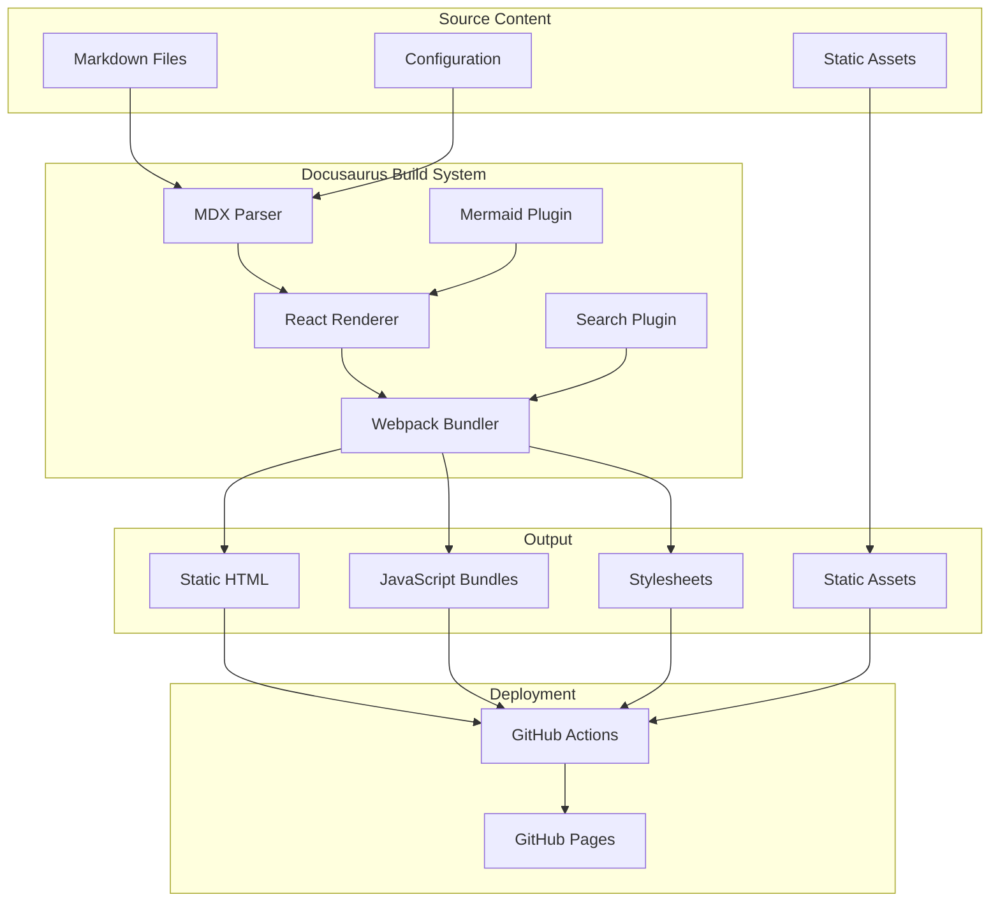
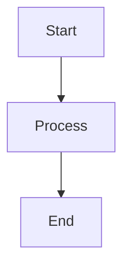

# Design Document: Starlight to Docusaurus Migration

## Overview

This design document specifies the technical approach for migrating Secan documentation from Starlight (Astro-based) to Docusaurus (React-based). The migration addresses reliability issues with Starlight builds while maintaining all existing documentation features and improving the overall documentation experience.

### Goals

1. **Improve Build Reliability**: Eliminate frequent build failures experienced with Starlight
2. **Maintain Feature Parity**: Preserve all existing documentation features (Mermaid diagrams, versioning, search)
3. **Enhance Maintainability**: Use a more mature, widely-adopted documentation framework
4. **Preserve Content**: Migrate all existing documentation without loss
5. **Improve Developer Experience**: Provide better tooling and faster build times

### Non-Goals

1. Redesigning the documentation structure or navigation
2. Rewriting documentation content
3. Changing the deployment target (GitHub Pages)
4. Modifying the Rust API documentation generation

### Success Criteria

1. All Starlight content successfully migrated to Docusaurus format
2. Build process completes reliably without errors
3. All features (Mermaid, versioning, search, theming) work correctly
4. Documentation deploys successfully to GitHub Pages at `/secan/`
5. Build time is comparable or better than Starlight
6. All internal links and asset references work correctly

## Architecture

### High-Level Architecture



### Directory Structure

The new Docusaurus structure will replace the current Starlight structure:

```
docs/
├── docs/                          # Documentation content
│   ├── getting-started/
│   │   ├── about.md
│   │   ├── installation.md
│   │   └── architecture.md
│   ├── features/
│   │   ├── dashboard.md
│   │   ├── cluster-details.md
│   │   ├── index-management.md
│   │   ├── shard-management.md
│   │   ├── rest-console.md
│   │   └── additional.md
│   ├── authentication/
│   │   └── index.md
│   ├── configuration/
│   │   ├── authentication.md
│   │   ├── clusters.md
│   │   └── logging.md
│   └── api/
│       └── index.md
├── src/
│   ├── components/              # Custom React components
│   ├── css/
│   │   └── custom.css          # Custom styling
│   └── pages/
│       └── index.tsx           # Landing page
├── static/
│   ├── img/
│   │   ├── sproutling.png      # Logo
│   │   └── favicon.ico         # Favicon
│   ├── api/                    # Rust API docs (copied during build)
│   └── .nojekyll               # GitHub Pages config
├── versioned_docs/             # Versioned documentation
│   └── version-1.1/
├── versioned_sidebars/         # Versioned sidebars
│   └── version-1.1-sidebars.json
├── versions.json               # Version configuration
├── docusaurus.config.js        # Main configuration
├── sidebars.js                 # Sidebar structure
├── package.json                # Dependencies
└── .gitignore                  # Git ignore rules
```

### Technology Stack

**Core Framework:**
- Docusaurus 3.x (latest stable)
- React 18
- Node.js 18+

**Plugins:**
- `@docusaurus/preset-classic` - Core Docusaurus functionality
- `@docusaurus/theme-mermaid` - Mermaid diagram support
- `mermaid` - Diagram rendering library

**Build Tools:**
- Webpack 5 (bundled with Docusaurus)
- Babel (bundled with Docusaurus)
- PostCSS (bundled with Docusaurus)

**Deployment:**
- GitHub Actions
- GitHub Pages

## Components and Interfaces

### Configuration Components

#### docusaurus.config.js

The main configuration file that defines site metadata, plugins, themes, and deployment settings.

```javascript
module.exports = {
  // Site metadata
  title: string,
  tagline: string,
  url: string,
  baseUrl: string,
  organizationName: string,
  projectName: string,
  
  // Build configuration
  onBrokenLinks: 'throw' | 'warn' | 'ignore',
  onBrokenMarkdownLinks: 'warn' | 'throw' | 'ignore',
  
  // Theme configuration
  themeConfig: {
    navbar: NavbarConfig,
    footer: FooterConfig,
    colorMode: ColorModeConfig,
    mermaid: MermaidConfig,
  },
  
  // Plugins
  presets: PresetConfig[],
  plugins: PluginConfig[],
  
  // Markdown configuration
  markdown: MarkdownConfig,
};
```

#### sidebars.js

Defines the sidebar navigation structure.

```javascript
module.exports = {
  docs: [
    {
      type: 'category',
      label: string,
      items: (string | SidebarItem)[],
      collapsed: boolean,
    },
  ],
};
```

### Content Components

#### Markdown Files

Standard markdown files with frontmatter:

```markdown
---
id: string              # Optional, defaults to filename
title: string           # Page title
description: string     # Page description
sidebar_label: string   # Optional, sidebar display name
sidebar_position: number # Optional, ordering
---

# Content here
```

#### MDX Components

Docusaurus provides built-in components for rich content:

- `<Tabs>` and `<TabItem>` - Tabbed content
- `<Admonition>` - Notes, warnings, tips, etc.
- Custom React components can be imported

#### Mermaid Diagrams

Mermaid diagrams are written in code blocks:

````markdown

````

### API Interfaces

#### Build Interface

The build process exposes these commands:

```bash
# Development server (with baseUrl for local testing)
npm run start
# or
docusaurus start --base-url /secan/

# Production build
npm run build
# or
docusaurus build

# Serve built site locally (with baseUrl)
npm run serve
# or
docusaurus serve --base-url /secan/

# Clear cache
npm run clear
# or
docusaurus clear
```

**Important**: The `--base-url /secan/` flag ensures local development matches production paths, preventing broken links and asset references during development.

#### Versioning Interface

Docusaurus versioning commands:

```bash
# Create a new version
npm run docusaurus docs:version 1.2

# List all versions
npm run docusaurus docs:version:list
```

### Integration Points

#### Rust API Documentation

The Rust API documentation is generated separately and copied into the Docusaurus static directory:

```bash
# Generate Rust docs
cargo doc --no-deps --document-private-items

# Copy to Docusaurus static directory
cp -r target/doc/* docs/static/api/
```

The sidebar links to `/api/` which serves the Rust documentation.

#### GitHub Actions Integration

The GitHub Actions workflow builds both Docusaurus and Rust API docs:

```yaml
- name: Build Docusaurus
  run: |
    cd docs
    npm ci
    npm run build

- name: Build Rust API Docs
  run: |
    cargo doc --no-deps
    cp -r target/doc docs/build/api/
```

## Data Models

### Configuration Data Model

#### Site Configuration

```typescript
interface SiteConfig {
  title: string;
  tagline: string;
  url: string;
  baseUrl: string;
  organizationName: string;
  projectName: string;
  favicon: string;
  trailingSlash: boolean;
}
```

#### Navbar Configuration

```typescript
interface NavbarConfig {
  title: string;
  logo: {
    alt: string;
    src: string;
    srcDark?: string;
  };
  items: NavbarItem[];
}

interface NavbarItem {
  type: 'doc' | 'docSidebar' | 'dropdown' | 'docsVersion' | 'link';
  label: string;
  position: 'left' | 'right';
  to?: string;
  href?: string;
  items?: NavbarItem[];
}
```

#### Footer Configuration

```typescript
interface FooterConfig {
  style: 'dark' | 'light';
  links: FooterLinkGroup[];
  copyright: string;
}

interface FooterLinkGroup {
  title: string;
  items: FooterLink[];
}

interface FooterLink {
  label: string;
  to?: string;
  href?: string;
}
```

#### Theme Configuration

```typescript
interface ColorModeConfig {
  defaultMode: 'light' | 'dark';
  disableSwitch: boolean;
  respectPrefersColorScheme: boolean;
}

interface MermaidConfig {
  theme: {
    light: string;
    dark: string;
  };
  options: {
    // Mermaid.js options
  };
}
```

### Content Data Model

#### Document Metadata

```typescript
interface DocumentMetadata {
  id: string;
  title: string;
  description?: string;
  sidebar_label?: string;
  sidebar_position?: number;
  tags?: string[];
  keywords?: string[];
  image?: string;
}
```

#### Version Configuration

```typescript
interface VersionConfig {
  versions: string[];
  currentVersion: string;
  lastVersion: string;
}
```

### Migration Data Model

#### Content Mapping

```typescript
interface ContentMapping {
  source: string;        // Starlight path
  destination: string;   // Docusaurus path
  frontmatter: {
    starlight: Record<string, any>;
    docusaurus: Record<string, any>;
  };
  components: ComponentMapping[];
}

interface ComponentMapping {
  starlightComponent: string;
  docusaurusComponent: string;
  transformation: (props: any) => any;
}
```

## Correctness Properties

*A property is a characteristic or behavior that should hold true across all valid executions of a system-essentially, a formal statement about what the system should do. Properties serve as the bridge between human-readable specifications and machine-verifiable correctness guarantees.*


### Property 1: Content File Migration Completeness

*For any* markdown file in the Starlight source directory (`docs/src/content/docs/`), there SHALL exist a corresponding markdown file in the Docusaurus destination directory (`docs/docs/`) with valid Docusaurus frontmatter.

**Validates: Requirements 1.1**

### Property 2: Frontmatter Preservation

*For any* markdown file with frontmatter fields (title, description), the migrated Docusaurus file SHALL contain the same title and description values.

**Validates: Requirements 1.2**

### Property 3: Component Transformation

*For any* Starlight-specific component (Card, CardGrid) in the source markdown, the migrated file SHALL contain the equivalent Docusaurus component or layout.

**Validates: Requirements 1.3**

### Property 4: Directory Structure Preservation

*For any* markdown file in the Starlight source, the relative path from the content root SHALL be preserved in the Docusaurus destination under the `docs/` folder.

**Validates: Requirements 1.4**

### Property 5: Code Block Preservation

*For any* code block with a language specifier in the source markdown, the migrated file SHALL maintain the same language specifier and code content.

**Validates: Requirements 1.7**

### Property 6: Internal Link Transformation

*For any* internal link in the source markdown, the migrated file SHALL contain a valid Docusaurus-compatible link that resolves to the same logical destination.

**Validates: Requirements 1.8**

### Property 7: Asset Path Transformation

*For any* asset reference (images, files) in the source markdown, the migrated file SHALL contain a valid Docusaurus static asset path (e.g., `/img/filename`).

**Validates: Requirements 1.9**

### Property 8: Configuration File Round-Trip

*For any* valid docusaurus.config.js file, parsing and serializing the configuration SHALL produce an equivalent configuration object.

**Validates: Requirements 13.1-13.10**

## Error Handling

### Build Errors

#### Invalid Markdown

**Error Condition**: Markdown file contains syntax errors or invalid frontmatter

**Handling Strategy**:
1. Docusaurus build process will fail with clear error message
2. Error message will include file path and line number
3. Build log will show the specific syntax issue
4. Developer must fix the markdown before build succeeds

**Example Error**:
```
Error: Invalid frontmatter in file: docs/getting-started/about.md
Line 3: Expected string value for 'title' field
```

#### Broken Links

**Error Condition**: Internal link points to non-existent page

**Handling Strategy**:
1. Configure `onBrokenLinks: 'throw'` in docusaurus.config.js
2. Build will fail if broken links are detected
3. Error message will list all broken links with source files
4. Developer must fix links before build succeeds

**Example Error**:
```
Error: Broken link on page /features/dashboard:
  - Link to /nonexistent/page does not exist
```

#### Missing Assets

**Error Condition**: Markdown references asset that doesn't exist in static directory

**Handling Strategy**:
1. Webpack will fail to resolve the asset
2. Build error will show the missing asset path
3. Developer must add the asset or fix the reference

**Example Error**:
```
Error: Cannot resolve asset: /img/missing-image.png
Referenced in: docs/features/dashboard.md
```

### Runtime Errors

#### Mermaid Rendering Errors

**Error Condition**: Mermaid diagram syntax is invalid

**Handling Strategy**:
1. Mermaid will display error message in place of diagram
2. Error message will indicate syntax issue
3. Page will still render, but diagram will show error
4. Developer should fix diagram syntax

**Example Error**:
```
Mermaid Error: Parse error on line 3:
Expecting 'SEMI', 'NEWLINE', 'EOF', got 'INVALID'
```

#### Search Index Errors

**Error Condition**: Search plugin fails to index content

**Handling Strategy**:
1. Build will log warning but continue
2. Search functionality may be degraded
3. Developer should check search plugin configuration
4. Re-running build usually resolves transient issues

### Migration Errors

#### Component Conversion Errors

**Error Condition**: Starlight component cannot be automatically converted

**Handling Strategy**:
1. Migration script will log warning with file path
2. Original component will be preserved with comment
3. Developer must manually convert the component
4. Build may fail if component is not valid MDX

**Example Warning**:
```
Warning: Could not convert Starlight component in docs/index.mdx
Component: <CustomStarlightComponent>
Action required: Manual conversion needed
```

#### Frontmatter Conversion Errors

**Error Condition**: Starlight frontmatter contains fields not supported by Docusaurus

**Handling Strategy**:
1. Migration script will preserve unknown fields
2. Log warning about unsupported fields
3. Developer should review and remove or convert fields
4. Docusaurus will ignore unknown frontmatter fields

**Example Warning**:
```
Warning: Unsupported frontmatter field in docs/about.md
Field: 'template: splash'
This field will be ignored by Docusaurus
```

### Deployment Errors

#### GitHub Actions Build Failure

**Error Condition**: Build fails in CI/CD pipeline

**Handling Strategy**:
1. GitHub Actions will mark workflow as failed
2. Build logs will be available in Actions tab
3. Deployment will not proceed
4. Developer must fix issues and push new commit

**Recovery Steps**:
1. Review GitHub Actions logs
2. Reproduce build locally: `npm run build`
3. Fix identified issues
4. Commit and push fixes
5. Workflow will re-run automatically

#### GitHub Pages Deployment Failure

**Error Condition**: Deployment to GitHub Pages fails

**Handling Strategy**:
1. Check GitHub Pages settings in repository
2. Verify baseUrl and url in docusaurus.config.js
3. Ensure GitHub Actions has Pages write permission
4. Check for GitHub Pages service issues

**Recovery Steps**:
1. Verify repository settings: Settings → Pages
2. Check deployment logs in Actions
3. Manually trigger workflow if needed
4. Contact GitHub support if persistent

### Configuration Errors

#### Invalid Plugin Configuration

**Error Condition**: Plugin configuration is invalid or incompatible

**Handling Strategy**:
1. Docusaurus will fail to start with error message
2. Error will indicate which plugin has issues
3. Developer must fix plugin configuration
4. Refer to plugin documentation for correct format

**Example Error**:
```
Error: Invalid plugin configuration for @docusaurus/theme-mermaid
Expected object, got undefined
```

#### Version Configuration Errors

**Error Condition**: versions.json is malformed or inconsistent

**Handling Strategy**:
1. Docusaurus will fail to build
2. Error will indicate version configuration issue
3. Developer must fix versions.json
4. Use `docusaurus docs:version` command to manage versions

**Example Error**:
```
Error: Invalid versions.json
Version "1.1" does not have corresponding versioned_docs directory
```

## Testing Strategy

### Dual Testing Approach

This migration project will use both unit tests and property-based tests to ensure correctness:

- **Unit tests**: Verify specific migration scenarios, configuration examples, and edge cases
- **Property tests**: Verify universal properties across all content files and transformations

### Unit Testing

Unit tests will focus on:

1. **Specific Migration Examples**
   - Test migration of sample markdown files
   - Test conversion of specific Starlight components
   - Test frontmatter transformation for known cases

2. **Configuration Validation**
   - Test docusaurus.config.js structure
   - Test sidebars.js structure
   - Test package.json dependencies

3. **Edge Cases**
   - Empty markdown files
   - Files with no frontmatter
   - Files with complex nested components
   - Files with special characters in paths

4. **Integration Points**
   - Test Rust API docs copying
   - Test asset copying
   - Test GitHub Actions workflow syntax

**Example Unit Test** (JavaScript/Jest):
```javascript
describe('Frontmatter Migration', () => {
  it('should convert Starlight frontmatter to Docusaurus format', () => {
    const starlightFrontmatter = {
      title: 'Test Page',
      description: 'Test description',
      template: 'doc'
    };
    
    const result = convertFrontmatter(starlightFrontmatter);
    
    expect(result).toEqual({
      title: 'Test Page',
      description: 'Test description'
    });
  });
  
  it('should preserve title and description', () => {
    const input = '---\ntitle: My Title\ndescription: My Desc\n---\n\nContent';
    const result = migrateMarkdown(input);
    
    expect(result).toContain('title: My Title');
    expect(result).toContain('description: My Desc');
  });
});
```

### Property-Based Testing

Property tests will verify universal properties across all content:

**Property Test Configuration**:
- Minimum 100 iterations per property test
- Use fast-check library for JavaScript property testing
- Each test references its design document property

**Example Property Test** (JavaScript/fast-check):
```javascript
const fc = require('fast-check');

describe('Content Migration Properties', () => {
  it('Property 1: All source files have destination files', () => {
    fc.assert(
      fc.property(
        fc.array(fc.string()),  // Generate array of file paths
        (sourceFiles) => {
          const migratedFiles = migrateAllFiles(sourceFiles);
          
          // For every source file, there should be a destination file
          return sourceFiles.every(source => 
            migratedFiles.some(dest => 
              pathsMatch(source, dest)
            )
          );
        }
      ),
      { numRuns: 100 }
    );
  });
  
  it('Property 2: Frontmatter preservation', () => {
    fc.assert(
      fc.property(
        fc.record({
          title: fc.string(),
          description: fc.string()
        }),
        (frontmatter) => {
          const markdown = createMarkdownWithFrontmatter(frontmatter);
          const migrated = migrateMarkdown(markdown);
          const extractedFrontmatter = extractFrontmatter(migrated);
          
          return extractedFrontmatter.title === frontmatter.title &&
                 extractedFrontmatter.description === frontmatter.description;
        }
      ),
      { numRuns: 100 }
    );
  });
  
  it('Property 5: Code block preservation', () => {
    fc.assert(
      fc.property(
        fc.constantFrom('javascript', 'typescript', 'rust', 'yaml', 'json'),
        fc.string(),
        (language, code) => {
          const markdown = `\`\`\`${language}\n${code}\n\`\`\``;
          const migrated = migrateMarkdown(markdown);
          
          return migrated.includes(`\`\`\`${language}`) &&
                 migrated.includes(code);
        }
      ),
      { numRuns: 100 }
    );
  });
});
```

**Property Test Tags**:
Each property test must include a comment tag:
```javascript
// Feature: starlight-to-docusaurus-migration, Property 1: Content File Migration Completeness
it('Property 1: All source files have destination files', () => {
  // test implementation
});
```

### Manual Testing

Manual testing is required for:

1. **Visual Verification**
   - Landing page layout and styling
   - Logo display and positioning
   - Theme switching (light/dark)
   - Mermaid diagram rendering
   - Mobile responsiveness

2. **Navigation Testing**
   - Sidebar navigation works correctly
   - All links navigate to correct pages
   - Version selector works
   - Search functionality works

3. **Build Verification**
   - Local build completes: `npm run build`
   - Development server works: `npm run start`
   - Preview server works: `npm run serve`
   - GitHub Actions workflow succeeds

4. **Deployment Verification**
   - Site deploys to GitHub Pages
   - All pages accessible at correct URLs
   - Assets load correctly
   - Rust API docs accessible at `/api/`

**Manual Testing Checklist**:
```markdown
## Migration Verification

- [ ] All markdown files migrated
- [ ] Landing page displays correctly
- [ ] Logo appears in navbar and landing page
- [ ] Theme switcher works (light/dark)
- [ ] Sidebar navigation matches Starlight structure
- [ ] All internal links work
- [ ] Mermaid diagrams render correctly
- [ ] Code blocks have syntax highlighting
- [ ] Search functionality works
- [ ] Version selector shows "1.1.x"
- [ ] Mobile view is responsive
- [ ] Build completes without errors: `npm run build`
- [ ] Dev server starts: `npm run start`
- [ ] GitHub Actions workflow passes
- [ ] Site deploys to https://wasilak.github.io/secan/
- [ ] Rust API docs accessible at /api/
- [ ] All assets load (images, favicon)
- [ ] No console errors in browser
```

### Testing Tools

**Unit Testing**:
- Jest - JavaScript testing framework
- @testing-library/react - React component testing

**Property Testing**:
- fast-check - Property-based testing for JavaScript

**Build Testing**:
- Docusaurus CLI - Built-in build and validation
- npm scripts - Automated build commands

**Integration Testing**:
- GitHub Actions - CI/CD pipeline testing
- Local build verification

### Test Execution

**Local Testing**:
```bash
# Run unit tests
npm test

# Run property tests
npm run test:properties

# Run build
npm run build

# Start dev server (serves at http://localhost:3000/secan/)
npm run start

# Preview production build (serves at http://localhost:3000/secan/)
npm run serve
```

**Important**: Both development and preview servers use the `/secan/` base path to match production, ensuring all links and assets work identically in local and production environments.

**CI/CD Testing**:
- GitHub Actions runs on every push and PR
- Workflow includes build and deployment steps
- Failed builds prevent deployment

### Test Coverage Goals

- **Unit Tests**: Cover all migration functions and configuration generation
- **Property Tests**: Cover all universal properties (minimum 7 properties)
- **Manual Tests**: Cover all visual and interactive features
- **Integration Tests**: Cover build and deployment pipeline


## Migration Strategy

### Phase 1: Project Setup

**Objective**: Initialize Docusaurus project structure and configuration

**Steps**:
1. Create new Docusaurus project in `docs/` directory (alongside existing Starlight)
2. Install dependencies: `@docusaurus/preset-classic`, `@docusaurus/theme-mermaid`, `mermaid`
3. Create initial `docusaurus.config.js` with basic settings including `baseUrl: '/secan/'`
4. Create `sidebars.js` with navigation structure
5. Set up directory structure: `docs/`, `src/`, `static/`
6. Configure npm scripts to use `--base-url /secan/` flag for local development

**Verification**:
- `npm run start` launches development server
- Default Docusaurus page loads at http://localhost:3000/secan/
- All assets and links work with /secan/ prefix locally

### Phase 2: Configuration Migration

**Objective**: Translate Starlight configuration to Docusaurus equivalents

**Configuration Mapping**:

| Starlight (astro.config.mjs) | Docusaurus (docusaurus.config.js) |
|------------------------------|-------------------------------------|
| `site: 'https://wasilak.github.io'` | `url: 'https://wasilak.github.io'` |
| `base: '/secan/'` | `baseUrl: '/secan/'` |
| `title: 'Secan'` | `title: 'Secan'` |
| `description: '...'` | `tagline: '...'` |
| `social: [{ icon: 'github', ... }]` | `navbar.items: [{ href: '...', label: 'GitHub' }]` |
| `sidebar: [...]` | `sidebars.js` structure |
| `customCss: []` | `stylesheets: ['./src/css/custom.css']` |
| `expressiveCode.themes` | `prism.theme` and `prism.darkTheme` |

**Steps**:
1. Create `docusaurus.config.js` with site metadata
2. Configure navbar with logo and GitHub link
3. Configure footer with copyright and links
4. Set up theme configuration (colors, dark mode)
5. Configure Mermaid plugin
6. Create `sidebars.js` matching Starlight structure
7. Set up versioning configuration

**Verification**:
- Configuration file is valid JavaScript
- `npm run build` succeeds with new configuration
- Navbar and footer render correctly

### Phase 3: Content Migration

**Objective**: Convert all Starlight markdown files to Docusaurus format

**Frontmatter Conversion**:

```javascript
// Starlight frontmatter
{
  title: "Page Title",
  description: "Page description",
  template: "doc" | "splash"
}

// Docusaurus frontmatter
{
  id: "page-id",           // Optional, defaults to filename
  title: "Page Title",
  description: "Page description",
  sidebar_label: "Label",  // Optional
  sidebar_position: 1      // Optional
}
```

**Component Conversion**:

| Starlight Component | Docusaurus Equivalent |
|---------------------|----------------------|
| `<Card title="..." icon="...">` | Custom Card component or Admonition |
| `<CardGrid cols={2}>` | CSS Grid layout or custom component |
| Mermaid code blocks | Same syntax, works natively |
| Code blocks | Same syntax, works natively |

**Link Conversion**:

```javascript
// Starlight links
/secan/getting-started/about/

// Docusaurus links
/getting-started/about
```

**Asset Path Conversion**:

```javascript
// Starlight asset reference
../../assets/sproutling.png

// Docusaurus asset reference
/img/sproutling.png
```

**Migration Script Approach**:

```javascript
// Pseudo-code for migration script
function migrateMarkdownFile(sourcePath, destPath) {
  const content = readFile(sourcePath);
  
  // Extract and convert frontmatter
  const { frontmatter, body } = parseFrontmatter(content);
  const newFrontmatter = convertFrontmatter(frontmatter);
  
  // Convert components
  let newBody = convertComponents(body);
  
  // Convert links
  newBody = convertLinks(newBody);
  
  // Convert asset paths
  newBody = convertAssetPaths(newBody);
  
  // Write to destination
  const newContent = stringifyFrontmatter(newFrontmatter) + newBody;
  writeFile(destPath, newContent);
}

function convertFrontmatter(starlight) {
  return {
    title: starlight.title,
    description: starlight.description,
    // Remove template field (not used in Docusaurus)
  };
}

function convertComponents(body) {
  // Convert Card components
  body = body.replace(
    /<Card title="([^"]+)" icon="([^"]+)">(.*?)<\/Card>/gs,
    (match, title, icon, content) => {
      return `:::tip ${title}\n${content}\n:::`;
    }
  );
  
  // Convert CardGrid
  body = body.replace(
    /<CardGrid cols={(\d+)}>(.*?)<\/CardGrid>/gs,
    (match, cols, content) => {
      return `<div className="card-grid">\n${content}\n</div>`;
    }
  );
  
  return body;
}

function convertLinks(body) {
  // Remove /secan/ prefix from internal links
  body = body.replace(/\/secan\//g, '/');
  
  // Ensure links don't have trailing slashes (Docusaurus convention)
  body = body.replace(/\]\(([^)]+)\/\)/g, ']($1)');
  
  return body;
}

function convertAssetPaths(body) {
  // Convert relative asset paths to /img/ paths
  body = body.replace(
    /!\[([^\]]*)\]\(\.\.\/\.\.\/assets\/([^)]+)\)/g,
    ''
  );
  
  return body;
}
```

**Steps**:
1. Create migration script (Node.js)
2. Run script to convert all markdown files
3. Manually review converted files
4. Fix any conversion issues
5. Test all pages in development server

**Verification**:
- All markdown files exist in `docs/docs/`
- All pages render without errors
- All links work correctly
- All images display correctly

### Phase 4: Asset Migration

**Objective**: Copy and organize static assets

**Steps**:
1. Create `docs/static/img/` directory
2. Copy `frontend/public/sproutling.png` to `docs/static/img/sproutling.png`
3. Copy favicon to `docs/static/img/favicon.ico`
4. Copy any other images from Starlight to `docs/static/img/`
5. Update all image references in markdown files

**Verification**:
- Logo displays in navbar
- Logo displays on landing page
- Favicon appears in browser tab
- All images load without 404 errors

### Phase 5: Landing Page Creation

**Objective**: Create custom landing page with hero section

**Implementation**:

```typescript
// docs/src/pages/index.tsx
import React from 'react';
import clsx from 'clsx';
import Link from '@docusaurus/Link';
import useDocusaurusContext from '@docusaurus/useDocusaurusContext';
import Layout from '@theme/Layout';
import styles from './index.module.css';

function HomepageHeader() {
  const {siteConfig} = useDocusaurusContext();
  return (
    <header className={clsx('hero hero--primary', styles.heroBanner)}>
      <div className="container">
        
        <h1 className="hero__title">{siteConfig.title}</h1>
        <p className="hero__subtitle">{siteConfig.tagline}</p>
        <div className={styles.buttons}>
          <Link
            className="button button--secondary button--lg"
            to="/getting-started/about">
            Get Started
          </Link>
          <Link
            className="button button--outline button--lg"
            to="/features/dashboard">
            View Features
          </Link>
        </div>
      </div>
    </header>
  );
}

function FeatureCard({title, description, icon}) {
  return (
    <div className={clsx('col col--4', styles.feature)}>
      <div className="text--center">
        <div className={styles.featureIcon}>{icon}</div>
      </div>
      <div className="text--center padding-horiz--md">
        <h3>{title}</h3>
        <p>{description}</p>
      </div>
    </div>
  );
}

function HomepageFeatures() {
  const features = [
    {
      title: 'Cluster Monitoring',
      icon: '⭐',
      description: 'Real-time health status, node statistics, and index metrics across all your clusters.',
    },
    {
      title: 'Index Management',
      icon: '📄',
      description: 'Create, delete, and modify indices with visual feedback and detailed configurations.',
    },
    {
      title: 'Shard Management',
      icon: '📋',
      description: 'Interactive grid-based shard allocation and relocation with visual representation.',
    },
    {
      title: 'REST Console',
      icon: '🔍',
      description: 'Execute Elasticsearch queries directly from the UI without leaving the application.',
    },
    {
      title: 'Multi-Cluster Support',
      icon: '⚙️',
      description: 'Manage multiple Elasticsearch clusters from a single unified interface.',
    },
    {
      title: 'Multiple Auth Modes',
      icon: '✅',
      description: 'Open mode, local users with bcrypt, and OIDC integration for enterprise deployments.',
    },
  ];

  return (
    <section className={styles.features}>
      <div className="container">
        <h2 className="text--center">Key Features</h2>
        <div className="row">
          {features.map((props, idx) => (
            <FeatureCard key={idx} {...props} />
          ))}
        </div>
      </div>
    </section>
  );
}

export default function Home() {
  const {siteConfig} = useDocusaurusContext();
  return (
    <Layout
      title={`${siteConfig.title} Documentation`}
      description="Modern Elasticsearch cluster management tool">
      <HomepageHeader />
      <main>
        <HomepageFeatures />
      </main>
    </Layout>
  );
}
```

**Steps**:
1. Create `docs/src/pages/index.tsx`
2. Create `docs/src/pages/index.module.css` for styling
3. Implement hero section with logo and CTA buttons
4. Implement feature cards section
5. Style components to match Secan branding

**Verification**:
- Landing page loads at http://localhost:3000
- Logo displays prominently
- CTA buttons navigate correctly
- Feature cards display in grid layout
- Page is responsive on mobile

### Phase 6: Styling and Theming

**Objective**: Apply custom styling to match Secan branding

**Custom CSS Structure**:

```css
/* docs/src/css/custom.css */

:root {
  /* Primary brand colors */
  --ifm-color-primary: #2e8555;
  --ifm-color-primary-dark: #29784c;
  --ifm-color-primary-darker: #277148;
  --ifm-color-primary-darkest: #205d3b;
  --ifm-color-primary-light: #33925d;
  --ifm-color-primary-lighter: #359962;
  --ifm-color-primary-lightest: #3cad6e;
  
  /* Code block styling */
  --ifm-code-font-size: 95%;
  
  /* Navbar */
  --ifm-navbar-height: 60px;
}

[data-theme='dark'] {
  /* Dark mode colors */
  --ifm-color-primary: #25c2a0;
  --ifm-color-primary-dark: #21af90;
  --ifm-color-primary-darker: #1fa588;
  --ifm-color-primary-darkest: #1a8870;
  --ifm-color-primary-light: #29d5b0;
  --ifm-color-primary-lighter: #32d8b4;
  --ifm-color-primary-lightest: #4fddbf;
  
  /* Background colors */
  --ifm-background-color: #1b1b1d;
  --ifm-background-surface-color: #242526;
}

/* Mermaid diagram theming */
[data-theme='light'] .mermaid {
  /* Light mode Mermaid colors */
}

[data-theme='dark'] .mermaid {
  /* Dark mode Mermaid colors */
}

/* Custom card grid for landing page */
.card-grid {
  display: grid;
  grid-template-columns: repeat(auto-fit, minmax(300px, 1fr));
  gap: 1rem;
  margin: 2rem 0;
}
```

**Mermaid Theme Configuration**:

```javascript
// In docusaurus.config.js
module.exports = {
  themeConfig: {
    mermaid: {
      theme: {
        light: 'default',
        dark: 'dark',
      },
      options: {
        themeVariables: {
          primaryColor: '#2e8555',
          primaryTextColor: '#fff',
          primaryBorderColor: '#29784c',
          lineColor: '#29784c',
          secondaryColor: '#33925d',
          tertiaryColor: '#3cad6e',
        },
      },
    },
  },
};
```

**Steps**:
1. Create `docs/src/css/custom.css`
2. Define color variables for light and dark modes
3. Configure Mermaid theme colors
4. Add custom styles for landing page components
5. Test theme switching

**Verification**:
- Light mode uses appropriate colors
- Dark mode uses appropriate colors
- Theme switcher works correctly
- Mermaid diagrams match theme
- Custom components are styled correctly

### Phase 7: Versioning Setup

**Objective**: Configure documentation versioning for v1.1.x

**Steps**:
1. Enable versioning in `docusaurus.config.js`
2. Create version 1.1: `npm run docusaurus docs:version 1.1`
3. This creates:
   - `versioned_docs/version-1.1/` (copy of current docs)
   - `versioned_sidebars/version-1.1-sidebars.json`
   - `versions.json` (version list)
4. Configure version dropdown in navbar
5. Set "Next" as current development version

**Version Configuration**:

```javascript
// docusaurus.config.js
module.exports = {
  presets: [
    [
      'classic',
      {
        docs: {
          lastVersion: 'current',
          versions: {
            current: {
              label: '1.2.x (Next)',
              path: '/',
            },
            '1.1': {
              label: '1.1.x',
              path: '1.1',
            },
          },
        },
      },
    ],
  ],
};
```

**Verification**:
- Version selector appears in navbar
- Can switch between versions
- Each version has correct content
- URLs include version path (e.g., `/1.1/getting-started/about`)

### Phase 8: Build Integration

**Objective**: Update build scripts and CI/CD pipeline

**Justfile Updates**:

```makefile
# docs-dev: Start Docusaurus development server with /secan/ base path
docs-dev:
    cd docs && npm run start

# docs-build: Build Docusaurus documentation
docs-build:
    cd docs && npm run build

# docs-preview: Preview built documentation with /secan/ base path
docs-preview:
    cd docs && npm run serve

# docs-build-complete: Build both Docusaurus and Rust API docs
docs-build-complete:
    cargo doc --no-deps --document-private-items
    cd docs && npm run build
    cp -r target/doc docs/build/api/
```

**Note**: The npm scripts in package.json will include the `--base-url /secan/` flag to ensure local development matches production paths.

**GitHub Actions Workflow**:

```yaml
name: Deploy Documentation

on:
  push:
    branches: [main]
    paths:
      - 'docs/**'
      - 'src/**'
      - 'Cargo.toml'
  pull_request:
    paths:
      - 'docs/**'
  workflow_dispatch:

permissions:
  contents: read
  pages: write
  id-token: write

jobs:
  build:
    runs-on: ubuntu-latest
    steps:
      - uses: actions/checkout@v4
      
      - name: Setup Node.js
        uses: actions/setup-node@v4
        with:
          node-version: '18'
          cache: 'npm'
          cache-dependency-path: docs/package-lock.json
      
      - name: Setup Rust
        uses: actions-rs/toolchain@v1
        with:
          toolchain: stable
          profile: minimal
      
      - name: Install dependencies
        run: |
          cd docs
          npm ci
      
      - name: Build Rust API docs
        run: |
          cargo doc --no-deps --document-private-items
      
      - name: Build Docusaurus
        run: |
          cd docs
          npm run build
      
      - name: Copy Rust API docs
        run: |
          mkdir -p docs/build/api
          cp -r target/doc/* docs/build/api/
      
      - name: Upload artifact
        uses: actions/upload-pages-artifact@v3
        with:
          path: docs/build

  deploy:
    if: github.ref == 'refs/heads/main'
    needs: build
    runs-on: ubuntu-latest
    environment:
      name: github-pages
      url: ${{ steps.deployment.outputs.page_url }}
    steps:
      - name: Deploy to GitHub Pages
        id: deployment
        uses: actions/deploy-pages@v4
```

**Steps**:
1. Update Justfile recipes
2. Create/update `.github/workflows/docs.yml`
3. Test workflow locally with `act` (optional)
4. Push to trigger workflow
5. Verify deployment succeeds

**Verification**:
- `just docs-dev` starts development server
- `just docs-build` builds successfully
- `just docs-build-complete` includes Rust API docs
- GitHub Actions workflow passes
- Site deploys to GitHub Pages

### Phase 9: Cleanup

**Objective**: Remove old Starlight files and dependencies

**Files to Remove**:
- `docs/astro.config.mjs`
- `docs/.astro/` directory
- `docs/src/content.config.ts`
- Starlight content structure (after verifying migration)

**Dependencies to Remove** (from `docs/package.json`):
- `astro`
- `@astrojs/starlight`
- `starlight-versions`
- `astro-mermaid`
- Any other Astro-specific dependencies

**`.gitignore` Updates**:

```gitignore
# Docusaurus
docs/.docusaurus/
docs/build/
docs/node_modules/

# Legacy Starlight (keep for reference during migration)
docs/.astro/
docs/dist/
```

**Steps**:
1. Verify Docusaurus build works completely
2. Verify all pages render correctly
3. Verify deployment succeeds
4. Remove Starlight configuration files
5. Remove Astro dependencies from package.json
6. Run `npm install` to update lock file
7. Update `.gitignore`
8. Commit cleanup changes

**Verification**:
- No Starlight files remain
- No Astro dependencies in package.json
- Build still succeeds
- Deployment still works
- Git repository is clean

### Phase 10: Documentation and Handoff

**Objective**: Document the new system and provide migration guide

**Documentation to Create**:

1. **README.md** (in docs directory):
   - How to run development server
   - How to build documentation
   - How to add new pages
   - How to create new versions
   - How to deploy

2. **MIGRATION.md**:
   - What changed from Starlight to Docusaurus
   - How to update content
   - How to add new features
   - Troubleshooting common issues

3. **Update main project README**:
   - Update documentation links
   - Update build instructions
   - Update contribution guidelines

**Steps**:
1. Create `docs/README.md`
2. Create `docs/MIGRATION.md`
3. Update root `README.md`
4. Document any custom components
5. Document styling conventions
6. Create troubleshooting guide

**Verification**:
- Documentation is clear and complete
- All commands work as documented
- New contributors can follow instructions
- Troubleshooting guide covers common issues

## Rollback Strategy

### If Migration Fails

**Scenario**: Docusaurus migration encounters blocking issues

**Rollback Steps**:
1. Keep Starlight files intact during migration
2. Docusaurus is built in parallel, not replacing Starlight
3. If issues arise, continue using Starlight
4. Fix Docusaurus issues in separate branch
5. Only remove Starlight after successful deployment

**Git Strategy**:
```bash
# Migration work happens in feature branch
git checkout -b feat/docusaurus-migration

# Starlight remains in main branch
# Only merge after successful deployment
```

### Deployment Rollback

**Scenario**: Deployed Docusaurus site has critical issues

**Rollback Steps**:
1. Revert GitHub Pages deployment to previous version
2. Use GitHub Actions to redeploy previous commit
3. Fix issues in development
4. Redeploy when fixed

**GitHub Actions Rollback**:
```bash
# Manually trigger workflow for previous commit
# Or revert commit and push
git revert HEAD
git push origin main
```

## Performance Considerations

### Build Performance

**Expected Build Times**:
- Starlight: 30-60 seconds (with frequent failures)
- Docusaurus: 20-40 seconds (more reliable)

**Optimization Strategies**:
1. Use npm ci instead of npm install in CI
2. Cache node_modules in GitHub Actions
3. Use Docusaurus's built-in caching
4. Minimize custom JavaScript
5. Optimize images before adding to static directory

### Runtime Performance

**Docusaurus Optimizations**:
- Code splitting for faster initial load
- Prefetching of linked pages
- Service worker for offline support (optional)
- Optimized CSS and JavaScript bundles
- Lazy loading of images

**Monitoring**:
- Use Lighthouse to measure performance
- Target scores: Performance > 90, Accessibility > 95
- Monitor bundle sizes
- Check page load times

## Security Considerations

### Dependency Security

**Strategy**:
1. Use locked dependency versions (package-lock.json)
2. Run `npm audit` regularly
3. Update dependencies for security patches
4. Use Dependabot for automated updates

**GitHub Actions Security**:
1. Use pinned action versions
2. Limit workflow permissions
3. Use GITHUB_TOKEN with minimal scope
4. Review workflow changes carefully

### Content Security

**Considerations**:
1. Sanitize any user-generated content (not applicable here)
2. Use HTTPS for all external links
3. Validate all markdown during build
4. No inline scripts in markdown

## Maintenance Plan

### Regular Maintenance Tasks

**Weekly**:
- Review and merge Dependabot PRs
- Check for broken links
- Monitor build times

**Monthly**:
- Update Docusaurus to latest patch version
- Review and update documentation content
- Check for deprecated features

**Quarterly**:
- Update to latest Docusaurus minor version
- Review and optimize performance
- Update styling and branding if needed

### Version Management

**Creating New Versions**:
```bash
# When releasing new Secan version
npm run docusaurus docs:version 1.2

# This creates:
# - versioned_docs/version-1.2/
# - versioned_sidebars/version-1.2-sidebars.json
# - Updates versions.json
```

**Version Lifecycle**:
1. Current development: "Next" (unversioned docs)
2. Latest release: Default version shown to users
3. Previous releases: Available via version selector
4. Archive old versions after 2-3 major releases

## Success Metrics

### Migration Success Criteria

1. **Build Reliability**: 100% build success rate (vs. ~60% with Starlight)
2. **Build Time**: < 60 seconds for full build
3. **Content Completeness**: 100% of Starlight content migrated
4. **Feature Parity**: All features working (Mermaid, search, versioning, theming)
5. **Link Integrity**: 0 broken links
6. **Deployment Success**: 100% deployment success rate

### Post-Migration Metrics

1. **Build Performance**: Monitor build times over time
2. **User Engagement**: Track page views and navigation patterns
3. **Search Usage**: Monitor search queries and results
4. **Mobile Usage**: Track mobile vs. desktop traffic
5. **Error Rate**: Monitor 404s and console errors

### Quality Metrics

1. **Lighthouse Scores**:
   - Performance: > 90
   - Accessibility: > 95
   - Best Practices: > 90
   - SEO: > 90

2. **Code Quality**:
   - No ESLint errors
   - No TypeScript errors
   - Consistent formatting

3. **Documentation Quality**:
   - Clear and concise
   - Up-to-date
   - Comprehensive

## Conclusion

This design provides a comprehensive approach to migrating Secan documentation from Starlight to Docusaurus. The migration will improve build reliability, maintain all existing features, and provide a better foundation for future documentation needs.

The phased approach allows for incremental progress and validation at each step, minimizing risk and ensuring a successful migration. The rollback strategy provides safety in case of unexpected issues.

Upon completion, the Secan project will have:
- Reliable documentation builds
- Modern, maintainable documentation platform
- Better developer experience
- Improved user experience
- Foundation for future enhancements
