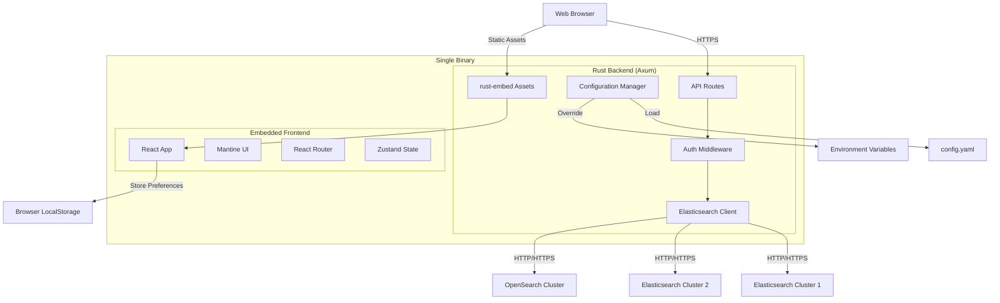
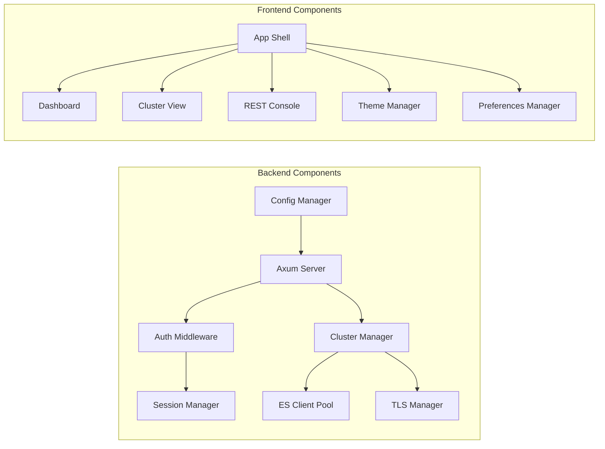

# Design Document: Cerebro Rewrite

## Overview

This design document outlines the architecture and implementation approach for rewriting Cerebro from Scala/Play/AngularJS to Rust + TypeScript/React with Mantine UI. The new architecture emphasizes:

- **Single binary distribution** with embedded frontend assets
- **Database-less architecture** using configuration files and browser storage
- **Modern authentication** with local users and OIDC support
- **Role-based access control** for multi-cluster environments
- **Cross-platform support** for Linux, macOS, and Windows
- **Flexible cluster connectivity** supporting Elasticsearch 7/8/9 and OpenSearch

The system follows a client-server architecture where the Rust backend serves as both an API server and static file server for the embedded React frontend.

## Architecture

### High-Level Architecture



### Component Architecture



## Components and Interfaces

### Backend Components

#### 1. Axum Server

The main HTTP server component built on Axum framework.

**Responsibilities:**
- Serve HTTP/HTTPS requests
- Route requests to appropriate handlers
- Serve embedded frontend assets
- Handle WebSocket connections (if needed for real-time updates)

**Interface:**
```rust
pub struct Server {
    config: Arc<Config>,
    cluster_manager: Arc<ClusterManager>,
    session_manager: Arc<SessionManager>,
}

impl Server {
    pub async fn new(config: Config) -> Result<Self>;
    pub async fn run(self) -> Result<()>;
    pub fn router(&self) -> Router;
}
```

**Routes:**
- `GET /` - Serve frontend SPA
- `GET /health` - Health check endpoint
- `GET /ready` - Readiness check endpoint
- `POST /api/auth/login` - Login endpoint
- `POST /api/auth/logout` - Logout endpoint
- `GET /api/auth/oidc/redirect` - OIDC callback
- `GET /api/clusters` - List accessible clusters
- `ALL /api/clusters/:id/*path` - Proxy to Elasticsearch cluster (GET, POST, PUT, DELETE, HEAD)

**Frontend Routes (React Router):**
- `/` - Dashboard (multi-cluster overview)
- `/login` - Login page
- `/cluster/:clusterId` - Cluster overview (redirects to /cluster/:clusterId/overview)
- `/cluster/:clusterId/overview` - Cluster overview tab
- `/cluster/:clusterId/nodes` - Nodes list
- `/cluster/:clusterId/indices` - Indices list
- `/cluster/:clusterId/indices/create` - Create new index
- `/cluster/:clusterId/indices/:indexName` - View index (redirects to settings)
- `/cluster/:clusterId/indices/:indexName/settings` - View/edit index settings
- `/cluster/:clusterId/indices/:indexName/mappings` - View/edit index mappings
- `/cluster/:clusterId/shards` - Shards visualization
- `/cluster/:clusterId/rest` - REST console
- `/cluster/:clusterId/aliases` - Aliases management (future)
- `/cluster/:clusterId/templates` - Templates management (future)
- `/cluster/:clusterId/snapshots` - Snapshots management (future)
- `/cluster/:clusterId/settings` - Cluster settings (future)

#### 2. Authentication Middleware

Handles authentication and authorization for all protected routes.

**Responsibilities:**
- Validate session tokens
- Enforce authentication requirements
- Extract user identity from requests
- Support multiple auth providers (Local, OIDC, Open)

**Interface:**
```rust
pub struct AuthMiddleware {
    session_manager: Arc<SessionManager>,
    auth_config: AuthConfig,
}

pub struct AuthUser {
    pub id: String,
    pub username: String,
    pub roles: Vec<String>,
}

impl AuthMiddleware {
    pub fn new(session_manager: Arc<SessionManager>, auth_config: AuthConfig) -> Self;
    pub async fn authenticate(&self, req: &Request) -> Result<Option<AuthUser>>;
    pub fn require_auth() -> impl Filter;
}
```

#### 3. Session Manager

Manages user sessions with secure token generation and validation.

**Responsibilities:**
- Create and validate session tokens
- Store active sessions in memory
- Handle session expiration
- Support session renewal

**Interface:**
```rust
pub struct SessionManager {
    sessions: Arc<RwLock<HashMap<String, Session>>>,
    config: SessionConfig,
}

pub struct Session {
    pub token: String,
    pub user_id: String,
    pub username: String,
    pub roles: Vec<String>,
    pub created_at: DateTime<Utc>,
    pub expires_at: DateTime<Utc>,
}

impl SessionManager {
    pub fn new(config: SessionConfig) -> Self;
    pub async fn create_session(&self, user: AuthUser) -> Result<String>;
    pub async fn validate_session(&self, token: &str) -> Result<Option<Session>>;
    pub async fn invalidate_session(&self, token: &str) -> Result<()>;
    pub async fn cleanup_expired(&self);
}
```

#### 4. Cluster Manager

Manages connections to multiple Elasticsearch/OpenSearch clusters.

**Responsibilities:**
- Maintain connection pools for each cluster
- Handle cluster authentication
- Manage TLS configuration per cluster
- Validate cluster connectivity
- Route requests to appropriate cluster

**Interface:**
```rust
pub struct ClusterManager {
    clusters: HashMap<String, ClusterConnection>,
    config: ClustersConfig,
}

pub struct ClusterConnection {
    pub id: String,
    pub name: String,
    pub nodes: Vec<String>,
    pub client: ElasticsearchClient,
    pub auth: Option<ClusterAuth>,
    pub tls_config: TlsConfig,
}

pub enum ClusterAuth {
    Basic { username: String, password: String },
    ApiKey { key: String },
    None,
}

impl ClusterManager {
    pub async fn new(config: ClustersConfig) -> Result<Self>;
    pub async fn get_cluster(&self, id: &str) -> Result<&ClusterConnection>;
    pub async fn proxy_request(&self, cluster_id: &str, method: Method, path: &str, body: Option<Bytes>) -> Result<Response>;
    pub async fn check_health(&self, cluster_id: &str) -> Result<ClusterHealth>;
    pub fn list_clusters(&self) -> Vec<ClusterInfo>;
}
```

#### 5. Elasticsearch Client

Wrapper around elasticsearch-rs or custom HTTP client for cluster communication.

**Responsibilities:**
- Execute requests against Elasticsearch/OpenSearch
- Handle version-specific API differences
- Support both SDK and raw HTTP modes
- Manage connection pooling

**Interface:**
```rust
pub enum ElasticsearchClient {
    Sdk(elasticsearch::Elasticsearch),
    Http(reqwest::Client),
}

impl ElasticsearchClient {
    pub async fn new(config: &ClusterConnection) -> Result<Self>;
    pub async fn request(&self, method: Method, path: &str, body: Option<Bytes>) -> Result<Response>;
    pub async fn health(&self) -> Result<ClusterHealth>;
    pub async fn info(&self) -> Result<ClusterInfo>;
}
```

#### 6. Configuration Manager

Loads and validates configuration from files and environment variables.

**Responsibilities:**
- Load configuration from YAML/TOML files
- Override with environment variables
- Validate configuration schema
- Provide typed configuration access

**Interface:**
```rust
pub struct Config {
    pub server: ServerConfig,
    pub auth: AuthConfig,
    pub clusters: ClustersConfig,
    pub session: SessionConfig,
}

pub struct ServerConfig {
    pub host: String,
    pub port: u16,
    pub tls: Option<TlsServerConfig>,
}

pub struct AuthConfig {
    pub mode: AuthMode,
    pub local_users: Option<Vec<LocalUser>>,
    pub oidc: Option<OidcConfig>,
}

pub enum AuthMode {
    LocalUsers,
    Oidc,
    Open,
}

pub struct ClustersConfig {
    pub clusters: Vec<ClusterConfig>,
}

pub struct ClusterConfig {
    pub id: String,
    pub name: String,
    pub nodes: Vec<String>,
    pub auth: Option<ClusterAuth>,
    pub tls: TlsConfig,
    pub client_type: ClientType,
}

pub enum ClientType {
    Sdk,
    Http,
}

impl Config {
    pub fn load() -> Result<Self>;
    pub fn from_file(path: &Path) -> Result<Self>;
    pub fn with_env_overrides(self) -> Result<Self>;
    pub fn validate(&self) -> Result<()>;
}
```

#### 7. TLS Manager

Handles TLS configuration for cluster connections.

**Responsibilities:**
- Load CA certificates
- Configure certificate verification
- Support self-signed certificates
- Manage TLS settings per cluster

**Interface:**
```rust
pub struct TlsConfig {
    pub verify: bool,
    pub ca_cert_file: Option<PathBuf>,
    pub ca_cert_dir: Option<PathBuf>,
}

pub struct TlsManager;

impl TlsManager {
    pub fn build_client(config: &TlsConfig) -> Result<reqwest::Client>;
    pub fn load_ca_certs(config: &TlsConfig) -> Result<Vec<Certificate>>;
    pub fn validate_config(config: &TlsConfig) -> Result<()>;
}
```

#### 8. Role-Based Access Control

Enforces user access to clusters based on roles.

**Responsibilities:**
- Map users to accessible clusters
- Validate cluster access permissions
- Support wildcard patterns in roles

**Interface:**
```rust
pub struct RbacManager {
    roles: HashMap<String, Role>,
}

pub struct Role {
    pub name: String,
    pub cluster_patterns: Vec<String>,
}

impl RbacManager {
    pub fn new(config: &AuthConfig) -> Self;
    pub fn get_accessible_clusters(&self, user: &AuthUser, all_clusters: &[String]) -> Vec<String>;
    pub fn can_access_cluster(&self, user: &AuthUser, cluster_id: &str) -> bool;
}
```

### Frontend Components

#### 1. App Shell

The root component that provides layout and navigation.

**Responsibilities:**
- Render main layout with header, sidebar, and content area
- Manage theme state
- Handle navigation
- Display user information and logout

**Interface:**
```typescript
interface AppShellProps {
  children: React.ReactNode;
}

export function AppShell({ children }: AppShellProps): JSX.Element;
```

#### 2. Dashboard Component

Multi-cluster overview showing all configured clusters.

**Responsibilities:**
- Fetch cluster health for all clusters
- Display clusters in table format
- Show cluster stats (nodes, shards, indices, documents)
- Handle cluster selection navigation
- Auto-refresh at configurable intervals

**Interface:**
```typescript
interface ClusterSummary {
  id: string;
  name: string;
  health: 'green' | 'yellow' | 'red' | 'unreachable';
  nodes: number;
  shards: number;
  indices: number;
  documents: number;
}

export function Dashboard(): JSX.Element;
```

#### 3. Cluster View Component

Detailed view of a single cluster with URL-based navigation.

**Responsibilities:**
- Display cluster health and statistics
- Route to different cluster views (overview, nodes, indices, shards)
- Provide operations (open/close indices, relocate shards, etc.)
- Navigate to specialized views using React Router

**Routes:**
- `/cluster/:clusterId/overview` - Cluster overview with statistics
- `/cluster/:clusterId/nodes` - Nodes list
- `/cluster/:clusterId/indices` - Indices list
- `/cluster/:clusterId/shards` - Shards visualization

**Interface:**
```typescript
interface ClusterViewProps {
  clusterId: string;
}

export function ClusterView({ clusterId }: ClusterViewProps): JSX.Element;
export function ClusterOverview({ clusterId }: ClusterViewProps): JSX.Element;
export function ClusterNodes({ clusterId }: ClusterViewProps): JSX.Element;
export function ClusterIndices({ clusterId }: ClusterViewProps): JSX.Element;
export function ClusterShards({ clusterId }: ClusterViewProps): JSX.Element;
```

#### 3a. Index Management Components

Components for creating and editing indices with JSON editors.

**Responsibilities:**
- Create new indices with settings and mappings
- View and edit index settings as JSON
- View and edit index mappings as JSON
- Validate JSON before submission
- Use Monaco Editor or similar for JSON editing
- Use Mantine Tabs to organize settings/mappings views

**Routes:**
- `/cluster/:clusterId/indices/create` - Create new index
- `/cluster/:clusterId/indices/:indexName/settings` - View/edit settings
- `/cluster/:clusterId/indices/:indexName/mappings` - View/edit mappings

**Interface:**
```typescript
interface IndexCreateProps {
  clusterId: string;
}

interface IndexEditProps {
  clusterId: string;
  indexName: string;
}

export function IndexCreate({ clusterId }: IndexCreateProps): JSX.Element;
export function IndexSettings({ clusterId, indexName }: IndexEditProps): JSX.Element;
export function IndexMappings({ clusterId, indexName }: IndexEditProps): JSX.Element;
```

#### 4. REST Console Component

Kibana-style console for executing arbitrary requests.

**Responsibilities:**
- Provide code editor with syntax highlighting
- Parse "METHOD endpoint" format
- Execute requests against selected cluster
- Display responses with formatting
- Manage request history in local storage

**Interface:**
```typescript
interface RestConsoleProps {
  clusterId: string;
}

interface RequestHistoryItem {
  timestamp: number;
  method: string;
  path: string;
  body?: string;
  response?: string;
}

export function RestConsole({ clusterId }: RestConsoleProps): JSX.Element;
```

#### 5. Theme Manager

Manages application theme (light/dark/system).

**Responsibilities:**
- Detect system theme preference
- Apply selected theme
- Persist theme preference
- Provide theme toggle UI

**Interface:**
```typescript
type Theme = 'light' | 'dark' | 'system';

interface ThemeContextValue {
  theme: Theme;
  setTheme: (theme: Theme) => void;
  resolvedTheme: 'light' | 'dark';
}

export function ThemeProvider({ children }: { children: React.ReactNode }): JSX.Element;
export function useTheme(): ThemeContextValue;
```

#### 6. Preferences Manager

Manages user preferences stored in local storage.

**Responsibilities:**
- Store and retrieve preferences
- Provide typed access to preferences
- Handle preference updates
- Support preference reset

**Interface:**
```typescript
interface UserPreferences {
  theme: Theme;
  refreshInterval: number;
  lastSelectedCluster?: string;
  restConsoleHistory: RequestHistoryItem[];
}

export function usePreferences(): {
  preferences: UserPreferences;
  updatePreference: <K extends keyof UserPreferences>(key: K, value: UserPreferences[K]) => void;
  resetPreferences: () => void;
};
```

#### 7. API Client

Handles all API communication with the backend.

**Responsibilities:**
- Make authenticated requests
- Handle session expiration
- Provide typed API methods
- Handle errors consistently

**Interface:**
```typescript
class ApiClient {
  async login(username: string, password: string): Promise<void>;
  async logout(): Promise<void>;
  async getClusters(): Promise<ClusterInfo[]>;
  async getClusterHealth(clusterId: string): Promise<ClusterHealth>;
  async proxyRequest(clusterId: string, method: string, path: string, body?: any): Promise<any>;
}

export const apiClient: ApiClient;
```

## Data Models

### Configuration Models

```rust
// Server configuration
pub struct ServerConfig {
    pub host: String,              // Default: "0.0.0.0"
    pub port: u16,                 // Default: 9000
    pub tls: Option<TlsServerConfig>,
}

pub struct TlsServerConfig {
    pub cert_file: PathBuf,
    pub key_file: PathBuf,
}

// Authentication configuration
pub struct AuthConfig {
    pub mode: AuthMode,
    pub session_timeout_minutes: u64,  // Default: 60
    pub local_users: Option<Vec<LocalUser>>,
    pub oidc: Option<OidcConfig>,
    pub roles: Vec<RoleConfig>,
}

pub struct LocalUser {
    pub username: String,
    pub password_hash: String,  // bcrypt or argon2
    pub roles: Vec<String>,
}

pub struct OidcConfig {
    pub discovery_url: String,
    pub client_id: String,
    pub client_secret: String,
    pub redirect_uri: String,
}

pub struct RoleConfig {
    pub name: String,
    pub cluster_patterns: Vec<String>,  // Glob patterns like "prod-*", "dev-*"
}

// Cluster configuration
pub struct ClusterConfig {
    pub id: String,
    pub name: String,
    pub nodes: Vec<String>,
    pub auth: Option<ClusterAuth>,
    pub tls: TlsConfig,
    pub client_type: ClientType,
    pub version_hint: Option<String>,  // "7", "8", "9", "opensearch"
}

pub struct TlsConfig {
    pub verify: bool,                    // Default: true
    pub ca_cert_file: Option<PathBuf>,
    pub ca_cert_dir: Option<PathBuf>,
}

pub enum ClusterAuth {
    Basic { username: String, password: String },
    ApiKey { key: String },
    None,
}

pub enum ClientType {
    Sdk,   // Use elasticsearch-rs
    Http,  // Use raw HTTP requests
}
```

### Runtime Models

```rust
// Cluster health and stats
pub struct ClusterHealth {
    pub status: HealthStatus,
    pub cluster_name: String,
    pub number_of_nodes: u32,
    pub number_of_data_nodes: u32,
    pub active_primary_shards: u32,
    pub active_shards: u32,
    pub relocating_shards: u32,
    pub initializing_shards: u32,
    pub unassigned_shards: u32,
}

pub enum HealthStatus {
    Green,
    Yellow,
    Red,
}

// Index information
pub struct IndexInfo {
    pub name: String,
    pub health: HealthStatus,
    pub status: IndexStatus,
    pub primary_shards: u32,
    pub replica_shards: u32,
    pub docs_count: u64,
    pub store_size: u64,
}

pub enum IndexStatus {
    Open,
    Close,
}

// Node information
pub struct NodeInfo {
    pub id: String,
    pub name: String,
    pub roles: Vec<NodeRole>,
    pub heap_used: u64,
    pub heap_max: u64,
    pub disk_used: u64,
    pub disk_total: u64,
    pub cpu_percent: f32,
}

pub enum NodeRole {
    Master,
    Data,
    Ingest,
    Coordinating,
}
```

### Frontend Models

```typescript
// Cluster models
interface ClusterInfo {
  id: string;
  name: string;
  nodes: string[];
  accessible: boolean;
}

interface ClusterHealth {
  status: 'green' | 'yellow' | 'red';
  clusterName: string;
  numberOfNodes: number;
  numberOfDataNodes: number;
  activePrimaryShards: number;
  activeShards: number;
  relocatingShards: number;
  initializingShards: number;
  unassignedShards: number;
}

// Index models
interface IndexInfo {
  name: string;
  health: 'green' | 'yellow' | 'red';
  status: 'open' | 'close';
  primaryShards: number;
  replicaShards: number;
  docsCount: number;
  storeSize: number;
}

// Node models
interface NodeInfo {
  id: string;
  name: string;
  roles: string[];
  heapUsed: number;
  heapMax: number;
  diskUsed: number;
  diskTotal: number;
  cpuPercent: number;
}
```

## Correctness Properties

*A property is a characteristic or behavior that should hold true across all valid executions of a system—essentially, a formal statement about what the system should do. Properties serve as the bridge between human-readable specifications and machine-verifiable correctness guarantees.*


### Property 1: Multi-Cluster Connection Management

*For any* set of configured Elasticsearch/OpenSearch clusters, the backend should maintain simultaneous connections to all clusters and allow switching between them without re-authentication.

**Validates: Requirements 2.1, 2.15, 2.16**

### Property 2: Configuration Override Precedence

*For any* configuration parameter that exists in both file and environment variables, the environment variable value should take precedence.

**Validates: Requirements 26.3**

### Property 3: Cluster Access Authorization

*For any* user with defined roles and any cluster, the user should only be able to access clusters that match their role patterns, and attempts to access unauthorized clusters should be rejected.

**Validates: Requirements 23.2, 23.3, 23.5, 23.6**

### Property 4: Session Token Security

*For any* generated session token, it should be cryptographically random, unique, and stored in HTTP-only cookies with SameSite attribute.

**Validates: Requirements 25.1, 25.7**

### Property 5: Session Lifecycle Management

*For any* valid session, making authenticated requests should validate the token, and after logout or expiration, the token should no longer be valid.

**Validates: Requirements 25.3, 25.4, 25.5**

### Property 6: Session Persistence Across Refreshes

*For any* authenticated user session, refreshing the page should not require re-authentication as long as the session hasn't expired.

**Validates: Requirements 21.9, 25.8**

### Property 7: Index Operation Execution

*For any* index operation (open, close, delete, force merge, clear cache, refresh, flush), executing the operation should proxy the request to Elasticsearch and return the result or error.

**Validates: Requirements 5.1, 5.2, 5.3, 5.4, 5.5, 5.6, 5.7**

### Property 8: Index Name Validation

*For any* index creation request with an invalid index name format, the backend should reject the request before sending it to Elasticsearch.

**Validates: Requirements 6.2**

### Property 9: JSON Validation Before Submission

*For any* user input that requires JSON format (index settings, mappings, cluster settings), invalid JSON syntax should be rejected before submission to Elasticsearch.

**Validates: Requirements 6.5, 7.3, 8.3, 13.4**

### Property 10: REST Console Request Parsing

*For any* REST console input in format "METHOD endpoint", the frontend should correctly parse the method and endpoint and execute the request against the selected cluster.

**Validates: Requirements 19.2, 19.4, 19.5**

### Property 11: REST Console History Management

*For any* executed REST request, it should be stored in browser local storage, displayed in history, and when selected from history, should populate the request fields with the same values.

**Validates: Requirements 19.8, 19.10**

### Property 12: REST Console History Limit

*For any* REST console history that exceeds the configured maximum entries, the oldest entries should be removed to maintain the limit.

**Validates: Requirements 19.13**

### Property 13: REST Console Export/Import Round-Trip

*For any* collection of REST requests, exporting then importing should produce an equivalent collection.

**Validates: Requirements 19.12**

### Property 14: Theme Persistence

*For any* theme selection (light, dark, system), the preference should be stored in browser local storage and restored on application load.

**Validates: Requirements 36.6, 36.7**

### Property 15: User Preferences Round-Trip

*For any* user preferences (theme, refresh interval, last selected cluster), storing then retrieving should produce equivalent values.

**Validates: Requirements 37.1, 37.2, 37.3, 37.4**

### Property 16: Dashboard Cluster Display

*For any* set of configured clusters, the dashboard should display all clusters the user is authorized to access with their health status and statistics.

**Validates: Requirements 3.2, 3.3, 3.4, 3.5, 3.6, 3.7**

### Property 17: Dashboard Cluster Navigation

*For any* cluster displayed in the dashboard, clicking it should navigate to that cluster's detail view.

**Validates: Requirements 3.9**

### Property 18: Dashboard Sorting

*For any* dashboard table column (name, health, nodes, shards, etc.), clicking the column header should sort the clusters by that column.

**Validates: Requirements 3.11**

### Property 19: Alias Operations Atomicity

*For any* bulk alias operation (add/remove multiple aliases), all operations should be executed atomically or none should be applied.

**Validates: Requirements 11.8**

### Property 20: Authentication Credential Validation

*For any* authentication attempt with local users, valid credentials should create a session and invalid credentials should return an authentication error.

**Validates: Requirements 21.1, 21.5, 21.6**

### Property 21: Cluster Health Status Display

*For any* cluster, the frontend should display its current health status (green, yellow, red, or unreachable) based on the latest health check.

**Validates: Requirements 3.3, 4.1**

### Property 22: Node Array Failover

*For any* cluster configured with multiple node URLs, if one node becomes unreachable, requests should failover to other nodes in the array.

**Validates: Requirements 2.5**

### Property 23: Concurrent Elasticsearch Requests

*For any* set of concurrent requests to Elasticsearch, the backend should handle them concurrently without blocking.

**Validates: Requirements 31.6**

### Property 24: Cluster Metadata Caching

*For any* cluster metadata request within the cache duration, the backend should return cached data without querying Elasticsearch.

**Validates: Requirements 31.2**

### Property 25: Error Message Propagation

*For any* failed Elasticsearch operation, the backend should return the Elasticsearch error message to the frontend for display.

**Validates: Requirements 5.9, 6.7, 8.6, 13.7, 18.11**

### Property 26: Keyboard Navigation Support

*For any* interactive element in the frontend, it should be accessible via keyboard navigation.

**Validates: Requirements 32.3**

### Property 27: Responsive Layout Adaptation

*For any* screen size (desktop, laptop, tablet, mobile), the frontend should adapt its layout appropriately.

**Validates: Requirements 33.1, 33.2, 33.3, 33.4**

### Property 28: TLS Certificate Validation

*For any* cluster connection with TLS verification enabled and valid CA certificates configured, the backend should validate the server certificate against the CA.

**Validates: Requirements 41.1, 41.5, 41.6, 41.7**

### Property 29: Authentication Rate Limiting

*For any* series of failed authentication attempts from the same source, after exceeding the rate limit threshold, subsequent attempts should be rejected.

**Validates: Requirements 21.8**

### Property 30: Session Renewal on Activity

*For any* active session, making authenticated requests should extend the session expiration time.

**Validates: Requirements 25.9**

## Error Handling

### Backend Error Handling

**Elasticsearch API Errors:**
- All Elasticsearch API errors should be caught and wrapped in a consistent error type
- Error responses should include the original Elasticsearch error message
- HTTP status codes should be preserved from Elasticsearch responses
- Errors should be logged with full context (cluster ID, request path, method)

**Configuration Errors:**
- Invalid configuration should cause startup failure with clear error messages
- Missing required configuration should use secure defaults where possible
- Configuration validation errors should specify which field is invalid and why

**Authentication Errors:**
- Failed authentication attempts should return 401 Unauthorized
- Expired sessions should return 401 Unauthorized with specific error code
- Authorization failures should return 403 Forbidden
- Rate limit exceeded should return 429 Too Many Requests

**Network Errors:**
- Connection failures to Elasticsearch should be retried with exponential backoff
- Timeout errors should be clearly distinguished from other errors
- TLS errors should provide specific information about certificate issues

**Error Response Format:**
```rust
pub struct ErrorResponse {
    pub error: String,
    pub message: String,
    pub details: Option<serde_json::Value>,
    pub request_id: String,
}
```

### Frontend Error Handling

**API Error Display:**
- User-friendly error messages should be displayed in notifications
- Technical details should be available in expandable sections
- Errors should be dismissible but logged to console

**Network Error Handling:**
- Connection errors should trigger retry with user notification
- Timeout errors should allow manual retry
- Session expiration should redirect to login page

**Validation Errors:**
- Form validation errors should be displayed inline
- JSON syntax errors should highlight the error location
- Validation should occur before submission

**Error Boundaries:**
- React error boundaries should catch component errors
- Error boundaries should display fallback UI
- Errors should be logged for debugging

## Testing Strategy

### Dual Testing Approach

This project will use both unit tests and property-based tests for comprehensive coverage:

**Unit Tests:**
- Specific examples demonstrating correct behavior
- Edge cases (empty inputs, boundary values, special characters)
- Error conditions and error handling
- Integration points between components
- Authentication flows (login, logout, session expiration)
- Configuration loading and validation
- TLS configuration scenarios

**Property-Based Tests:**
- Universal properties that hold for all inputs
- Comprehensive input coverage through randomization
- Each property test should run minimum 100 iterations
- Properties should be tagged with references to design document

### Backend Testing

**Unit Tests (Rust):**
- Framework: `cargo test` with `tokio::test` for async
- Mock Elasticsearch responses using `wiremock` or `mockito`
- Test authentication flows with test users
- Test configuration loading from files and env vars
- Test TLS configuration with test certificates
- Test session management (creation, validation, expiration)
- Test RBAC with various role configurations

**Property-Based Tests (Rust):**
- Framework: `proptest` or `quickcheck`
- Minimum 100 iterations per test
- Tag format: `// Feature: cerebro-rewrite, Property N: [property text]`

Example property tests:
- Property 2: Configuration override precedence
- Property 3: Cluster access authorization
- Property 4: Session token security
- Property 8: Index name validation
- Property 9: JSON validation
- Property 12: REST console history limit
- Property 22: Node array failover
- Property 29: Authentication rate limiting

**Integration Tests:**
- Test with real Elasticsearch/OpenSearch instances (Docker containers)
- Test multi-cluster scenarios
- Test authentication end-to-end
- Test proxy functionality
- Test TLS with self-signed certificates

### Frontend Testing

**Unit Tests (TypeScript/React):**
- Framework: Vitest + React Testing Library
- Test component rendering
- Test user interactions (clicks, form submissions)
- Test API client methods
- Test theme switching
- Test preferences persistence
- Test REST console parsing
- Mock API responses using MSW (Mock Service Worker)

**Property-Based Tests (TypeScript):**
- Framework: `fast-check`
- Minimum 100 iterations per test
- Tag format: `// Feature: cerebro-rewrite, Property N: [property text]`

Example property tests:
- Property 10: REST console request parsing
- Property 13: REST console export/import round-trip
- Property 15: User preferences round-trip
- Property 18: Dashboard sorting
- Property 26: Keyboard navigation

**End-to-End Tests:**
- Framework: Playwright
- Test complete user workflows
- Test authentication flows
- Test cluster management
- Test index operations
- Test REST console
- Run against real backend and Elasticsearch

### Test Organization

```
cerebro-rewrite/
├── backend/
│   ├── src/
│   │   └── *.rs (with inline unit tests)
│   ├── tests/
│   │   ├── integration/
│   │   │   ├── auth_test.rs
│   │   │   ├── cluster_test.rs
│   │   │   └── proxy_test.rs
│   │   └── property/
│   │       ├── config_test.rs
│   │       ├── rbac_test.rs
│   │       └── session_test.rs
│   └── Cargo.toml
├── frontend/
│   ├── src/
│   │   └── **/*.test.tsx
│   ├── tests/
│   │   ├── property/
│   │   │   ├── rest-console.test.ts
│   │   │   ├── preferences.test.ts
│   │   │   └── navigation.test.ts
│   │   └── e2e/
│   │       ├── auth.spec.ts
│   │       ├── cluster.spec.ts
│   │       └── rest-console.spec.ts
│   └── package.json
└── docker-compose.test.yml (for integration tests)
```

### Continuous Integration

**GitHub Actions Workflow:**
1. Run backend unit tests
2. Run backend property tests
3. Run frontend unit tests
4. Run frontend property tests
5. Build backend binary
6. Build frontend assets
7. Run integration tests with Docker
8. Run E2E tests
9. Build Docker image
10. Build release binaries for all platforms

**Test Coverage:**
- Aim for >80% code coverage
- Track coverage trends over time
- Require tests for new features
- Property tests should cover core business logic

## Implementation Notes

### Rust Backend Dependencies

```toml
[dependencies]
axum = "0.7"
tokio = { version = "1", features = ["full"] }
tower = "0.4"
tower-http = { version = "0.5", features = ["fs", "cors", "compression-gzip"] }
serde = { version = "1", features = ["derive"] }
serde_json = "1"
serde_yaml = "0.9"
config = "0.14"
elasticsearch = "8"
reqwest = { version = "0.11", features = ["json", "rustls-tls"] }
rust-embed = "8"
bcrypt = "0.15"
argon2 = "0.5"
jsonwebtoken = "9"
tracing = "0.1"
tracing-subscriber = { version = "0.3", features = ["json"] }
thiserror = "1"
anyhow = "1"
clap = { version = "4", features = ["derive", "env"] }
rustls = "0.22"
rustls-pemfile = "2"

[dev-dependencies]
proptest = "1"
wiremock = "0.6"
tokio-test = "0.4"
```

### Frontend Dependencies

```json
{
  "dependencies": {
    "react": "^18.2.0",
    "react-dom": "^18.2.0",
    "react-router-dom": "^6.20.0",
    "@mantine/core": "^7.3.0",
    "@mantine/hooks": "^7.3.0",
    "@mantine/notifications": "^7.3.0",
    "@monaco-editor/react": "^4.6.0",
    "zustand": "^4.4.0",
    "@tanstack/react-query": "^5.12.0",
    "axios": "^1.6.0"
  },
  "devDependencies": {
    "typescript": "^5.3.0",
    "vite": "^5.0.0",
    "@vitejs/plugin-react": "^4.2.0",
    "vitest": "^1.0.0",
    "@testing-library/react": "^14.1.0",
    "@testing-library/user-event": "^14.5.0",
    "msw": "^2.0.0",
    "fast-check": "^3.15.0",
    "@playwright/test": "^1.40.0"
  }
}
```

### Build Process

**Backend Build:**
1. Compile Rust code with `cargo build --release`
2. Strip debug symbols for smaller binary
3. Embed frontend assets using rust-embed
4. Cross-compile for multiple platforms using `cross`

**Frontend Build:**
1. Build React app with Vite: `vite build`
2. Output to `backend/assets/` directory
3. Assets are embedded during backend build

**Single Binary Creation:**
```rust
#[derive(RustEmbed)]
#[folder = "assets/"]
struct Assets;

// Serve embedded assets
async fn serve_frontend(uri: Uri) -> Response {
    let path = uri.path().trim_start_matches('/');
    let path = if path.is_empty() { "index.html" } else { path };
    
    match Assets::get(path) {
        Some(content) => {
            let mime = mime_guess::from_path(path).first_or_octet_stream();
            Response::builder()
                .header("content-type", mime.as_ref())
                .body(Body::from(content.data))
                .unwrap()
        }
        None => {
            // Serve index.html for SPA routing
            let index = Assets::get("index.html").unwrap();
            Response::builder()
                .header("content-type", "text/html")
                .body(Body::from(index.data))
                .unwrap()
        }
    }
}
```

### Configuration Example

```yaml
# config.yaml
server:
  host: "0.0.0.0"
  port: 9000
  tls:
    cert_file: "/path/to/cert.pem"
    key_file: "/path/to/key.pem"

auth:
  mode: "local_users"  # or "oidc" or "open"
  session_timeout_minutes: 60
  
  local_users:
    - username: "admin"
      password_hash: "$2b$12$..."
      roles: ["admin"]
    - username: "dev"
      password_hash: "$2b$12$..."
      roles: ["developer"]
  
  # oidc:
  #   discovery_url: "https://auth.example.com/.well-known/openid-configuration"
  #   client_id: "cerebro"
  #   client_secret: "secret"
  #   redirect_uri: "https://cerebro.example.com/api/auth/oidc/redirect"
  
  roles:
    - name: "admin"
      cluster_patterns: ["*"]
    - name: "developer"
      cluster_patterns: ["dev-*", "staging-*"]

clusters:
  - id: "prod-main"
    name: "Production Main"
    nodes:
      - "https://es-node1.example.com:9200"
      - "https://es-node2.example.com:9200"
      - "https://es-node3.example.com:9200"
    auth:
      type: "basic"
      username: "cerebro"
      password: "secret"
    tls:
      verify: true
      ca_cert_file: "/path/to/ca.pem"
    client_type: "sdk"
    version_hint: "8"
  
  - id: "dev-local"
    name: "Development Local"
    nodes:
      - "http://localhost:9200"
    auth:
      type: "none"
    tls:
      verify: false
    client_type: "http"
    version_hint: "8"
  
  - id: "opensearch-prod"
    name: "OpenSearch Production"
    nodes:
      - "https://opensearch.example.com:9200"
    auth:
      type: "api_key"
      key: "base64encodedkey"
    tls:
      verify: true
    client_type: "http"
    version_hint: "opensearch"
```

### Environment Variable Overrides

```bash
# Server configuration
CEREBRO_SERVER_HOST=0.0.0.0
CEREBRO_SERVER_PORT=9000

# Authentication
CEREBRO_AUTH_MODE=local_users
CEREBRO_AUTH_SESSION_TIMEOUT_MINUTES=60

# Clusters (JSON array)
CEREBRO_CLUSTERS='[{"id":"prod","name":"Production","nodes":["https://es.example.com:9200"],"auth":{"type":"basic","username":"user","password":"pass"}}]'

# Or individual cluster
CEREBRO_CLUSTER_0_ID=prod
CEREBRO_CLUSTER_0_NAME=Production
CEREBRO_CLUSTER_0_NODES_0=https://es.example.com:9200
CEREBRO_CLUSTER_0_AUTH_TYPE=basic
CEREBRO_CLUSTER_0_AUTH_USERNAME=user
CEREBRO_CLUSTER_0_AUTH_PASSWORD=pass
```

## Deployment

### Docker Deployment

**Dockerfile:**
```dockerfile
FROM rust:1.75 as builder
WORKDIR /app
COPY . .
RUN cargo build --release

FROM debian:bookworm-slim
RUN apt-get update && apt-get install -y ca-certificates && rm -rf /var/lib/apt/lists/*
RUN useradd -m -u 1000 cerebro
USER cerebro
COPY --from=builder /app/target/release/cerebro /usr/local/bin/cerebro
EXPOSE 9000
HEALTHCHECK --interval=30s --timeout=3s --start-period=5s --retries=3 \
  CMD curl -f http://localhost:9000/health || exit 1
ENTRYPOINT ["/usr/local/bin/cerebro"]
```

**Docker Compose:**
```yaml
services:
  cerebro:
    image: cerebro:latest
    ports:
      - "9000:9000"
    environment:
      - CEREBRO_AUTH_MODE=open
      - CEREBRO_CLUSTERS=[{"id":"es","name":"Elasticsearch","nodes":["http://elasticsearch:9200"]}]
    volumes:
      - ./config.yaml:/config.yaml:ro
    depends_on:
      - elasticsearch
  
  elasticsearch:
    image: docker.elastic.co/elasticsearch/elasticsearch:8.11.0
    environment:
      - discovery.type=single-node
      - xpack.security.enabled=false
    ports:
      - "9200:9200"
```

### Binary Deployment

1. Download platform-specific binary from releases
2. Create configuration file
3. Run binary: `./cerebro --config config.yaml`
4. Access at `http://localhost:9000`

### Kubernetes Deployment

```yaml
apiVersion: apps/v1
kind: Deployment
metadata:
  name: cerebro
spec:
  replicas: 2
  selector:
    matchLabels:
      app: cerebro
  template:
    metadata:
      labels:
        app: cerebro
    spec:
      containers:
      - name: cerebro
        image: cerebro:latest
        ports:
        - containerPort: 9000
        env:
        - name: CEREBRO_AUTH_MODE
          value: "oidc"
        - name: CEREBRO_AUTH_OIDC_DISCOVERY_URL
          valueFrom:
            secretKeyRef:
              name: cerebro-secrets
              key: oidc-discovery-url
        volumeMounts:
        - name: config
          mountPath: /config.yaml
          subPath: config.yaml
        livenessProbe:
          httpGet:
            path: /health
            port: 9000
          initialDelaySeconds: 10
          periodSeconds: 30
        readinessProbe:
          httpGet:
            path: /ready
            port: 9000
          initialDelaySeconds: 5
          periodSeconds: 10
      volumes:
      - name: config
        configMap:
          name: cerebro-config
---
apiVersion: v1
kind: Service
metadata:
  name: cerebro
spec:
  selector:
    app: cerebro
  ports:
  - port: 80
    targetPort: 9000
  type: LoadBalancer
```

## Migration from Legacy Cerebro

### Configuration Migration

Legacy Cerebro uses a different configuration format. A migration tool should be provided:

```bash
cerebro migrate-config --input cerebro-legacy.conf --output config.yaml
```

**Key Differences:**
- LDAP authentication → OIDC or local users
- SQLite REST history → Browser local storage
- Hosts configuration → Clusters with node arrays
- Play Framework config → YAML/TOML config

### Migration Guide

1. **Export REST history** (if needed): Legacy Cerebro stores in SQLite, new version uses browser storage
2. **Convert configuration**: Use migration tool or manually convert
3. **Update authentication**: Map LDAP users to local users or configure OIDC
4. **Test connectivity**: Verify all clusters are accessible
5. **Deploy new version**: Run alongside legacy for testing
6. **Switch over**: Update DNS/load balancer to point to new version

### Breaking Changes

- REST history not automatically migrated (stored in browser)
- LDAP authentication replaced with OIDC or local users
- Configuration format changed from HOCON to YAML/TOML
- API endpoints may have minor differences
- Some legacy features may not be implemented initially

## Future Enhancements

### Phase 2 Features

- **Audit logging**: Track all user actions
- **Alerting**: Configure alerts for cluster health
- **Saved queries**: Save and share REST console queries
- **Index lifecycle management**: Visual ILM policy management
- **Watcher management**: Manage Elasticsearch watchers
- **Machine learning**: View ML jobs and datafeeds
- **Cross-cluster search**: Manage cross-cluster search
- **Index rollover**: Automated index rollover management

### Phase 3 Features

- **Multi-tenancy**: Support multiple organizations
- **SSO integration**: Additional SSO providers (SAML, OAuth2)
- **Custom dashboards**: User-defined dashboards
- **Query builder**: Visual query builder for REST console
- **Bulk operations**: Bulk index operations
- **Data visualization**: Basic charts and graphs
- **Export/import**: Export cluster configurations
- **API documentation**: Interactive API documentation

## Conclusion

This design provides a comprehensive architecture for rewriting Cerebro with modern technologies while preserving all existing functionality. The single binary distribution, database-less architecture, and improved authentication make deployment and management significantly easier. The use of Rust for the backend ensures high performance and reliability, while React with Mantine UI provides a modern, accessible user interface.

The dual testing approach with both unit tests and property-based tests ensures comprehensive coverage and correctness. The modular architecture allows for easy extension and maintenance, and the clear separation of concerns makes the codebase approachable for contributors.
