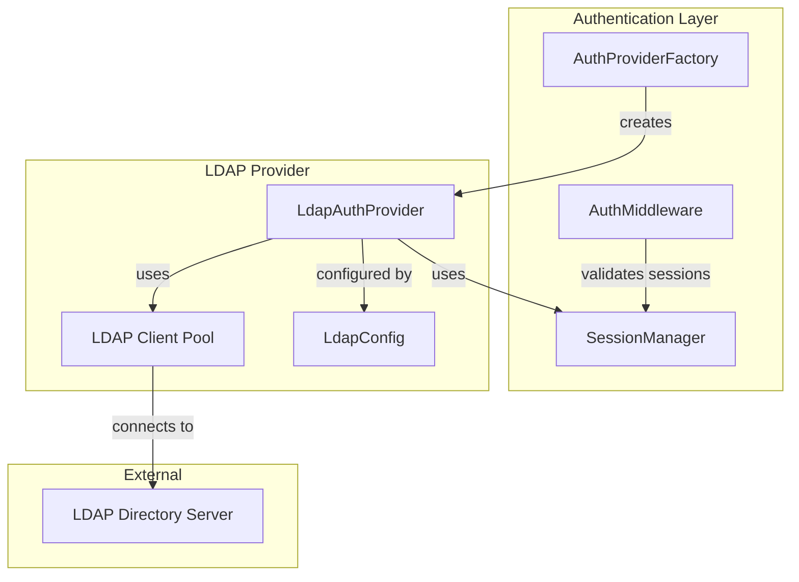
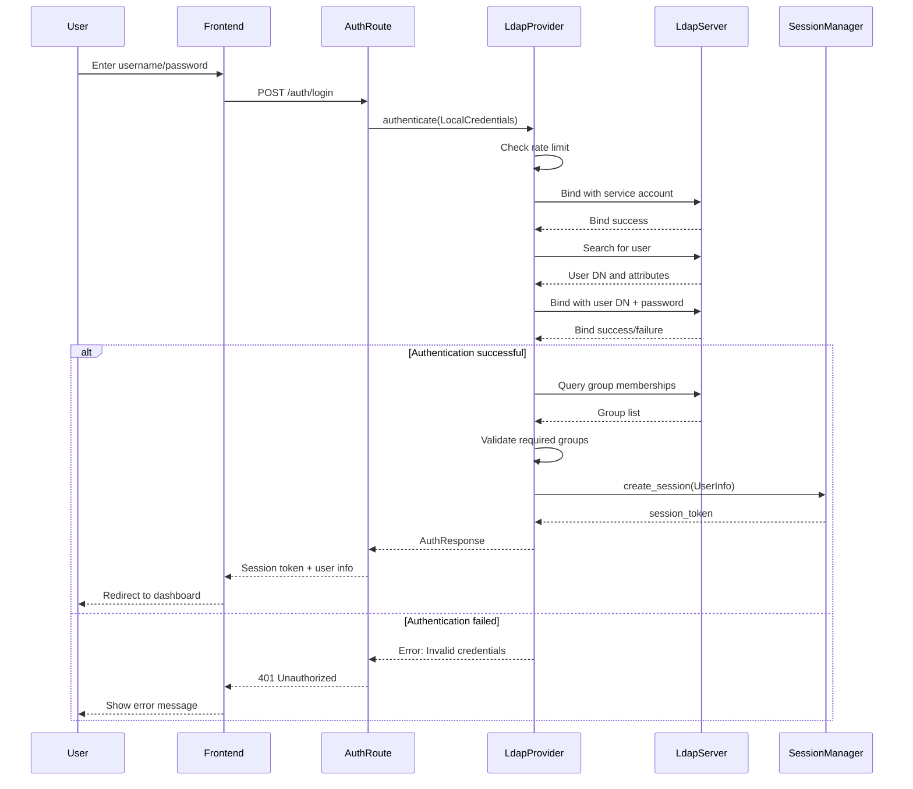

# Design Document: LDAP Authentication

## Overview

This design document specifies the technical implementation of LDAP (Lightweight Directory Access Protocol) authentication support for the application. LDAP authentication will be added as a third authentication provider alongside the existing local user and OIDC authentication modes.

### Purpose

The LDAP authentication feature enables users to authenticate against enterprise directory services such as Active Directory, OpenLDAP, FreeIPA, and other LDAP-compliant directory servers. This allows organizations to leverage their existing identity infrastructure without requiring separate user management in the application.

### Scope

This design covers:

- Integration of the ldap3 Rust crate for LDAP protocol communication
- Implementation of an LDAP authentication provider following the existing AuthProvider trait pattern
- LDAP configuration structure and validation
- Direct login flow (username/password form submission) similar to local authentication
- Group membership extraction and mapping to application roles
- Connection pooling and error handling
- Security considerations including LDAP injection prevention and rate limiting

### Key Design Decisions

1. **Library Selection**: Use the ldap3 Rust crate, which provides a well-maintained, async-capable LDAP client with support for LDAP v3, TLS/StartTLS, and connection pooling.

2. **Authentication Flow**: Follow the direct login pattern used by local authentication (form submission) rather than the redirect-based flow used by OIDC. This provides a simpler user experience for LDAP authentication.

3. **Integration Pattern**: Implement LDAP as an AuthProvider that integrates seamlessly with the existing authentication infrastructure (AuthFactory, SessionManager, rate limiting, logging).

4. **Group Mapping**: Support flexible group membership queries (both direct and reverse lookups) with optional required group enforcement, similar to OIDC's group validation.

5. **Connection Management**: Use connection pooling provided by ldap3 to minimize connection overhead while handling connection failures gracefully with automatic reconnection.

6. **Security**: Implement LDAP injection prevention through proper escaping, return generic error messages to prevent information disclosure, and integrate with existing rate limiting mechanisms.

## Architecture

### Component Diagram



### Authentication Flow



### Integration with Existing Authentication Infrastructure

The LDAP provider integrates with existing components:

1. **AuthProviderFactory**: Extended to support "ldap" authentication mode and create LdapAuthProvider instances
2. **AuthProvider trait**: LdapAuthProvider implements this trait, accepting LocalCredentials requests
3. **SessionManager**: Used to create and manage user sessions after successful authentication
4. **Rate Limiting**: Integrated via SessionManager's check_rate_limit method
5. **Logging**: Uses the existing tracing infrastructure with component-specific log levels
6. **Configuration**: Extends AuthConfig with LdapConfig structure

## Components and Interfaces

### LdapAuthProvider

The main authentication provider implementation.

```rust
pub struct LdapAuthProvider {
    config: LdapConfig,
    session_manager: Arc<SessionManager>,
    ldap_pool: LdapConnPool,
}

impl LdapAuthProvider {
    /// Create a new LDAP authentication provider
    ///
    /// Validates configuration and establishes initial connection to verify
    /// LDAP server accessibility.
    pub fn new(
        config: LdapConfig,
        session_manager: Arc<SessionManager>
    ) -> Result<Self>;
    
    /// Bind to LDAP server with service account credentials
    async fn bind_service_account(&self, conn: &mut LdapConn) -> Result<()>;
    
    /// Search for user in LDAP directory
    async fn search_user(&self, conn: &mut LdapConn, username: &str) -> Result<SearchEntry>;
    
    /// Authenticate user by binding with their credentials
    async fn authenticate_user(
        &self,
        conn: &mut LdapConn,
        user_dn: &str,
        password: &str
    ) -> Result<bool>;
    
    /// Query user's group memberships
    async fn get_user_groups(
        &self,
        conn: &mut LdapConn,
        user_dn: &str,
        user_entry: &SearchEntry
    ) -> Result<Vec<String>>;
    
    /// Validate user is member of required groups
    fn validate_required_groups(&self, user_groups: &[String]) -> Result<()>;
    
    /// Extract user attributes from LDAP entry
    fn extract_user_info(
        &self,
        user_dn: String,
        entry: &SearchEntry,
        groups: Vec<String>
    ) -> UserInfo;
    
    /// Sanitize user input to prevent LDAP injection
    fn sanitize_ldap_input(input: &str) -> String;
}

#[async_trait]
impl AuthProvider for LdapAuthProvider {
    async fn authenticate(&self, request: AuthRequest) -> Result<AuthResponse>;
    fn provider_type(&self) -> &str;
}
```

### LdapConfig

Configuration structure for LDAP authentication.

```rust
#[derive(Debug, Clone, Deserialize)]
pub struct LdapConfig {
    /// LDAP server URL (e.g., "ldap://ldap.example.com:389" or "ldaps://ldap.example.com:636")
    pub server_url: String,
    
    /// Service account bind DN for searching users
    pub bind_dn: String,
    
    /// Service account password
    pub bind_password: String,
    
    /// User DN pattern for direct bind (e.g., "uid={username},ou=users,dc=example,dc=com")
    /// If not provided, user search is required
    pub user_dn_pattern: Option<String>,
    
    /// Base DN for user searches (e.g., "ou=users,dc=example,dc=com")
    pub search_base: Option<String>,
    
    /// LDAP filter for user searches (e.g., "(uid={username})")
    pub search_filter: Option<String>,
    
    /// Base DN for group searches (e.g., "ou=groups,dc=example,dc=com")
    pub group_search_base: Option<String>,
    
    /// LDAP filter for group searches (e.g., "(member={user_dn})")
    pub group_search_filter: Option<String>,
    
    /// Attribute containing group members (e.g., "member" or "memberUid")
    pub group_member_attribute: Option<String>,
    
    /// User attribute containing group DNs (for reverse lookup)
    pub user_group_attribute: Option<String>,
    
    /// Required groups for access (empty = allow all authenticated users)
    #[serde(default)]
    pub required_groups: Vec<String>,
    
    /// Connection timeout in seconds
    #[serde(default = "default_timeout")]
    pub connection_timeout_seconds: u64,
    
    /// TLS/SSL mode: "none", "starttls", or "ldaps"
    #[serde(default = "default_tls_mode")]
    pub tls_mode: TlsMode,
    
    /// Skip TLS certificate verification (for testing only)
    #[serde(default)]
    pub tls_skip_verify: bool,
    
    /// Username attribute (default: "uid")
    #[serde(default = "default_username_attr")]
    pub username_attribute: String,
    
    /// Email attribute (default: "mail")
    #[serde(default = "default_email_attr")]
    pub email_attribute: String,
    
    /// Display name attribute (default: "cn")
    #[serde(default = "default_display_name_attr")]
    pub display_name_attribute: String,
}

#[derive(Debug, Clone, Deserialize, PartialEq, Eq)]
#[serde(rename_all = "lowercase")]
pub enum TlsMode {
    None,
    StartTls,
    Ldaps,
}

fn default_timeout() -> u64 { 10 }
fn default_tls_mode() -> TlsMode { TlsMode::None }
fn default_username_attr() -> String { "uid".to_string() }
fn default_email_attr() -> String { "mail".to_string() }
fn default_display_name_attr() -> String { "cn".to_string() }
```

### AuthMode Extension

Extend the existing AuthMode enum to include LDAP:

```rust
#[derive(Debug, Clone, Deserialize, PartialEq, Eq)]
#[serde(rename_all = "lowercase")]
pub enum AuthMode {
    Local,
    Oidc,
    Ldap,  // New variant
    Open,
}
```

### AuthConfig Extension

Extend AuthConfig to include LDAP configuration:

```rust
#[derive(Debug, Clone, Deserialize)]
pub struct AuthConfig {
    pub mode: AuthMode,
    pub local: Option<LocalAuthConfig>,
    pub oidc: Option<OidcConfig>,
    pub ldap: Option<LdapConfig>,  // New field
    pub session: SessionConfig,
    pub security: SecurityConfig,
    pub logging: LoggingConfig,
}
```

### AuthProviderFactory Extension

Extend the factory's create method to handle LDAP mode:

```rust
impl AuthProviderFactory {
    pub fn create(&self) -> Result<Box<dyn AuthProvider>> {
        match self.config.mode {
            AuthMode::Local => { /* existing code */ }
            AuthMode::Oidc => { /* existing code */ }
            AuthMode::Ldap => {
                let ldap_config = self
                    .config
                    .ldap
                    .as_ref()
                    .ok_or_else(|| anyhow!("LDAP auth mode requires LDAP configuration"))?;

                Ok(Box::new(LdapAuthProvider::new(
                    ldap_config.clone(),
                    self.session_manager.clone(),
                )?))
            }
            AuthMode::Open => { /* existing code */ }
        }
    }
}
```

## Data Models

### UserInfo Structure

The existing UserInfo structure is used without modification:

```rust
pub struct UserInfo {
    pub id: String,           // User's Distinguished Name
    pub username: String,     // Extracted from username_attribute
    pub email: Option<String>, // Extracted from email_attribute
    pub roles: Vec<String>,   // Empty for LDAP (could be mapped from groups)
    pub groups: Vec<String>,  // LDAP group memberships
}
```

### LDAP Search Entry

Internal representation of LDAP search results (from ldap3 crate):

```rust
// From ldap3 crate
pub struct SearchEntry {
    pub dn: String,
    pub attrs: HashMap<String, Vec<String>>,
}
```

### Configuration Example

Example YAML configuration for LDAP authentication:

```yaml
mode: ldap

ldap:
  server_url: "ldap://ldap.example.com:389"
  bind_dn: "cn=service-account,dc=example,dc=com"
  bind_password: "service-password"
  
  # User search configuration
  search_base: "ou=users,dc=example,dc=com"
  search_filter: "(uid={username})"
  
  # Group search configuration
  group_search_base: "ou=groups,dc=example,dc=com"
  group_search_filter: "(member={user_dn})"
  group_member_attribute: "member"
  
  # Required groups (empty = allow all)
  required_groups:
    - "app-users"
    - "app-admins"
  
  # Connection settings
  connection_timeout_seconds: 10
  tls_mode: starttls
  tls_skip_verify: false
  
  # Attribute mapping
  username_attribute: "uid"
  email_attribute: "mail"
  display_name_attribute: "cn"

session:
  timeout_seconds: 3600
  renewal_mode: sliding_window
  cookie_name: session_token
  secure_only: true

security:
  rate_limit_attempts: 5
  rate_limit_window_seconds: 300
  min_password_length: 8
  require_https: true

logging:
  level: INFO
  component_levels:
    ldap: DEBUG
```


## Correctness Properties

*A property is a characteristic or behavior that should hold true across all valid executions of a system—essentially, a formal statement about what the system should do. Properties serve as the bridge between human-readable specifications and machine-verifiable correctness guarantees.*

### Property Reflection

After analyzing all acceptance criteria, I identified the following redundancies and consolidations:

- **Attribute Extraction Properties (10.1, 10.2, 10.3)**: These three properties about extracting username, email, and display name can be combined into a single comprehensive property about attribute extraction.
- **Generic Error Properties (4.8, 4.9, 4.10, 8.1)**: These properties about returning generic errors for different failure scenarios can be consolidated into one property about consistent error messaging.
- **Logging Properties (4.11, 4.12, 8.2, 8.6)**: Multiple logging requirements can be consolidated into properties about logging failures and successes with appropriate detail levels.
- **Group Population Properties (5.4, 5.5)**: Extracting group names and populating UserInfo can be combined into one property about group data flow.
- **Validation Properties (6.2, 6.7, 6.8)**: Multiple validation requirements can be consolidated into comprehensive validation properties.

### Property 1: Configuration Validation Rejects Invalid Configurations

*For any* LDAP configuration with invalid parameters (empty bind DN, empty password, invalid URL scheme, non-positive timeout, or missing required fields), the configuration validation should reject it with a descriptive error message.

**Validates: Requirements 6.2, 6.3, 6.4, 6.7, 6.8**

### Property 2: Authentication Failures Return Generic Error Messages

*For any* authentication failure scenario (service account bind failure, user not found, invalid password, or any other LDAP error), the LDAP provider should return the same generic "Invalid credentials" error message to the client to prevent information disclosure.

**Validates: Requirements 4.8, 4.9, 4.10, 8.1, 8.5**

### Property 3: Successful Authentication Creates Complete UserInfo

*For any* successful LDAP authentication, the returned AuthResponse should contain a UserInfo object with the user's Distinguished Name as the ID, extracted username, email (if present), and groups, along with a non-empty session token.

**Validates: Requirements 4.5, 4.7**

### Property 4: User Attribute Extraction Uses Configured Attribute Names

*For any* LDAP entry and configured attribute mappings (username_attribute, email_attribute, display_name_attribute), the extracted user information should use the values from the specified attributes, with the Distinguished Name as the user ID.

**Validates: Requirements 10.1, 10.2, 10.3, 10.4**

### Property 5: Missing Attributes Are Handled Gracefully

*For any* LDAP entry where configured attributes are not present, the attribute extraction should complete without error, using empty/default values for missing fields.

**Validates: Requirements 10.5**

### Property 6: Group Membership Extraction Produces Group Names

*For any* user with group memberships in LDAP, when groups are queried and extracted, the UserInfo groups field should contain the group names (not full DNs) extracted from the group entries.

**Validates: Requirements 5.4, 5.5**

### Property 7: Required Group Validation Enforces Access Control

*For any* LDAP configuration with required groups specified, when a user authenticates, the authentication should succeed only if the user is a member of at least one required group.

**Validates: Requirements 5.6**

### Property 8: Rate Limiting Prevents Brute Force Attacks

*For any* username, when authentication attempts exceed the configured rate limit within the time window, subsequent authentication attempts should be rejected with a rate limit error.

**Validates: Requirements 8.3**

### Property 9: LDAP Injection Prevention Through Input Sanitization

*For any* user input containing LDAP special characters (parentheses, asterisks, backslashes, null bytes), the sanitization function should escape these characters to prevent LDAP injection attacks in search filters.

**Validates: Requirements 8.7**

### Property 10: Connection Timeout Enforcement

*For any* LDAP operation, if the operation does not complete within the configured connection timeout, the operation should fail with a timeout error.

**Validates: Requirements 9.3**

### Property 11: Authentication Success Logging Contains User Details

*For any* successful LDAP authentication, the system should log the success event with the username and extracted groups at the appropriate log level.

**Validates: Requirements 4.12**

### Property 12: Authentication Failure Logging Contains Administrative Details

*For any* failed LDAP authentication, the system should log the failure with detailed error information for administrators (not exposed to clients).

**Validates: Requirements 4.11, 8.2**

### Property 13: Connection Error Logging For Troubleshooting

*For any* LDAP connection error, the system should log the error details to aid in troubleshooting.

**Validates: Requirements 8.6**

### Property 14: Session Creation After Successful Authentication

*For any* successful LDAP authentication, a session should be created via the SessionManager and the session token should be included in the AuthResponse.

**Validates: Requirements 4.6**

## Error Handling

### Error Categories

The LDAP authentication provider handles several categories of errors:

1. **Configuration Errors**: Invalid or missing configuration parameters detected at startup
2. **Connection Errors**: Network failures, unreachable LDAP servers, TLS errors
3. **Authentication Errors**: Invalid credentials, user not found, bind failures
4. **Authorization Errors**: User not in required groups, access denied
5. **Timeout Errors**: Operations exceeding configured timeout
6. **Rate Limit Errors**: Too many authentication attempts

### Error Handling Strategy

#### Configuration Errors

Configuration errors are detected during provider initialization and prevent the provider from being created:

```rust
// Example configuration validation
pub fn validate_config(config: &LdapConfig) -> Result<()> {
    if config.bind_dn.is_empty() {
        return Err(anyhow!("LDAP bind_dn cannot be empty"));
    }
    
    if config.bind_password.is_empty() {
        return Err(anyhow!("LDAP bind_password cannot be empty"));
    }
    
    // Validate URL scheme
    if !config.server_url.starts_with("ldap://") && !config.server_url.starts_with("ldaps://") {
        return Err(anyhow!(
            "LDAP server_url must use ldap:// or ldaps:// scheme, got: {}",
            config.server_url
        ));
    }
    
    // Validate timeout
    if config.connection_timeout_seconds == 0 {
        return Err(anyhow!("LDAP connection_timeout_seconds must be positive"));
    }
    
    // Validate search configuration
    if config.user_dn_pattern.is_none() && 
       (config.search_base.is_none() || config.search_filter.is_none()) {
        return Err(anyhow!(
            "LDAP configuration must provide either user_dn_pattern or both search_base and search_filter"
        ));
    }
    
    // Validate group mapping configuration
    if config.group_search_base.is_some() || config.group_search_filter.is_some() {
        if config.group_search_base.is_none() || config.group_search_filter.is_none() {
            return Err(anyhow!(
                "LDAP group mapping requires both group_search_base and group_search_filter"
            ));
        }
    }
    
    Ok(())
}
```

#### Connection Errors

Connection errors are logged with full details for administrators but return generic errors to clients:

```rust
async fn bind_service_account(&self, conn: &mut LdapConn) -> Result<()> {
    conn.simple_bind(&self.config.bind_dn, &self.config.bind_password)
        .await
        .map_err(|e| {
            error!(
                "LDAP service account bind failed for DN '{}': {}",
                self.config.bind_dn, e
            );
            // Return generic error to client
            anyhow!("LDAP connection failed")
        })?;
    
    Ok(())
}
```

#### Authentication Errors

All authentication failures return the same generic error message to prevent information disclosure:

```rust
// Generic error for all authentication failures
const AUTH_ERROR: &str = "Invalid credentials";

async fn authenticate(&self, request: AuthRequest) -> Result<AuthResponse> {
    // ... authentication logic ...
    
    // User not found
    if user_entry.is_none() {
        warn!("LDAP authentication failed: user '{}' not found", username);
        return Err(anyhow!(AUTH_ERROR));
    }
    
    // Invalid password
    if !bind_success {
        warn!("LDAP authentication failed: invalid password for user '{}'", username);
        return Err(anyhow!(AUTH_ERROR));
    }
    
    // ... success path ...
}
```

#### Authorization Errors

Group validation failures return descriptive errors (since the user is already authenticated):

```rust
fn validate_required_groups(&self, user_groups: &[String]) -> Result<()> {
    if self.config.required_groups.is_empty() {
        return Ok(());
    }
    
    let has_required = user_groups
        .iter()
        .any(|g| self.config.required_groups.contains(g));
    
    if !has_required {
        warn!(
            "LDAP access denied: user not in required groups. Required: {:?}, User has: {:?}",
            self.config.required_groups, user_groups
        );
        return Err(anyhow!(
            "Access denied: user is not a member of required groups"
        ));
    }
    
    Ok(())
}
```

#### Timeout Errors

Operations that exceed the configured timeout return timeout errors:

```rust
async fn search_user(&self, conn: &mut LdapConn, username: &str) -> Result<SearchEntry> {
    let timeout = Duration::from_secs(self.config.connection_timeout_seconds);
    
    tokio::time::timeout(timeout, async {
        // Perform LDAP search
        // ...
    })
    .await
    .map_err(|_| {
        error!("LDAP search timeout for user '{}'", username);
        anyhow!("LDAP operation timed out")
    })?
}
```

#### Rate Limit Errors

Rate limiting is enforced before attempting LDAP operations:

```rust
async fn authenticate(&self, request: AuthRequest) -> Result<AuthResponse> {
    let (username, password) = match request {
        AuthRequest::LocalCredentials { username, password } => (username, password),
        _ => return Err(anyhow!("Invalid request type for LDAP authentication")),
    };
    
    // Check rate limit first
    if let Err(e) = self.session_manager.check_rate_limit(&username) {
        warn!("Rate limit exceeded for user: {}", username);
        return Err(anyhow!("Too many authentication attempts. Please try again later."));
    }
    
    // ... continue with authentication ...
}
```

### Error Logging

All errors are logged with appropriate detail levels:

- **ERROR**: Configuration errors, connection failures, unexpected errors
- **WARN**: Authentication failures, authorization failures, rate limit violations
- **INFO**: Successful authentications
- **DEBUG**: LDAP operation details, search results, group queries

Example logging:

```rust
// Configuration error
error!("LDAP configuration validation failed: {}", error);

// Connection error
error!("LDAP connection failed to {}: {}", server_url, error);

// Authentication failure
warn!("LDAP authentication failed for user '{}': user not found", username);

// Authorization failure
warn!("LDAP access denied for user '{}': not in required groups", username);

// Successful authentication
info!(
    "LDAP authentication successful for user '{}' (DN: {}, groups: {:?})",
    username, user_dn, groups
);

// Debug details
debug!("LDAP search filter: {}", search_filter);
debug!("LDAP search returned {} entries", entries.len());
```

### Security Considerations

1. **Information Disclosure Prevention**: All authentication failures return the same generic error message
2. **Timing Attack Mitigation**: Consistent error handling paths to minimize timing differences
3. **LDAP Injection Prevention**: All user input is sanitized before use in LDAP filters
4. **Rate Limiting**: Integrated with existing rate limiting to prevent brute force attacks
5. **Secure Logging**: Passwords are never logged; only usernames and DNs are logged
6. **TLS Support**: Support for LDAPS and StartTLS to encrypt LDAP traffic

## Testing Strategy

### Dual Testing Approach

The LDAP authentication feature will be tested using both unit tests and property-based tests:

- **Unit tests**: Verify specific examples, edge cases, and error conditions
- **Property tests**: Verify universal properties across all inputs

Both testing approaches are complementary and necessary for comprehensive coverage.

### Unit Testing

Unit tests focus on specific scenarios and edge cases:

#### Configuration Validation Tests

```rust
#[test]
fn test_validate_config_empty_bind_dn() {
    let config = LdapConfig {
        bind_dn: String::new(),
        // ... other fields ...
    };
    
    let result = validate_config(&config);
    assert!(result.is_err());
    assert!(result.unwrap_err().to_string().contains("bind_dn cannot be empty"));
}

#[test]
fn test_validate_config_invalid_url_scheme() {
    let config = LdapConfig {
        server_url: "http://ldap.example.com".to_string(),
        // ... other fields ...
    };
    
    let result = validate_config(&config);
    assert!(result.is_err());
    assert!(result.unwrap_err().to_string().contains("must use ldap:// or ldaps://"));
}
```

#### Authentication Flow Tests

```rust
#[tokio::test]
async fn test_successful_authentication() {
    // Mock LDAP server setup
    let mock_server = MockLdapServer::new();
    mock_server.expect_bind().returning(|_, _| Ok(()));
    mock_server.expect_search().returning(|_| Ok(mock_user_entry()));
    
    let provider = create_test_provider(mock_server);
    
    let request = AuthRequest::LocalCredentials {
        username: "testuser".to_string(),
        password: "password".to_string(),
    };
    
    let response = provider.authenticate(request).await.unwrap();
    assert_eq!(response.user_info.username, "testuser");
    assert!(!response.session_token.is_empty());
}

#[tokio::test]
async fn test_authentication_user_not_found() {
    let mock_server = MockLdapServer::new();
    mock_server.expect_bind().returning(|_, _| Ok(()));
    mock_server.expect_search().returning(|_| Ok(vec![])); // No user found
    
    let provider = create_test_provider(mock_server);
    
    let request = AuthRequest::LocalCredentials {
        username: "nonexistent".to_string(),
        password: "password".to_string(),
    };
    
    let result = provider.authenticate(request).await;
    assert!(result.is_err());
    assert_eq!(result.unwrap_err().to_string(), "Invalid credentials");
}
```

#### Group Validation Tests

```rust
#[test]
fn test_validate_required_groups_success() {
    let config = LdapConfig {
        required_groups: vec!["app-users".to_string()],
        // ... other fields ...
    };
    
    let provider = create_test_provider_with_config(config);
    let user_groups = vec!["app-users".to_string(), "other-group".to_string()];
    
    let result = provider.validate_required_groups(&user_groups);
    assert!(result.is_ok());
}

#[test]
fn test_validate_required_groups_failure() {
    let config = LdapConfig {
        required_groups: vec!["app-admins".to_string()],
        // ... other fields ...
    };
    
    let provider = create_test_provider_with_config(config);
    let user_groups = vec!["app-users".to_string()];
    
    let result = provider.validate_required_groups(&user_groups);
    assert!(result.is_err());
    assert!(result.unwrap_err().to_string().contains("not a member of required groups"));
}
```

#### LDAP Injection Prevention Tests

```rust
#[test]
fn test_sanitize_ldap_input() {
    assert_eq!(
        LdapAuthProvider::sanitize_ldap_input("user*"),
        "user\\2a"
    );
    
    assert_eq!(
        LdapAuthProvider::sanitize_ldap_input("(admin)"),
        "\\28admin\\29"
    );
    
    assert_eq!(
        LdapAuthProvider::sanitize_ldap_input("user\\name"),
        "user\\5cname"
    );
}
```

### Property-Based Testing

Property-based tests verify universal properties across many generated inputs using the `proptest` crate.

#### Configuration

Each property test should run a minimum of 100 iterations:

```rust
use proptest::prelude::*;

proptest! {
    #![proptest_config(ProptestConfig::with_cases(100))]
    
    // Property tests here
}
```

#### Property Test Examples

```rust
// Feature: ldap-authentication, Property 1: Configuration Validation Rejects Invalid Configurations
proptest! {
    #![proptest_config(ProptestConfig::with_cases(100))]
    
    #[test]
    fn prop_invalid_configs_rejected(
        bind_dn in prop::option::of("[a-z]{0,5}"),
        bind_password in prop::option::of("[a-z]{0,5}"),
        timeout in 0u64..=0u64,
    ) {
        let config = LdapConfig {
            server_url: "ldap://test.com".to_string(),
            bind_dn: bind_dn.unwrap_or_default(),
            bind_password: bind_password.unwrap_or_default(),
            connection_timeout_seconds: timeout,
            // ... other fields with valid defaults ...
        };
        
        // At least one validation should fail
        let result = validate_config(&config);
        if config.bind_dn.is_empty() || 
           config.bind_password.is_empty() || 
           config.connection_timeout_seconds == 0 {
            assert!(result.is_err());
        }
    }
}

// Feature: ldap-authentication, Property 2: Authentication Failures Return Generic Error Messages
proptest! {
    #![proptest_config(ProptestConfig::with_cases(100))]
    
    #[test]
    fn prop_all_auth_failures_return_generic_error(
        username in "[a-z]{3,10}",
        password in "[a-z]{3,10}",
    ) {
        // Test with various failure scenarios
        let scenarios = vec![
            FailureScenario::ServiceAccountBindFailed,
            FailureScenario::UserNotFound,
            FailureScenario::InvalidPassword,
        ];
        
        for scenario in scenarios {
            let mock_server = create_mock_server_with_scenario(scenario);
            let provider = create_test_provider(mock_server);
            
            let request = AuthRequest::LocalCredentials {
                username: username.clone(),
                password: password.clone(),
            };
            
            let result = provider.authenticate(request).await;
            assert!(result.is_err());
            assert_eq!(result.unwrap_err().to_string(), "Invalid credentials");
        }
    }
}

// Feature: ldap-authentication, Property 9: LDAP Injection Prevention Through Input Sanitization
proptest! {
    #![proptest_config(ProptestConfig::with_cases(100))]
    
    #[test]
    fn prop_ldap_special_chars_escaped(
        input in "[a-z0-9\\(\\)\\*\\\\\\x00]{1,20}",
    ) {
        let sanitized = LdapAuthProvider::sanitize_ldap_input(&input);
        
        // Verify special characters are escaped
        assert!(!sanitized.contains('(') || sanitized.contains("\\28"));
        assert!(!sanitized.contains(')') || sanitized.contains("\\29"));
        assert!(!sanitized.contains('*') || sanitized.contains("\\2a"));
        assert!(!sanitized.contains('\\') || sanitized.contains("\\5c"));
        assert!(!sanitized.contains('\0') || sanitized.contains("\\00"));
    }
}

// Feature: ldap-authentication, Property 4: User Attribute Extraction Uses Configured Attribute Names
proptest! {
    #![proptest_config(ProptestConfig::with_cases(100))]
    
    #[test]
    fn prop_attribute_extraction_uses_config(
        username_attr in "[a-z]{2,10}",
        email_attr in "[a-z]{2,10}",
        display_attr in "[a-z]{2,10}",
        username_value in "[a-z]{3,15}",
        email_value in "[a-z]{3,10}@[a-z]{3,10}\\.[a-z]{2,3}",
    ) {
        let config = LdapConfig {
            username_attribute: username_attr.clone(),
            email_attribute: email_attr.clone(),
            display_name_attribute: display_attr.clone(),
            // ... other fields ...
        };
        
        let mut attrs = HashMap::new();
        attrs.insert(username_attr.clone(), vec![username_value.clone()]);
        attrs.insert(email_attr.clone(), vec![email_value.clone()]);
        
        let entry = SearchEntry {
            dn: "cn=test,dc=example,dc=com".to_string(),
            attrs,
        };
        
        let provider = create_test_provider_with_config(config);
        let user_info = provider.extract_user_info(entry.dn.clone(), &entry, vec![]);
        
        assert_eq!(user_info.username, username_value);
        assert_eq!(user_info.email, Some(email_value));
        assert_eq!(user_info.id, entry.dn);
    }
}

// Feature: ldap-authentication, Property 7: Required Group Validation Enforces Access Control
proptest! {
    #![proptest_config(ProptestConfig::with_cases(100))]
    
    #[test]
    fn prop_required_groups_enforced(
        required_groups in prop::collection::vec("[a-z]{3,10}", 1..5),
        user_groups in prop::collection::vec("[a-z]{3,10}", 0..10),
    ) {
        let config = LdapConfig {
            required_groups: required_groups.clone(),
            // ... other fields ...
        };
        
        let provider = create_test_provider_with_config(config);
        let result = provider.validate_required_groups(&user_groups);
        
        let has_required = user_groups.iter()
            .any(|g| required_groups.contains(g));
        
        if has_required {
            assert!(result.is_ok());
        } else {
            assert!(result.is_err());
        }
    }
}
```

### Integration Testing

Integration tests verify the LDAP provider works with a real LDAP server:

1. **Docker-based LDAP Server**: Use OpenLDAP or 389 Directory Server in Docker for integration tests
2. **Test Data Setup**: Populate test users and groups before running tests
3. **Full Authentication Flow**: Test complete authentication flows including group queries
4. **TLS Testing**: Test both StartTLS and LDAPS connections
5. **Error Scenarios**: Test connection failures, timeouts, and invalid credentials

### Manual Testing Checklist

Manual testing with real LDAP servers is essential:

- [ ] Test with OpenLDAP server
- [ ] Test with Active Directory
- [ ] Test with FreeIPA
- [ ] Test StartTLS connection
- [ ] Test LDAPS connection
- [ ] Test unencrypted connection (for development)
- [ ] Test with valid credentials
- [ ] Test with invalid credentials
- [ ] Test with non-existent user
- [ ] Test group membership queries
- [ ] Test required group enforcement
- [ ] Test rate limiting
- [ ] Test connection timeout
- [ ] Test server unreachable scenario
- [ ] Verify generic error messages
- [ ] Verify detailed logging for administrators
- [ ] Test attribute extraction with various LDAP schemas

### Test Coverage Goals

- Unit test coverage: >80% of code lines
- Property test coverage: All correctness properties implemented
- Integration test coverage: All major authentication flows
- Manual test coverage: All supported LDAP server types


## Implementation Details

### LDAP Connection Management

The ldap3 crate provides connection pooling through the `LdapConnPool` type:

```rust
use ldap3::{LdapConnPool, LdapConnSettings};

pub struct LdapAuthProvider {
    config: LdapConfig,
    session_manager: Arc<SessionManager>,
    ldap_pool: LdapConnPool,
}

impl LdapAuthProvider {
    pub fn new(
        config: LdapConfig,
        session_manager: Arc<SessionManager>
    ) -> Result<Self> {
        // Validate configuration
        validate_config(&config)?;
        
        // Create connection settings
        let mut settings = LdapConnSettings::new();
        settings = settings.set_conn_timeout(
            Duration::from_secs(config.connection_timeout_seconds)
        );
        
        // Configure TLS
        settings = match config.tls_mode {
            TlsMode::None => settings,
            TlsMode::StartTls => settings.set_starttls(true),
            TlsMode::Ldaps => {
                // LDAPS is handled by the URL scheme
                settings
            }
        };
        
        if config.tls_skip_verify {
            settings = settings.set_no_tls_verify(true);
        }
        
        // Create connection pool
        let ldap_pool = LdapConnPool::new(&config.server_url, settings)
            .context("Failed to create LDAP connection pool")?;
        
        // Test connectivity
        tokio::task::block_in_place(|| {
            tokio::runtime::Handle::current().block_on(async {
                let mut conn = ldap_pool.get_conn().await
                    .context("Failed to get LDAP connection from pool")?;
                
                // Test bind with service account
                conn.simple_bind(&config.bind_dn, &config.bind_password)
                    .await
                    .context("Failed to bind with service account")?;
                
                Ok::<(), anyhow::Error>(())
            })
        })?;
        
        info!("LDAP provider initialized successfully");
        
        Ok(Self {
            config,
            session_manager,
            ldap_pool,
        })
    }
}
```

### Authentication Implementation

The complete authentication flow:

```rust
#[async_trait]
impl AuthProvider for LdapAuthProvider {
    async fn authenticate(&self, request: AuthRequest) -> Result<AuthResponse> {
        // Extract credentials
        let (username, password) = match request {
            AuthRequest::LocalCredentials { username, password } => (username, password),
            _ => {
                error!("Invalid request type for LDAP authentication");
                return Err(anyhow!("Invalid request type for LDAP authentication"));
            }
        };
        
        debug!("LDAP authentication attempt for user: {}", username);
        
        // Check rate limit
        if let Err(e) = self.session_manager.check_rate_limit(&username) {
            warn!("Rate limit exceeded for user: {}", username);
            return Err(anyhow!("Too many authentication attempts. Please try again later."));
        }
        
        // Get connection from pool
        let mut conn = self.ldap_pool.get_conn().await
            .map_err(|e| {
                error!("Failed to get LDAP connection: {}", e);
                anyhow!("LDAP connection failed")
            })?;
        
        // Bind with service account
        self.bind_service_account(&mut conn).await?;
        
        // Search for user
        let user_entry = self.search_user(&mut conn, &username).await
            .map_err(|e| {
                warn!("LDAP user search failed for '{}': {}", username, e);
                anyhow!("Invalid credentials")
            })?;
        
        // Authenticate user by binding with their credentials
        let user_dn = user_entry.dn.clone();
        let auth_success = self.authenticate_user(&mut conn, &user_dn, &password).await
            .map_err(|e| {
                warn!("LDAP bind failed for user '{}': {}", username, e);
                anyhow!("Invalid credentials")
            })?;
        
        if !auth_success {
            warn!("LDAP authentication failed for user '{}'", username);
            return Err(anyhow!("Invalid credentials"));
        }
        
        // Re-bind with service account for group queries
        self.bind_service_account(&mut conn).await?;
        
        // Query group memberships
        let groups = self.get_user_groups(&mut conn, &user_dn, &user_entry).await
            .unwrap_or_else(|e| {
                warn!("Failed to query groups for user '{}': {}", username, e);
                vec![]
            });
        
        // Validate required groups
        self.validate_required_groups(&groups)?;
        
        // Extract user information
        let user_info = self.extract_user_info(user_dn, &user_entry, groups);
        
        // Create session
        let session_token = self.session_manager
            .create_session(user_info.clone())
            .await
            .context("Failed to create session")?;
        
        info!(
            "LDAP authentication successful for user '{}' (DN: {}, groups: {:?})",
            username, user_info.id, user_info.groups
        );
        
        Ok(AuthResponse {
            user_info,
            session_token,
        })
    }
    
    fn provider_type(&self) -> &str {
        "ldap"
    }
}
```

### User Search Implementation

Two search strategies are supported:

1. **Direct Bind with DN Pattern**: Construct user DN from username pattern
2. **Search-then-Bind**: Search for user, then bind with found DN

```rust
async fn search_user(&self, conn: &mut LdapConn, username: &str) -> Result<SearchEntry> {
    // Sanitize username to prevent LDAP injection
    let safe_username = Self::sanitize_ldap_input(username);
    
    // If user_dn_pattern is configured, construct DN directly
    if let Some(pattern) = &self.config.user_dn_pattern {
        let user_dn = pattern.replace("{username}", &safe_username);
        
        // Perform a base search to get user attributes
        let search_base = &user_dn;
        let (rs, _res) = conn.search(
            search_base,
            Scope::Base,
            "(objectClass=*)",
            vec!["*"]
        )
        .await
        .context("LDAP search failed")?
        .success()
        .context("LDAP search returned error")?;
        
        if rs.is_empty() {
            return Err(anyhow!("User not found"));
        }
        
        return Ok(SearchEntry::construct(rs[0].clone()));
    }
    
    // Otherwise, search for user
    let search_base = self.config.search_base.as_ref()
        .ok_or_else(|| anyhow!("No search_base configured"))?;
    
    let search_filter = self.config.search_filter.as_ref()
        .ok_or_else(|| anyhow!("No search_filter configured"))?
        .replace("{username}", &safe_username);
    
    debug!("LDAP search: base='{}', filter='{}'", search_base, search_filter);
    
    let timeout = Duration::from_secs(self.config.connection_timeout_seconds);
    
    let (rs, _res) = tokio::time::timeout(timeout, async {
        conn.search(
            search_base,
            Scope::Subtree,
            &search_filter,
            vec!["*"]
        )
        .await
        .context("LDAP search failed")?
        .success()
        .context("LDAP search returned error")
    })
    .await
    .map_err(|_| anyhow!("LDAP search timeout"))??;
    
    if rs.is_empty() {
        return Err(anyhow!("User not found"));
    }
    
    if rs.len() > 1 {
        warn!("LDAP search returned multiple users for '{}'", username);
    }
    
    Ok(SearchEntry::construct(rs[0].clone()))
}
```

### User Authentication (Bind)

```rust
async fn authenticate_user(
    &self,
    conn: &mut LdapConn,
    user_dn: &str,
    password: &str
) -> Result<bool> {
    debug!("Attempting LDAP bind for DN: {}", user_dn);
    
    let timeout = Duration::from_secs(self.config.connection_timeout_seconds);
    
    let bind_result = tokio::time::timeout(timeout, async {
        conn.simple_bind(user_dn, password).await
    })
    .await
    .map_err(|_| anyhow!("LDAP bind timeout"))?;
    
    match bind_result {
        Ok(_) => {
            debug!("LDAP bind successful for DN: {}", user_dn);
            Ok(true)
        }
        Err(e) => {
            debug!("LDAP bind failed for DN '{}': {}", user_dn, e);
            Ok(false)
        }
    }
}
```

### Group Membership Query

Support both direct and reverse group membership queries:

```rust
async fn get_user_groups(
    &self,
    conn: &mut LdapConn,
    user_dn: &str,
    user_entry: &SearchEntry
) -> Result<Vec<String>> {
    let mut groups = Vec::new();
    
    // Method 1: Direct group membership (search groups where user is a member)
    if let (Some(search_base), Some(search_filter)) = (
        &self.config.group_search_base,
        &self.config.group_search_filter,
    ) {
        let filter = search_filter.replace("{user_dn}", user_dn);
        
        debug!("LDAP group search: base='{}', filter='{}'", search_base, filter);
        
        let (rs, _res) = conn.search(
            search_base,
            Scope::Subtree,
            &filter,
            vec!["cn"]
        )
        .await
        .context("LDAP group search failed")?
        .success()
        .context("LDAP group search returned error")?;
        
        for entry in rs {
            let group_entry = SearchEntry::construct(entry);
            if let Some(cn_values) = group_entry.attrs.get("cn") {
                if let Some(group_name) = cn_values.first() {
                    groups.push(group_name.clone());
                }
            }
        }
    }
    
    // Method 2: Reverse lookup (user entry contains group DNs)
    if let Some(group_attr) = &self.config.user_group_attribute {
        if let Some(group_dns) = user_entry.attrs.get(group_attr) {
            for group_dn in group_dns {
                // Extract CN from group DN
                if let Some(cn) = extract_cn_from_dn(group_dn) {
                    groups.push(cn);
                }
            }
        }
    }
    
    debug!("User '{}' groups: {:?}", user_dn, groups);
    
    Ok(groups)
}

fn extract_cn_from_dn(dn: &str) -> Option<String> {
    // Parse DN and extract CN component
    // Example: "cn=admins,ou=groups,dc=example,dc=com" -> "admins"
    for component in dn.split(',') {
        let parts: Vec<&str> = component.trim().splitn(2, '=').collect();
        if parts.len() == 2 && parts[0].eq_ignore_ascii_case("cn") {
            return Some(parts[1].to_string());
        }
    }
    None
}
```

### LDAP Injection Prevention

```rust
fn sanitize_ldap_input(input: &str) -> String {
    // Escape LDAP special characters according to RFC 4515
    input
        .replace('\\', "\\5c")  // Backslash must be first
        .replace('*', "\\2a")   // Asterisk
        .replace('(', "\\28")   // Left parenthesis
        .replace(')', "\\29")   // Right parenthesis
        .replace('\0', "\\00")  // Null byte
}
```

### Attribute Extraction

```rust
fn extract_user_info(
    &self,
    user_dn: String,
    entry: &SearchEntry,
    groups: Vec<String>
) -> UserInfo {
    let username = entry.attrs
        .get(&self.config.username_attribute)
        .and_then(|v| v.first())
        .cloned()
        .unwrap_or_else(|| {
            // Fallback: extract from DN
            extract_cn_from_dn(&user_dn).unwrap_or(user_dn.clone())
        });
    
    let email = entry.attrs
        .get(&self.config.email_attribute)
        .and_then(|v| v.first())
        .cloned();
    
    UserInfo {
        id: user_dn,
        username,
        email,
        roles: vec![], // Could map from groups if needed
        groups,
    }
}
```

### Configuration Validation

```rust
impl ConfigLoader {
    fn validate_ldap_config(&self, ldap: &LdapConfig) -> Result<()> {
        // Validate server URL
        if !ldap.server_url.starts_with("ldap://") && 
           !ldap.server_url.starts_with("ldaps://") {
            return Err(anyhow!(
                "LDAP server_url must use ldap:// or ldaps:// scheme, got: {}",
                ldap.server_url
            ));
        }
        
        // Validate bind credentials
        if ldap.bind_dn.is_empty() {
            return Err(anyhow!("LDAP bind_dn cannot be empty"));
        }
        
        if ldap.bind_password.is_empty() {
            return Err(anyhow!("LDAP bind_password cannot be empty"));
        }
        
        // Validate user search configuration
        if ldap.user_dn_pattern.is_none() {
            if ldap.search_base.is_none() || ldap.search_filter.is_none() {
                return Err(anyhow!(
                    "LDAP configuration must provide either user_dn_pattern or both search_base and search_filter"
                ));
            }
        }
        
        // Validate group search configuration
        let has_group_base = ldap.group_search_base.is_some();
        let has_group_filter = ldap.group_search_filter.is_some();
        
        if has_group_base != has_group_filter {
            return Err(anyhow!(
                "LDAP group mapping requires both group_search_base and group_search_filter"
            ));
        }
        
        // Validate timeout
        if ldap.connection_timeout_seconds == 0 {
            return Err(anyhow!("LDAP connection_timeout_seconds must be positive"));
        }
        
        Ok(())
    }
}
```

## Dependencies

### Rust Crates

Add the following dependencies to `backend/Cargo.toml`:

```toml
[dependencies]
# Existing dependencies
anyhow = "1"
async-trait = "0.1"
tokio = { version = "1", features = ["full"] }
tracing = "0.1"
serde = { version = "1", features = ["derive"] }

# New dependency for LDAP
ldap3 = { version = "0.11", features = ["tls"] }
```

### Library Selection Rationale

The `ldap3` crate was selected because:

1. **Well-maintained**: Active development with regular updates
2. **Async Support**: Built on tokio for async/await compatibility
3. **Feature Complete**: Supports LDAP v3, TLS, StartTLS, connection pooling
4. **Type Safe**: Rust's type system prevents common LDAP errors
5. **Documentation**: Good documentation and examples
6. **Community**: Used by other Rust projects in production

Alternative considered: `ldap3-client` (less mature, fewer features)

## Migration and Deployment

### Configuration Migration

Organizations migrating from other authentication modes to LDAP:

1. **Backup existing configuration**: Save current auth configuration
2. **Add LDAP configuration**: Add ldap section to config file
3. **Test LDAP connectivity**: Verify LDAP server is reachable
4. **Test with test user**: Authenticate with a test account
5. **Switch authentication mode**: Change mode from "local" or "oidc" to "ldap"
6. **Restart application**: Restart to apply new configuration
7. **Verify authentication**: Test with multiple users
8. **Monitor logs**: Check for any authentication issues

### Deployment Considerations

1. **LDAP Server Availability**: Ensure LDAP server is highly available
2. **Network Connectivity**: Verify network path from application to LDAP server
3. **TLS Certificates**: Install and configure TLS certificates for LDAPS/StartTLS
4. **Service Account**: Create dedicated service account with minimal permissions
5. **Firewall Rules**: Open required ports (389 for LDAP, 636 for LDAPS)
6. **Monitoring**: Monitor LDAP authentication success/failure rates
7. **Logging**: Configure appropriate log levels for troubleshooting

### Performance Considerations

1. **Connection Pooling**: ldap3 connection pool minimizes connection overhead
2. **Caching**: Consider caching group memberships (future enhancement)
3. **Timeout Configuration**: Set appropriate timeouts for your network
4. **Rate Limiting**: Existing rate limiting prevents abuse
5. **LDAP Server Load**: Monitor LDAP server performance under load

## Security Considerations

### Authentication Security

1. **TLS Encryption**: Always use LDAPS or StartTLS in production
2. **Certificate Validation**: Never skip certificate verification in production
3. **Service Account Permissions**: Grant minimal required permissions
4. **Password Security**: Service account password stored in configuration (consider secrets management)
5. **Rate Limiting**: Integrated rate limiting prevents brute force attacks

### Information Disclosure Prevention

1. **Generic Error Messages**: All authentication failures return same error
2. **Timing Consistency**: Consistent error handling paths minimize timing attacks
3. **No Username Enumeration**: Cannot determine if username exists
4. **Detailed Logging**: Errors logged for admins but not exposed to clients

### LDAP Injection Prevention

1. **Input Sanitization**: All user input sanitized before use in filters
2. **Parameterized Queries**: Use ldap3's safe query construction
3. **Filter Validation**: Validate filter syntax before execution

### Network Security

1. **TLS Support**: LDAPS and StartTLS supported
2. **Certificate Validation**: Verify LDAP server certificates
3. **Secure Defaults**: TLS enabled by default in production configs
4. **Network Isolation**: LDAP traffic should be on secure network

## Future Enhancements

Potential future improvements (not in scope for initial implementation):

1. **Group Membership Caching**: Cache group memberships to reduce LDAP queries
2. **Multiple LDAP Servers**: Support failover to backup LDAP servers
3. **Nested Group Support**: Resolve nested group memberships
4. **Attribute-based Access Control**: Map LDAP attributes to fine-grained permissions
5. **LDAP Write Operations**: Support password changes via LDAP
6. **Connection Pool Tuning**: Configurable pool size and connection limits
7. **Metrics**: Expose Prometheus metrics for LDAP operations
8. **Health Checks**: Periodic LDAP server health checks

## References

### LDAP Standards

- RFC 4510: Lightweight Directory Access Protocol (LDAP) Technical Specification Road Map
- RFC 4511: Lightweight Directory Access Protocol (LDAP): The Protocol
- RFC 4515: Lightweight Directory Access Protocol (LDAP): String Representation of Search Filters
- RFC 4516: Lightweight Directory Access Protocol (LDAP): Uniform Resource Locator
- RFC 4517: Lightweight Directory Access Protocol (LDAP): Syntaxes and Matching Rules
- RFC 4518: Lightweight Directory Access Protocol (LDAP): Internationalized String Preparation
- RFC 4519: Lightweight Directory Access Protocol (LDAP): Schema for User Applications

### Security References

- OWASP LDAP Injection Prevention Cheat Sheet
- CWE-90: Improper Neutralization of Special Elements used in an LDAP Query ('LDAP Injection')

### Library Documentation

- ldap3 crate documentation: https://docs.rs/ldap3/
- ldap3 GitHub repository: https://github.com/inejge/ldap3

### Related Documentation

- Active Directory LDAP Schema Reference
- OpenLDAP Administrator's Guide
- FreeIPA Documentation

