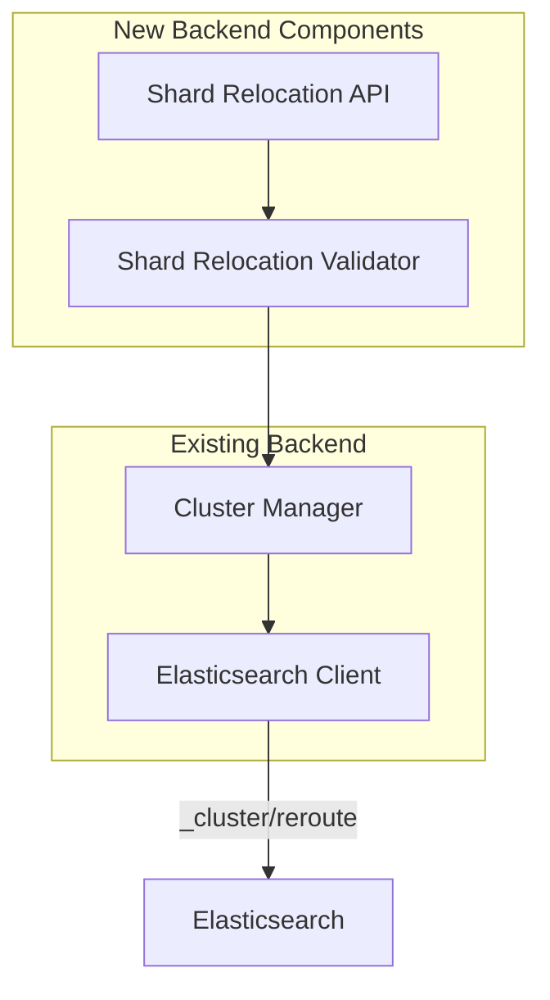
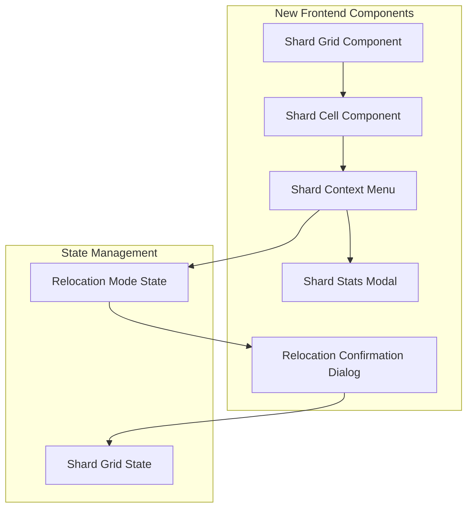
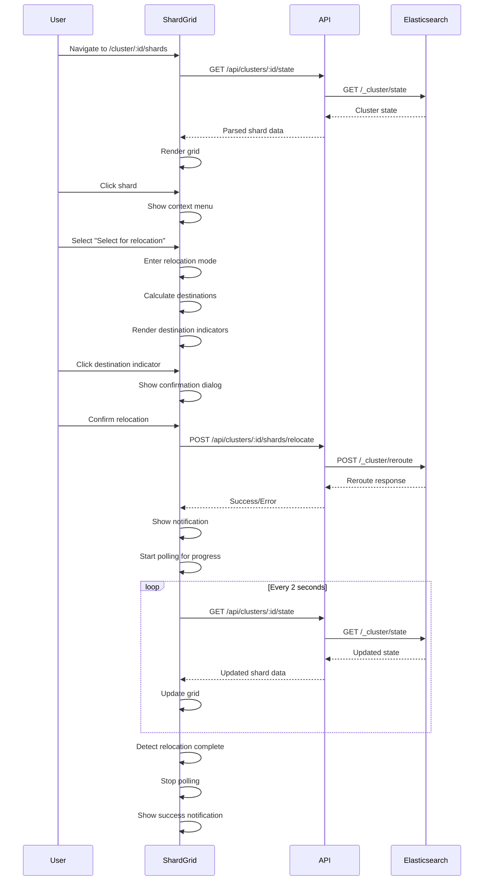

# Design Document: Project Enhancements - Rebranding and Shard Reallocation

## Overview

This design document outlines the implementation approach for three major enhancements:

1. **Project Rebranding** - Rename from "Cerebro" to "Secan"
2. **Full-Width Layout** - Remove width constraints across all views
3. **Interactive Shard Reallocation** - Visual grid-based shard management with drag-free click-to-relocate

The design maintains the existing architecture while adding new frontend components and backend endpoints for shard management.

## Selected Project Name: Secan

**Etymology:** Old English *sēcan* - to seek, to inquire

**Rationale:**
- Short and memorable (2 syllables)
- Meaningful: "to seek, to inquire" perfectly fits a search/cluster management tool
- Unique in the tech/software space (no conflicts with existing Elasticsearch tools)
- Easy to pronounce and spell
- Professional and modern
- Maintains the intelligence/search theme from Cerebro

**One-liner:** Secan is a lightweight, full-width cluster management tool for Elasticsearch, built to replace Cerebro with a focus on modern screen utility and efficient shard operations.

## Architecture Changes

### Backend Changes



### Frontend Changes



## Component Design

### 1. Dynamic Favicon Component

**Responsibilities:**
- Monitor current cluster health state
- Update browser favicon based on cluster health
- Revert to neutral favicon when not viewing a cluster
- Handle favicon updates without page flicker

**Interface:**
```typescript
interface FaviconManagerProps {
  clusterHealth: 'green' | 'yellow' | 'red' | null;
}

export function useFaviconManager(clusterHealth: 'green' | 'yellow' | 'red' | null): void;
```

**Implementation:**
```typescript
// frontend/src/hooks/useFaviconManager.ts

export function useFaviconManager(clusterHealth: 'green' | 'yellow' | 'red' | null) {
  useEffect(() => {
    const faviconLink = document.querySelector<HTMLLinkElement>('link[rel="icon"]');
    
    if (!faviconLink) {
      console.warn('Favicon link element not found');
      return;
    }
    
    // Determine which favicon to use
    let faviconPath: string;
    
    if (clusterHealth === null) {
      faviconPath = '/favicon-neutral.svg';
    } else if (clusterHealth === 'green') {
      faviconPath = '/favicon-green.svg';
    } else if (clusterHealth === 'yellow') {
      faviconPath = '/favicon-yellow.svg';
    } else if (clusterHealth === 'red') {
      faviconPath = '/favicon-red.svg';
    } else {
      faviconPath = '/favicon-neutral.svg';
    }
    
    // Update favicon
    faviconLink.href = faviconPath;
  }, [clusterHealth]);
}
```

**Usage in Cluster View:**
```typescript
// frontend/src/pages/ClusterView.tsx

export function ClusterView() {
  const { clusterId } = useParams();
  const { data: clusterHealth } = useClusterHealth(clusterId);
  
  // Update favicon based on cluster health
  useFaviconManager(clusterHealth?.status || null);
  
  return (
    <div>
      {/* Cluster view content */}
    </div>
  );
}
```

**Usage in Clusters List:**
```typescript
// frontend/src/pages/ClustersList.tsx

export function ClustersList() {
  // Always use neutral favicon on clusters list
  useFaviconManager(null);
  
  return (
    <div>
      {/* Clusters list content */}
    </div>
  );
}
```

### 2. Shard Grid Component

**Responsibilities:**
- Render grid layout with nodes as rows and indices as columns
- Display node statistics and index metadata
- Handle scroll and virtualization for large clusters
- Manage shard selection and relocation mode
- Poll for cluster state updates

**Interface:**
```typescript
interface ShardGridProps {
  clusterId: string;
  refreshInterval?: number;
}

interface ShardGridData {
  nodes: NodeWithShards[];
  indices: IndexMetadata[];
  unassignedShards: ShardInfo[];
}

interface NodeWithShards {
  id: string;
  name: string;
  ip: string;
  heap: NodeHeapStats;
  disk: NodeDiskStats;
  cpu: number;
  load: number[];
  shards: Map<string, ShardInfo[]>; // index name -> shards
}

interface IndexMetadata {
  name: string;
  shardCount: number;
  docsCount: number;
  size: number;
}

interface ShardInfo {
  shard: number;
  index: string;
  primary: boolean;
  state: 'STARTED' | 'INITIALIZING' | 'RELOCATING' | 'UNASSIGNED';
  node?: string;
  relocatingNode?: string;
  docs: number;
  size: number;
}

export function ShardGrid({ clusterId, refreshInterval = 30000 }: ShardGridProps): JSX.Element;
```

**Layout Structure:**
```
┌─────────────┬──────────────┬──────────────┬──────────────┐
│             │  Index 1     │  Index 2     │  Index 3     │
│             │  shards: 2   │  shards: 3   │  shards: 1   │
├─────────────┼──────────────┼──────────────┼──────────────┤
│ Node 1      │  ┌───┐ ┌───┐ │  ┌───┐       │              │
│ 10.0.0.1    │  │ 0 │ │ 1 │ │  │ 0 │       │              │
│ heap: 50%   │  └───┘ └───┘ │  └───┘       │              │
├─────────────┼──────────────┼──────────────┼──────────────┤
│ Node 2      │              │  ┌───┐ ┌───┐ │  ┌───┐       │
│ 10.0.0.2    │              │  │ 1 │ │ 2 │ │  │ 0 │       │
│ heap: 45%   │              │  └───┘ └───┘ │  └───┘       │
└─────────────┴──────────────┴──────────────┴──────────────┘
```

### 2. Shard Cell Component

**Responsibilities:**
- Render individual shard box
- Apply color coding based on shard state
- Handle click events for selection
- Display shard number and type indicator

**Interface:**
```typescript
interface ShardCellProps {
  shard: ShardInfo;
  isSelected: boolean;
  isDestinationIndicator: boolean;
  onClick: (shard: ShardInfo) => void;
}

export function ShardCell({ 
  shard, 
  isSelected, 
  isDestinationIndicator, 
  onClick 
}: ShardCellProps): JSX.Element;
```

**Visual States:**
- **STARTED (healthy)**: Green border, solid fill for primary, outlined for replica
- **INITIALIZING**: Yellow border, dashed pattern
- **RELOCATING**: Orange border, animated gradient
- **UNASSIGNED**: Red border, no fill
- **Destination Indicator**: Purple dashed border, semi-transparent fill
- **Selected**: Pulsing animation, thicker border

### 3. Shard Context Menu

**Responsibilities:**
- Display menu options when shard is clicked
- Handle "Display shard stats" action
- Handle "Select for relocation" action
- Position menu near clicked shard

**Interface:**
```typescript
interface ShardContextMenuProps {
  shard: ShardInfo;
  position: { x: number; y: number };
  onClose: () => void;
  onShowStats: (shard: ShardInfo) => void;
  onSelectForRelocation: (shard: ShardInfo) => void;
}

export function ShardContextMenu({
  shard,
  position,
  onClose,
  onShowStats,
  onSelectForRelocation
}: ShardContextMenuProps): JSX.Element;
```

**Implementation:**
- Use Mantine Menu component
- Position using absolute positioning
- Close on outside click or Escape key
- Disable "Select for relocation" for UNASSIGNED shards

### 4. Shard Stats Modal

**Responsibilities:**
- Display detailed shard information
- Show shard metrics and statistics
- Provide close action

**Interface:**
```typescript
interface ShardStatsModalProps {
  shard: ShardInfo;
  opened: boolean;
  onClose: () => void;
}

interface DetailedShardStats extends ShardInfo {
  segments: number;
  merges: number;
  refreshes: number;
  flushes: number;
}

export function ShardStatsModal({ 
  shard, 
  opened, 
  onClose 
}: ShardStatsModalProps): JSX.Element;
```

**Display Information:**
- Shard number and type (primary/replica)
- Index name
- Node name and ID
- State (STARTED, INITIALIZING, etc.)
- Document count
- Size in bytes (formatted)
- Segments count
- Additional metrics from shard stats API

### 5. Relocation Confirmation Dialog

**Responsibilities:**
- Confirm shard relocation action
- Display source and destination details
- Show warning about performance impact
- Execute relocation on confirmation

**Interface:**
```typescript
interface RelocationConfirmDialogProps {
  shard: ShardInfo;
  sourceNode: NodeWithShards;
  destinationNode: NodeWithShards;
  opened: boolean;
  onClose: () => void;
  onConfirm: () => Promise<void>;
}

export function RelocationConfirmDialog({
  shard,
  sourceNode,
  destinationNode,
  opened,
  onClose,
  onConfirm
}: RelocationConfirmDialogProps): JSX.Element;
```

**Dialog Content:**
```
┌─────────────────────────────────────────────┐
│  Confirm Shard Relocation                   │
├─────────────────────────────────────────────┤
│                                             │
│  Index: logs-2024.01                        │
│  Shard: 0 (primary)                         │
│                                             │
│  From: node-1 (10.0.0.1)                    │
│  To:   node-2 (10.0.0.2)                    │
│                                             │
│  ⚠️  Warning: Shard relocation may impact   │
│     cluster performance during the move.    │
│                                             │
│  [ Cancel ]              [ Relocate Shard ] │
└─────────────────────────────────────────────┘
```

## State Management

### Shard Grid State

```typescript
interface ShardGridState {
  // Data
  nodes: NodeWithShards[];
  indices: IndexMetadata[];
  unassignedShards: ShardInfo[];
  
  // UI State
  selectedShard: ShardInfo | null;
  relocationMode: boolean;
  destinationIndicators: Map<string, ShardInfo>; // nodeId -> shard
  
  // Loading State
  loading: boolean;
  error: Error | null;
  
  // Actions
  selectShard: (shard: ShardInfo) => void;
  enterRelocationMode: (shard: ShardInfo) => void;
  exitRelocationMode: () => void;
  calculateDestinations: (shard: ShardInfo) => void;
  relocateShard: (shard: ShardInfo, toNode: string) => Promise<void>;
  refresh: () => Promise<void>;
}

// Zustand store
export const useShardGridStore = create<ShardGridState>((set, get) => ({
  // ... implementation
}));
```

### Relocation Mode Logic

**Entering Relocation Mode:**
1. User clicks "Select for relocation" in context menu
2. Store selected shard in state
3. Calculate valid destination nodes
4. Create destination indicators for valid nodes
5. Render destination indicators in grid
6. Add event listeners for destination clicks and Escape key

**Calculating Valid Destinations:**
```typescript
function calculateValidDestinations(
  shard: ShardInfo,
  nodes: NodeWithShards[]
): Map<string, ShardInfo> {
  const destinations = new Map<string, ShardInfo>();
  
  for (const node of nodes) {
    // Skip source node
    if (node.id === shard.node) continue;
    
    // Skip if node already has this shard
    const indexShards = node.shards.get(shard.index) || [];
    if (indexShards.some(s => s.shard === shard.shard)) continue;
    
    // Skip non-data nodes
    if (!node.roles.includes('data')) continue;
    
    // Create destination indicator
    destinations.set(node.id, {
      ...shard,
      node: node.id,
      state: 'STARTED' // Indicator shows as if shard would be there
    });
  }
  
  return destinations;
}
```

**Exiting Relocation Mode:**
1. User clicks destination indicator (triggers relocation)
2. User clicks outside grid
3. User presses Escape key
4. Clear selected shard
5. Clear destination indicators
6. Remove event listeners

## Backend API Design

### Shard Relocation Endpoint

**Route:** `POST /api/clusters/:id/shards/relocate`

**Request Body:**
```json
{
  "index": "logs-2024.01",
  "shard": 0,
  "from_node": "node-1-id",
  "to_node": "node-2-id"
}
```

**Response (Success):**
```json
{
  "acknowledged": true,
  "state": {
    "cluster_name": "my-cluster",
    "version": 123,
    "state_uuid": "abc123"
  }
}
```

**Response (Error):**
```json
{
  "error": "illegal_argument_exception",
  "message": "Cannot move shard [logs-2024.01][0] from node-1-id to node-2-id: shard already exists on target node"
}
```

**Implementation:**
```rust
// backend/src/routes/shards.rs

#[derive(Debug, Deserialize)]
pub struct RelocateShardRequest {
    pub index: String,
    pub shard: u32,
    pub from_node: String,
    pub to_node: String,
}

pub async fn relocate_shard(
    Path(cluster_id): Path<String>,
    State(cluster_manager): State<Arc<ClusterManager>>,
    Json(req): Json<RelocateShardRequest>,
) -> Result<Json<Value>, AppError> {
    // Validate request
    validate_relocation_request(&req)?;
    
    // Get cluster connection
    let cluster = cluster_manager.get_cluster(&cluster_id).await?;
    
    // Build reroute command
    let command = json!({
        "commands": [{
            "move": {
                "index": req.index,
                "shard": req.shard,
                "from_node": req.from_node,
                "to_node": req.to_node
            }
        }]
    });
    
    // Execute reroute
    let response = cluster.client
        .request(Method::POST, "/_cluster/reroute", Some(command.to_string().into()))
        .await?;
    
    // Parse and return response
    let body: Value = serde_json::from_slice(&response.bytes().await?)?;
    Ok(Json(body))
}

fn validate_relocation_request(req: &RelocateShardRequest) -> Result<(), AppError> {
    // Validate index name
    if req.index.is_empty() {
        return Err(AppError::BadRequest("Index name is required".into()));
    }
    
    // Validate node IDs
    if req.from_node.is_empty() || req.to_node.is_empty() {
        return Err(AppError::BadRequest("Source and destination nodes are required".into()));
    }
    
    // Validate nodes are different
    if req.from_node == req.to_node {
        return Err(AppError::BadRequest("Source and destination nodes must be different".into()));
    }
    
    Ok(())
}
```

## Full-Width Layout Implementation

### Current Layout Constraint

The existing layout likely has a max-width constraint in the AppShell or Container component:

```typescript
// Current (constrained)
<Container size="xl"> {/* max-width: 1200px */}
  <Content />
</Container>
```

### New Full-Width Layout

```typescript
// New (full-width)
<Box style={{ width: '100%', padding: '0 1rem' }}>
  <Content />
</Box>
```

### Changes Required

1. **AppShell Component:**
   - Remove Container component or set size="fluid"
   - Use Box with 100% width
   - Add minimal horizontal padding (1rem) for edge spacing

2. **Individual Views:**
   - Remove any max-width constraints
   - Use full available width
   - Maintain responsive breakpoints for mobile

3. **Responsive Behavior:**
   - Desktop (>1920px): Full width with padding
   - Laptop (1366-1920px): Full width with padding
   - Tablet (768-1366px): Full width with padding
   - Mobile (<768px): Full width with minimal padding

## Data Flow

### Shard Grid Data Flow



## Performance Optimizations

### Virtualization for Large Grids

For clusters with >20 nodes or >20 indices, use virtualization:

```typescript
import { useVirtualizer } from '@tanstack/react-virtual';

function ShardGrid({ clusterId }: ShardGridProps) {
  const parentRef = useRef<HTMLDivElement>(null);
  
  const rowVirtualizer = useVirtualizer({
    count: nodes.length,
    getScrollElement: () => parentRef.current,
    estimateSize: () => 80, // Row height
    overscan: 5
  });
  
  const columnVirtualizer = useVirtualizer({
    horizontal: true,
    count: indices.length,
    getScrollElement: () => parentRef.current,
    estimateSize: () => 120, // Column width
    overscan: 3
  });
  
  return (
    <div ref={parentRef} style={{ overflow: 'auto', height: '100%' }}>
      <div
        style={{
          height: `${rowVirtualizer.getTotalSize()}px`,
          width: `${columnVirtualizer.getTotalSize()}px`,
          position: 'relative'
        }}
      >
        {rowVirtualizer.getVirtualItems().map(virtualRow => (
          <div key={virtualRow.index}>
            {columnVirtualizer.getVirtualItems().map(virtualColumn => (
              <ShardCell
                key={`${virtualRow.index}-${virtualColumn.index}`}
                shard={getShardAt(virtualRow.index, virtualColumn.index)}
              />
            ))}
          </div>
        ))}
      </div>
    </div>
  );
}
```

### Memoization

```typescript
const ShardCell = memo(({ shard, isSelected, onClick }: ShardCellProps) => {
  // Component implementation
}, (prevProps, nextProps) => {
  // Custom comparison for optimal re-rendering
  return (
    prevProps.shard.state === nextProps.shard.state &&
    prevProps.isSelected === nextProps.isSelected
  );
});
```

### Debounced Polling

```typescript
function useShardGridPolling(clusterId: string, enabled: boolean) {
  const [data, setData] = useState<ShardGridData | null>(null);
  
  useEffect(() => {
    if (!enabled) return;
    
    const fetchData = async () => {
      const response = await apiClient.getClusterState(clusterId);
      setData(parseShardGridData(response));
    };
    
    fetchData();
    const interval = setInterval(fetchData, 2000);
    
    return () => clearInterval(interval);
  }, [clusterId, enabled]);
  
  return data;
}
```

## Rebranding Implementation

### Files to Update

**Backend (Rust):**
1. `backend/Cargo.toml` - Package name
2. `backend/src/main.rs` - Startup message
3. `backend/README.md` - Documentation
4. `Dockerfile` - Image name and labels

**Frontend (TypeScript):**
1. `frontend/package.json` - Package name
2. `frontend/index.html` - Title tag
3. `frontend/src/App.tsx` - App title
4. `frontend/README.md` - Documentation

**Root:**
1. `README.md` - Project description
2. `CONFIGURATION.md` - Configuration examples
3. `DOCKER.md` - Docker instructions
4. `Taskfile.yml` - Task names

### Example Changes

**Before (Cerebro):**
```toml
# backend/Cargo.toml
[package]
name = "cerebro"
description = "Elasticsearch web administration tool"
```

**After (Secan):**
```toml
# backend/Cargo.toml
[package]
name = "secan"
description = "Elasticsearch cluster management tool"
```

**Before (Cerebro):**
```rust
// backend/src/main.rs
println!("Cerebro - Elasticsearch Web Admin Tool");
```

**After (Secan):**
```rust
// backend/src/main.rs
println!("Secan - Elasticsearch Cluster Management Tool");
```

## Testing Strategy

### Unit Tests

**Backend:**
```rust
#[cfg(test)]
mod tests {
    use super::*;
    
    #[test]
    fn test_validate_relocation_request() {
        let valid_req = RelocateShardRequest {
            index: "test-index".to_string(),
            shard: 0,
            from_node: "node-1".to_string(),
            to_node: "node-2".to_string(),
        };
        assert!(validate_relocation_request(&valid_req).is_ok());
        
        let invalid_req = RelocateShardRequest {
            index: "test-index".to_string(),
            shard: 0,
            from_node: "node-1".to_string(),
            to_node: "node-1".to_string(), // Same node
        };
        assert!(validate_relocation_request(&invalid_req).is_err());
    }
}
```

**Frontend:**
```typescript
describe('ShardGrid', () => {
  it('calculates valid destinations correctly', () => {
    const shard: ShardInfo = {
      shard: 0,
      index: 'test-index',
      primary: true,
      state: 'STARTED',
      node: 'node-1',
      docs: 1000,
      size: 1024000
    };
    
    const nodes: NodeWithShards[] = [
      { id: 'node-1', shards: new Map([['test-index', [shard]]]) },
      { id: 'node-2', shards: new Map() },
      { id: 'node-3', shards: new Map() }
    ];
    
    const destinations = calculateValidDestinations(shard, nodes);
    
    expect(destinations.size).toBe(2); // node-2 and node-3
    expect(destinations.has('node-1')).toBe(false); // Source node excluded
  });
});
```

### Integration Tests

Test the complete shard relocation flow:
1. Render shard grid
2. Click on a shard
3. Select "Select for relocation"
4. Verify destination indicators appear
5. Click destination indicator
6. Verify confirmation dialog appears
7. Confirm relocation
8. Verify API call is made
9. Verify notification appears
10. Verify polling starts
11. Verify grid updates when relocation completes

### Manual Testing Checklist

- [ ] Shard grid renders correctly for small clusters (5 nodes, 10 indices)
- [ ] Shard grid renders correctly for large clusters (50 nodes, 100 indices)
- [ ] Shard colors match their states (green, yellow, orange, red)
- [ ] Context menu appears on shard click
- [ ] Shard stats modal displays correct information
- [ ] Relocation mode shows destination indicators
- [ ] Destination indicators only appear on valid nodes
- [ ] Confirmation dialog shows correct source and destination
- [ ] Relocation API call succeeds
- [ ] Grid updates during relocation (shows RELOCATING state)
- [ ] Grid updates when relocation completes
- [ ] Error handling works for failed relocations
- [ ] Keyboard navigation works
- [ ] Full-width layout works on all views
- [ ] Responsive design works on mobile/tablet

## Accessibility

### Keyboard Navigation

- Tab: Focus next shard
- Shift+Tab: Focus previous shard
- Enter/Space: Open context menu for focused shard
- Arrow keys: Navigate context menu
- Escape: Close context menu or exit relocation mode

### Screen Reader Support

```typescript
<div
  role="grid"
  aria-label="Shard allocation grid"
  aria-describedby="grid-description"
>
  <div id="grid-description" className="sr-only">
    Grid showing shard allocation across nodes. 
    Use arrow keys to navigate, Enter to select a shard.
  </div>
  
  <div role="row" aria-label={`Node ${node.name}`}>
    <div
      role="gridcell"
      aria-label={`Shard ${shard.shard} of index ${shard.index}, state ${shard.state}`}
      tabIndex={0}
      onClick={handleClick}
    >
      {shard.shard}
    </div>
  </div>
</div>
```

### Color Contrast

Ensure all shard state colors meet WCAG AA standards:
- Green (STARTED): #40c057 on white background (contrast ratio: 3.5:1)
- Yellow (INITIALIZING): #fab005 on white background (contrast ratio: 2.8:1)
- Orange (RELOCATING): #fd7e14 on white background (contrast ratio: 3.2:1)
- Red (UNASSIGNED): #fa5252 on white background (contrast ratio: 4.1:1)
- Purple (Destination): #7950f2 on white background (contrast ratio: 5.2:1)

## Migration Path

### Phase 1: Rebranding (1 day)
1. Update all documentation
2. Update package names
3. Update user-facing messages
4. Test builds
5. Update Docker images

### Phase 2: Full-Width Layout (1 day)
1. Update AppShell component
2. Remove Container constraints
3. Test all views
4. Verify responsive behavior

### Phase 3: Shard Grid Foundation (2 days)
1. Implement ShardGrid component
2. Implement ShardCell component
3. Fetch and parse cluster state
4. Render basic grid
5. Add color coding

### Phase 4: Shard Selection (1 day)
1. Implement ShardContextMenu
2. Implement ShardStatsModal
3. Handle shard clicks
4. Display shard details

### Phase 5: Shard Relocation (2 days)
1. Implement relocation mode
2. Calculate destination indicators
3. Implement RelocationConfirmDialog
4. Add backend API endpoint
5. Integrate relocation flow

### Phase 6: Polish and Optimization (1 day)
1. Add virtualization
2. Optimize performance
3. Add keyboard navigation
4. Test accessibility
5. Handle edge cases

Total estimated time: 8 days
