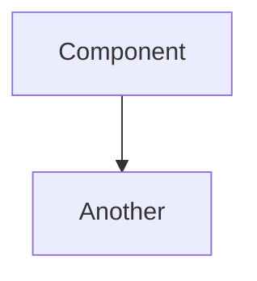

# Documentation Setup

## Features Implemented

### 1. Mermaid Diagram Support
- **Package:** `astro-mermaid` (v1.3.1)
- **Status:** ✅ Active
- **Usage:** Create code blocks with ` ```mermaid ` language identifier in markdown
- **Example:** See `docs/src/content/docs/getting-started/architecture.md`

### 2. Documentation Versioning
- **Package:** `starlight-versions` (v0.7.0)
- **Status:** ✅ Active
- **How it works:**
  - Current docs in `src/content/docs/` are served as "Latest"
  - Archived versions stored in `src/content/versions/{version}/`
  - Version selector dropdown in docs header
  - URL structure: `/secan/` (latest), `/secan/0.2/` (v0.2), etc.

## Workflow: Creating a New Release

### Step 1: Update Version
```bash
just version-bump 1.1.0
```

This automatically:
1. Updates `Cargo.toml` with new version
2. Updates `frontend/package.json` with new version
3. Commits all changes: `chore: bump version to 1.1.0`

### Step 2: Register Version in Docs (IMPORTANT)
Edit `docs/astro.config.mjs` and add the new version to the versions array:
```javascript
versions: [
  { slug: '1.1', label: 'v1.1.x' },  // ← Add this line
  { slug: '1.0', label: 'v1.0.x' },
  { slug: '0.2', label: 'v0.2.x' },
],
```

Commit this change:
```bash
git add docs/astro.config.mjs
git commit -m "docs: add v1.1 to version selector"
git push origin main
```

### Step 3: Create Release Tag
```bash
git tag -a "v1.1.0" -m "Release v1.1.0"
git push origin v1.1.0
```

### GitHub Actions Automatically:

**For tags matching `v*.*.*`:**
1. **build-docs job:**
   - Builds docs from the tagged commit
   - Since astro.config.mjs lists all versions, the version selector includes all of them
   - Copies built docs to `/secan/1.1/` (if tag is v1.1.0, extracts major.minor)

2. **deploy-docs job:**
   - Deploys to GitHub Pages
   - Results in:
     - `https://wasilak.github.io/secan/` → latest (main branch)
     - `https://wasilak.github.io/secan/1.1/` → v1.1.0 docs (with full version selector)
     - `https://wasilak.github.io/secan/1.0/` → v1.0.0 docs (with full version selector)
     - `https://wasilak.github.io/secan/0.2/` → v0.2.0 docs (with full version selector)

**For main branch pushes:**
- Builds current docs as "Latest"
- Deploys to `/secan/` 
- Version selector reflects all versions currently in astro.config.mjs

## File Structure After Release

```
docs/
├── src/
│   ├── content/
│   │   ├── docs/              ← Current/Latest version
│   │   │   ├── getting-started/
│   │   │   │   └── architecture.md
│   │   │   ├── features/
│   │   │   └── ...
│   │   └── versions/           ← Archived versions
│   │       ├── 1.1/
│   │       │   └── docs.json
│   │       └── 0.2/
│   │           └── docs.json
│   └── content.config.ts      ← Includes docsVersionsLoader
├── astro.config.mjs           ← Updated by build script for tags
├── package.json
└── ...
```

## Key Files

- **astro.config.mjs** - Starlight + Mermaid + Versions configuration
- **src/content.config.ts** - Content collections with versions loader
- **scripts/bump-version.sh** - Updates version + docs config + creates tag
- **docs/src/content/docs/getting-started/architecture.md** - Example Mermaid diagram
- **.github/workflows/ci-cd.yml** - Build and deploy automation

## Adding a Second Archived Version

When you tag `v1.1.0`, the script automatically adds it. But to maintain older versions when creating even newer ones, just keep the versions in `astro.config.mjs`.

For example, after tagging v1.1.0 and v2.0.0:
```javascript
versions: [
  { slug: '2.0', label: 'v2.0.x' },
  { slug: '1.1', label: 'v1.1.x' },
  { slug: '0.2', label: 'v0.2.x' },
]
```

Each CI build includes all versions.

## Local Development

```bash
# Start dev server (includes all versions)
just docs-dev

# Build production (includes all versions)
just docs-build

# Preview production build
just docs-preview
```

## Adding More Diagrams

Create any markdown file with Mermaid code blocks:
```markdown
## System Architecture


```

All diagram types supported: flowchart, sequence, state, class, ER, etc.

## Troubleshooting

**"Version not showing in selector"**
- Verify version added to `astro.config.mjs` versions array
- Run build: `npm run build`
- Check `dist/` contains version directory

**"Build fails for tag"**
- Verify script permissions: `chmod +x scripts/update-docs-version.sh`
- Check tag format matches `v*.*.*`
- Review GitHub Actions logs

**"Deploy didn't update"**
- Check GitHub Pages is enabled in repo settings
- Verify branch is set to "GitHub Actions" as source
- Wait 1-2 minutes for Pages deployment

## Next Steps

1. Test by creating a release: `just version-bump 0.3.0`
2. Push: `git push origin main --tags`
3. Watch GitHub Actions complete docs build and deploy
4. Verify at https://wasilak.github.io/secan/ and https://wasilak.github.io/secan/0.3/
