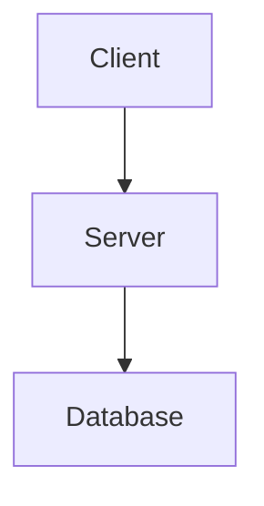

# Documentation Setup

## Features

### 1. Mermaid Diagram Support
- **Package:** `astro-mermaid` (v1.3.1)
- Render diagrams directly in markdown with ` ```mermaid ` blocks
- Example: `docs/src/content/docs/getting-started/architecture.md`

### 2. Documentation Versioning
- **Package:** `starlight-versions` (v0.7.0)
- Version selector dropdown in docs header
- URL structure: `/secan/` (latest), `/secan/1.2/` (archived), etc.

## Workflow: Release and Version Docs

### 1. Update Code & Docs on main
Make your code and documentation changes, commit to main:
```bash
git add .
git commit -m "feature: add new feature"
git push origin main
```

### 2. When Ready to Release: Register Version
Edit `docs/astro.config.mjs` and add the version to the versions array:
```javascript
versions: [
  { slug: '1.2', label: 'v1.2.x' },  // ← Add new version
  { slug: '1.1', label: 'v1.1.x' },
  { slug: '0.2', label: 'v0.2.x' },
],
```

Commit:
```bash
git add docs/astro.config.mjs
git commit -m "docs: register v1.2"
git push origin main
```

### 3. Create Git Tag
```bash
git tag -a "v1.2.0" -m "Release v1.2.0"
git push origin v1.2.0
```

### 4. Build & Deploy Docs Locally
```bash
# Build production docs
just docs-build-complete

# Docs are in docs/dist/
# - Current version goes to: docs/dist/
# - Extract version from git tag, e.g., v1.2.0 → 1.2
# - Archive to: docs/dist/1.2/

# Deploy manually to GitHub Pages or your hosting
```

## Local Development

```bash
# Dev server with live reload
just docs-dev

# Production build
just docs-build-complete

# Preview production build
just docs-preview
```

## Adding Diagrams

Create markdown files with Mermaid blocks:
```markdown
## System Architecture


```

All Mermaid diagram types supported: flowchart, sequence, state, class, ER, gantt, etc.

## File Structure

```
docs/
├── src/
│   ├── content/
│   │   ├── docs/                    ← Current/latest docs
│   │   │   ├── getting-started/
│   │   │   └── features/
│   │   └── versions/                ← Starlight versions loader
│   └── content.config.ts
├── astro.config.mjs                 ← Version selector config
├── package.json
└── dist/                            ← Built output (not in git)
```

## Release Process Summary

| Step | Action |
|------|--------|
| 1 | Make code/docs changes on main |
| 2 | Add version slug to `astro.config.mjs`, commit, push |
| 3 | Create git tag: `git tag -a v1.2.0 ...` and push |
| 4 | Run `just docs-build-complete` locally |
| 5 | Copy `docs/dist/` to `/secan/` (latest) and `/secan/1.2/` (archive) |

That's it. No complex CI/CD versioning logic—just git tags marking release points, and manual version registration in the config.
