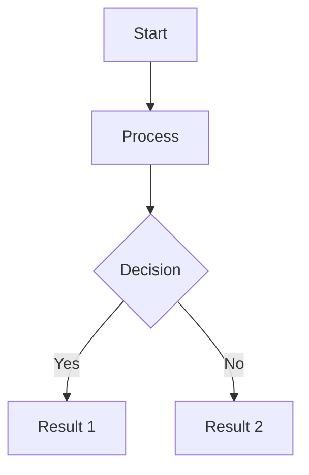

# Migration Guide: Starlight to Docusaurus

This document explains the migration from Starlight (Astro-based) to Docusaurus (React-based) for Secan documentation, what changed, and how to work with the new system.

## Why We Migrated

The Starlight documentation framework experienced frequent build failures and reliability issues. Docusaurus provides:

- **Better Build Reliability**: Consistent, reproducible builds without random failures
- **Mature Ecosystem**: Larger community, more plugins, better support
- **Better Versioning**: Native support for multiple documentation versions
- **Improved Performance**: Faster builds and better runtime performance
- **Enhanced Features**: Better search, theming, and component system

## What Changed

### Framework and Technology

| Aspect | Starlight (Old) | Docusaurus (New) |
|--------|----------------|------------------|
| **Framework** | Astro | React |
| **Build Tool** | Astro | Webpack (bundled) |
| **Language** | Astro components | React/TypeScript |
| **Config File** | `astro.config.mjs` | `docusaurus.config.js` |
| **Content Dir** | `src/content/docs/` | `docs/` |
| **Build Output** | `dist/` | `build/` |
| **Dev Server** | `npm run dev` | `npm run start` |

### Directory Structure Changes

**Before (Starlight):**
```
docs/
├── src/
│   ├── content/
│   │   └── docs/           # Documentation content
│   └── assets/             # Images and assets
├── public/                 # Static files
├── astro.config.mjs        # Configuration
└── dist/                   # Build output
```

**After (Docusaurus):**
```
docs/
├── docs/                   # Documentation content (current version)
├── versioned_docs/         # Versioned documentation
├── src/
│   ├── components/         # Custom React components
│   ├── css/               # Custom styling
│   └── pages/             # Custom pages (landing page)
├── static/
│   ├── img/               # Images and assets
│   └── api/               # Rust API docs
├── docusaurus.config.js   # Configuration
├── sidebars.js            # Sidebar structure
└── build/                 # Build output
```

### Content Location Changes

| Content Type | Starlight Path | Docusaurus Path |
|-------------|----------------|-----------------|
| Documentation | `src/content/docs/` | `docs/` |
| Images | `src/assets/` | `static/img/` |
| Logo | `public/sproutling.png` | `static/img/sproutling.png` |
| Landing Page | `src/content/docs/index.mdx` | `src/pages/index.tsx` |
| Config | `astro.config.mjs` | `docusaurus.config.js` |

### Frontmatter Changes

**Starlight Frontmatter:**
```markdown
---
title: Page Title
description: Page description
template: doc
---
```

**Docusaurus Frontmatter:**
```markdown
---
id: page-id
title: Page Title
description: Page description
sidebar_label: Sidebar Label
sidebar_position: 1
---
```

**Key Differences:**
- `template` field removed (not needed in Docusaurus)
- `id` field optional (defaults to filename)
- `sidebar_label` optional (defaults to title)
- `sidebar_position` optional (for ordering)

### Component Changes

#### Card Components

**Starlight:**
```markdown
<Card title="Feature Name" icon="🚀">
  Feature description here
</Card>
```

**Docusaurus:**
```markdown
:::tip Feature Name
Feature description here
:::
```

Or use custom React components:
```jsx
import Card from '@site/src/components/Card';

<Card title="Feature Name" icon="🚀">
  Feature description here
</Card>
```

#### CardGrid Components

**Starlight:**
```markdown
<CardGrid cols={2}>
  <Card>...</Card>
  <Card>...</Card>
</CardGrid>
```

**Docusaurus:**
```markdown
<div className="card-grid">
  <div className="card">...</div>
  <div className="card">...</div>
</div>
```

Or use CSS Grid in custom components.

### Link Changes

**Starlight Links:**
```markdown
[Link](/secan/getting-started/about/)
```

**Docusaurus Links:**
```markdown
[Link](/getting-started/about)
```

**Key Differences:**
- Remove `/secan/` prefix (handled by baseUrl)
- Remove trailing slashes
- Relative links work the same: `./page.md` or `../other/page.md`

### Asset Path Changes

**Starlight:**
```markdown

```

**Docusaurus:**
```markdown

```

**Key Differences:**
- All assets in `static/img/`
- Use absolute paths from root: `/img/filename.png`
- No relative paths needed

### Command Changes

| Task | Starlight Command | Docusaurus Command |
|------|------------------|-------------------|
| **Dev Server** | `npm run dev` | `npm run start` |
| **Build** | `npm run build` | `npm run build` |
| **Preview** | `npm run preview` | `npm run serve` |
| **Clear Cache** | N/A | `npm run clear` |

**Important**: All commands now use `/secan/` base path automatically to match production.

## How to Update Content

### Adding a New Page

1. **Create the markdown file** in the appropriate directory:
   ```bash
   touch docs/features/my-new-feature.md
   ```

2. **Add frontmatter**:
   ```markdown
   ---
   title: My New Feature
   description: Description of the feature
   sidebar_position: 5
   ---
   
   # My New Feature
   
   Content here...
   ```

3. **Update sidebar** (if needed) in `sidebars.js`:
   ```javascript
   {
     type: 'category',
     label: 'Features',
     items: [
       'features/dashboard',
       'features/my-new-feature', // Add here
     ],
   }
   ```

4. **Test locally**:
   ```bash
   npm run start
   ```

### Updating Existing Content

1. **Find the file** in `docs/` directory
2. **Edit the markdown** using standard Markdown syntax
3. **Save the file** - changes appear immediately in dev server
4. **Verify** the changes look correct

### Adding Images

1. **Copy image** to `static/img/`:
   ```bash
   cp ~/my-image.png docs/static/img/my-image.png
   ```

2. **Reference in markdown**:
   ```markdown
   
   ```

3. **Verify** image displays correctly

### Using Admonitions

Replace Starlight Cards with Docusaurus Admonitions:

```markdown
:::note
This is a note - for general information.
:::

:::tip
This is a tip - for helpful suggestions.
:::

:::info
This is info - for important information.
:::

:::warning
This is a warning - for cautionary information.
:::

:::danger
This is danger - for critical warnings.
:::
```

### Using Mermaid Diagrams

Mermaid syntax remains the same:

````markdown

````

The theme automatically adjusts for light/dark mode.

### Using Code Blocks

Code blocks work the same way:

````markdown
```rust
fn main() {
    println!("Hello, Secan!");
}
```

```yaml
server:
  host: "0.0.0.0"
  port: 9000
```
````

## How to Add New Features

### Creating Custom Components

1. **Create component file** in `src/components/`:
   ```bash
   touch docs/src/components/MyComponent.tsx
   ```

2. **Write React component**:
   ```typescript
   import React from 'react';
   
   interface MyComponentProps {
     title: string;
     children: React.ReactNode;
   }
   
   export default function MyComponent({ title, children }: MyComponentProps) {
     return (
       <div className="my-component">
         <h3>{title}</h3>
         <div>{children}</div>
       </div>
     );
   }
   ```

3. **Use in markdown**:
   ```markdown
   import MyComponent from '@site/src/components/MyComponent';
   
   <MyComponent title="Example">
     Content here
   </MyComponent>
   ```

### Adding Custom Styles

1. **Edit** `src/css/custom.css`:
   ```css
   .my-custom-class {
     background-color: var(--ifm-color-primary);
     padding: 1rem;
     border-radius: 4px;
   }
   ```

2. **Use in markdown**:
   ```markdown
   <div className="my-custom-class">
     Styled content
   </div>
   ```

### Adding Plugins

1. **Install plugin**:
   ```bash
   npm install --save @docusaurus/plugin-name
   ```

2. **Configure in** `docusaurus.config.js`:
   ```javascript
   module.exports = {
     plugins: [
       '@docusaurus/plugin-name',
     ],
   };
   ```

3. **Restart dev server**:
   ```bash
   npm run start
   ```

### Customizing Theme

Edit `src/css/custom.css` to customize colors:

```css
:root {
  /* Light mode colors */
  --ifm-color-primary: #2e8555;
  --ifm-color-primary-dark: #29784c;
  /* ... more colors */
}

[data-theme='dark'] {
  /* Dark mode colors */
  --ifm-color-primary: #25c2a0;
  --ifm-color-primary-dark: #21af90;
  /* ... more colors */
}
```

## Versioning

### Creating a New Version

When releasing a new Secan version:

```bash
npm run docusaurus docs:version 1.2
```

This creates:
- `versioned_docs/version-1.2/` - Snapshot of current docs
- `versioned_sidebars/version-1.2-sidebars.json` - Sidebar config
- Updates `versions.json`

### Editing Versioned Docs

- **Current development**: Edit files in `docs/`
- **Released versions**: Edit files in `versioned_docs/version-X.X/`

### Version Configuration

Edit `docusaurus.config.js`:

```javascript
docs: {
  lastVersion: 'current',
  versions: {
    current: {
      label: '1.3.x (Next)',
      path: '/',
    },
    '1.2': {
      label: '1.2.x',
      path: '1.2',
    },
  },
}
```

## Troubleshooting Common Issues

### Build Fails with "Cannot resolve module"

**Problem**: Missing dependency or incorrect import path

**Solution**:
```bash
# Clear cache and reinstall
npm run clear
rm -rf node_modules package-lock.json
npm install
npm run build
```

### Broken Links After Migration

**Problem**: Links still use old Starlight format

**Solution**: Update links to remove `/secan/` prefix and trailing slashes:
```markdown
<!-- Old -->
[Link](/secan/getting-started/about/)

<!-- New -->
[Link](/getting-started/about)
```

### Images Not Displaying

**Problem**: Image paths still use old relative paths

**Solution**: Move images to `static/img/` and use absolute paths:
```markdown
<!-- Old -->


<!-- New -->

```

### Mermaid Diagrams Not Rendering

**Problem**: Mermaid syntax error or plugin not configured

**Solution**:
1. Check diagram syntax is valid
2. Ensure code block uses `mermaid` language:
   ````markdown
   ```mermaid
   graph TD
       A --> B
   ```
   ````
3. Verify `@docusaurus/theme-mermaid` is in `docusaurus.config.js`

### Changes Not Appearing in Dev Server

**Problem**: Browser cache or dev server not reloading

**Solution**:
1. Hard refresh: `Ctrl+Shift+R` (Windows/Linux) or `Cmd+Shift+R` (macOS)
2. Restart dev server: `Ctrl+C` then `npm run start`
3. Clear Docusaurus cache: `npm run clear`

### GitHub Pages Shows 404

**Problem**: Base URL mismatch or deployment issue

**Solution**:
1. Verify `baseUrl: '/secan/'` in `docusaurus.config.js`
2. Check GitHub Pages is enabled in repository settings
3. Verify GitHub Actions workflow completed successfully
4. Check deployment logs in Actions tab

### Assets Not Loading on GitHub Pages

**Problem**: Asset paths don't include base URL

**Solution**: Use absolute paths from root:
```markdown
<!-- Correct -->


<!-- Incorrect -->


```

### Version Selector Not Showing

**Problem**: Versioning not configured or `versions.json` missing

**Solution**:
1. Ensure `versions.json` exists and contains versions:
   ```json
   ["1.1"]
   ```
2. Verify version dropdown is in navbar config:
   ```javascript
   navbar: {
     items: [
       {
         type: 'docsVersionDropdown',
         position: 'right',
       },
     ],
   }
   ```

### Port 3000 Already in Use

**Problem**: Another process using port 3000

**Solution**:
```bash
# Use different port
npm run start -- --port 3001

# Or kill process on port 3000 (Linux/macOS)
lsof -ti:3000 | xargs kill -9

# Windows
netstat -ano | findstr :3000
taskkill /PID <PID> /F
```

## Migration Checklist

Use this checklist when migrating content from Starlight:

- [ ] Update frontmatter (remove `template`, add optional fields)
- [ ] Convert Card components to Admonitions or custom components
- [ ] Convert CardGrid to CSS Grid or custom components
- [ ] Update internal links (remove `/secan/` prefix, remove trailing slashes)
- [ ] Update asset paths (move to `static/img/`, use absolute paths)
- [ ] Test Mermaid diagrams render correctly
- [ ] Verify code blocks have syntax highlighting
- [ ] Check all images display correctly
- [ ] Test all internal links work
- [ ] Verify page appears in sidebar
- [ ] Test on mobile devices
- [ ] Build locally to check for errors: `npm run build`
- [ ] Preview production build: `npm run serve`

## Key Differences Summary

### Advantages of Docusaurus

✅ **Better Build Reliability**: Consistent builds without random failures  
✅ **Native Versioning**: Built-in support for multiple versions  
✅ **Better Performance**: Faster builds and runtime performance  
✅ **Larger Ecosystem**: More plugins, themes, and community support  
✅ **Better Search**: More powerful search capabilities  
✅ **React Components**: Full React ecosystem for custom components  
✅ **Better Documentation**: Comprehensive official documentation  

### Things to Remember

⚠️ **Base URL**: All commands use `/secan/` automatically  
⚠️ **Asset Paths**: Use absolute paths from root (`/img/`)  
⚠️ **Link Format**: No trailing slashes, no `/secan/` prefix  
⚠️ **Components**: Use React/TypeScript instead of Astro  
⚠️ **Versioning**: Versioned docs are snapshots, not live  
⚠️ **Build Output**: `build/` directory instead of `dist/`  

## Additional Resources

- [Docusaurus Documentation](https://docusaurus.io/docs)
- [Docusaurus Migration Guide](https://docusaurus.io/docs/migration)
- [Markdown Guide](https://www.markdownguide.org/)
- [Mermaid Documentation](https://mermaid.js.org/)
- [React Documentation](https://react.dev/)
- [Secan Documentation README](./README.md)

## Getting Help

If you encounter issues not covered in this guide:

1. **Check the README**: See `docs/README.md` for detailed usage instructions
2. **Search Docusaurus Docs**: Most questions are answered in official docs
3. **GitHub Issues**: Report bugs or ask questions in the Secan repository
4. **Docusaurus Discord**: Join the Docusaurus community for help

## Contributing to Documentation

When contributing to the new Docusaurus documentation:

1. **Follow the style guide** in `docs/README.md`
2. **Test locally** before submitting PR
3. **Run build** to ensure no errors: `npm run build`
4. **Use clear commit messages**: `docs: add migration guide for components`
5. **Update this guide** if you discover new migration patterns

---

**Migration completed**: December 2024  
**Docusaurus version**: 3.x  
**Previous framework**: Starlight (Astro)
