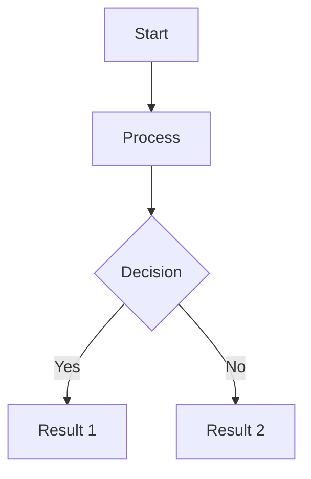

# Secan Documentation

This directory contains the Secan documentation built with [Docusaurus](https://docusaurus.io/).

## Quick Start

### Prerequisites

- Node.js 18.0.0 or higher
- npm (comes with Node.js)

### Development Server

Start the local development server to preview documentation changes:

```bash
npm run start
```

This will start the development server at `http://localhost:3000/secan/`. The server includes hot reloading, so changes to documentation files will be reflected immediately.

**Note**: The development server uses the `/secan/` base path to match the production GitHub Pages deployment, ensuring all links and assets work identically in both environments.

### Building Documentation

Build the static documentation site for production:

```bash
npm run build
```

This generates static content in the `build/` directory that can be served by any static hosting service.

### Preview Production Build

Preview the production build locally:

```bash
npm run serve
```

This serves the built documentation at `http://localhost:3000/secan/` using the same base path as production.

### Clear Cache

If you encounter build issues, clear the Docusaurus cache:

```bash
npm run clear
```

## Adding New Pages

### Creating a New Documentation Page

1. Create a new Markdown file in the appropriate directory under `docs/`:

```bash
# Example: Create a new feature documentation page
touch docs/features/my-new-feature.md
```

2. Add frontmatter to the file:

```markdown
---
id: my-new-feature
title: My New Feature
description: Description of the new feature
sidebar_label: New Feature
sidebar_position: 5
---

# My New Feature

Content goes here...
```

3. The page will automatically appear in the sidebar based on its location and `sidebar_position`.

### Frontmatter Options

- `id`: Unique identifier (optional, defaults to filename)
- `title`: Page title shown in browser tab and page header
- `description`: Page description for SEO
- `sidebar_label`: Label shown in sidebar (optional, defaults to title)
- `sidebar_position`: Order in sidebar (optional)
- `tags`: Array of tags for categorization (optional)
- `keywords`: Array of keywords for SEO (optional)

### Organizing Pages

Pages are organized by directory structure:

```
docs/
├── getting-started/
│   ├── about.md
│   ├── installation.md
│   └── architecture.md
├── features/
│   ├── dashboard.md
│   ├── cluster-details.md
│   └── my-new-feature.md
├── authentication/
│   └── index.md
└── configuration/
    ├── authentication.md
    ├── clusters.md
    └── logging.md
```

### Updating the Sidebar

The sidebar is automatically generated based on the directory structure. To customize it, edit `sidebars.js`:

```javascript
module.exports = {
  docs: [
    {
      type: 'category',
      label: 'Getting Started',
      items: [
        'getting-started/about',
        'getting-started/installation',
        'getting-started/architecture',
      ],
    },
    {
      type: 'category',
      label: 'Features',
      items: [
        'features/dashboard',
        'features/cluster-details',
        'features/my-new-feature', // Add your new page here
      ],
    },
    // ... more categories
  ],
};
```

## Creating New Versions

Docusaurus supports versioning to maintain documentation for multiple releases.

### Current Version Structure

- **Current (1.2.x Latest)**: Unversioned docs in `docs/` - for upcoming release
- **1.1**: Versioned docs in `versioned_docs/version-1.1/` - previous stable release

### Creating a New Version (e.g., Bumping to 1.3.x)

When you're ready to release a new version of Secan (e.g., releasing 1.2.0 and starting work on 1.3.x):

**Step 1: Create the version snapshot**

```bash
cd docs
npm run docusaurus docs:version 1.2
```

This command:
1. Creates `versioned_docs/version-1.2/` with a snapshot of current docs from `docs/`
2. Creates `versioned_sidebars/version-1.2-sidebars.json` with sidebar configuration
3. Updates `versions.json` to include the new version

**Step 2: Update version labels in config**

Edit `docusaurus.config.js` to update the version labels:

```javascript
docs: {
  lastVersion: 'current',
  versions: {
    current: {
      label: '1.3.x (Latest)',  // Update to next version
      path: '/',
    },
    '1.2': {                     // Add the newly created version
      label: '1.2',
      path: '1.2',
      banner: 'none',
    },
    '1.1': {
      label: '1.1',
      path: '1.1',
      banner: 'none',
    },
  },
}
```

**Step 3: Verify the changes**

```bash
# Start dev server
npm run start

# Check that:
# 1. Version dropdown shows "1.3.x (Latest)", "1.2", and "1.1"
# 2. Current docs (/) show "1.3.x (Latest)" in version selector
# 3. Clicking "1.2" shows the snapshot you just created
# 4. All links work correctly in all versions
```

**Step 4: Commit the changes**

```bash
git add versioned_docs/ versioned_sidebars/ versions.json docusaurus.config.js
git commit -m "docs: create version 1.2 and bump current to 1.3.x"
git push
```

### Complete Example: Bumping from 1.2.x to 1.3.x

Here's the complete process when releasing version 1.2.0:

```bash
# 1. Create version snapshot
cd docs
npm run docusaurus docs:version 1.2

# 2. Edit docusaurus.config.js
# Change:
#   current: { label: '1.2.x (Latest)', ... }
# To:
#   current: { label: '1.3.x (Latest)', ... }
# Add:
#   '1.2': { label: '1.2', path: '1.2', banner: 'none' }

# 3. Test locally
npm run start
# Visit http://localhost:3000/secan/
# Test version selector
# Verify all versions work

# 4. Build to verify no errors
npm run build

# 5. Commit
git add versioned_docs/ versioned_sidebars/ versions.json docusaurus.config.js
git commit -m "docs: create version 1.2 and bump current to 1.3.x"
git push
```

### Version Configuration

Edit `docusaurus.config.js` to configure version labels and paths:

```javascript
docs: {
  lastVersion: 'current',
  versions: {
    current: {
      label: '1.3.x (Latest)',  // Always shows (Latest) for current
      path: '/',                 // Current version at root path
    },
    '1.2': {
      label: '1.2',              // Released version number
      path: '1.2',               // Path: /docs/1.2/
      banner: 'none',            // No banner for recent versions
    },
    '1.1': {
      label: '1.1',
      path: '1.1',
      banner: 'none',
    },
  },
}
```

### Managing Versions

**List all versions:**
```bash
npm run docusaurus docs:version:list
```

**Editing versioned docs:**
- Current development: Edit files in `docs/`
- Released versions: Edit files in `versioned_docs/version-X.X/`

**Important**: Versioned docs are snapshots. Changes to `docs/` do NOT affect versioned docs. To update a released version, edit the files in `versioned_docs/version-X.X/` directly.

**Removing old versions:**

When a version becomes too old to maintain:

1. Delete the version directory: `rm -rf versioned_docs/version-X.X/`
2. Delete the sidebar file: `rm versioned_sidebars/version-X.X-sidebars.json`
3. Remove the version from `versions.json`
4. Remove the version from `docusaurus.config.js` versions object
5. Commit the changes

## Deployment

### GitHub Pages Deployment

Documentation is automatically deployed to GitHub Pages when changes are pushed to the `main` branch.

#### Automatic Deployment

The GitHub Actions workflow (`.github/workflows/docs.yml`) handles deployment:

1. **Triggers**: Runs on push to `main` branch (docs changes), pull requests, or manual dispatch
2. **Build**: Installs dependencies, builds Rust API docs, builds Docusaurus
3. **Deploy**: Deploys to GitHub Pages (main branch only)

#### Manual Deployment

To manually trigger deployment:

1. Go to GitHub repository → Actions tab
2. Select "Deploy Documentation" workflow
3. Click "Run workflow" → Select branch → Run

#### Deployment Configuration

The site is configured for GitHub Pages in `docusaurus.config.js`:

```javascript
url: 'https://wasilak.github.io',
baseUrl: '/secan/',
organizationName: 'wasilak',
projectName: 'secan',
```

**Important**: The `baseUrl: '/secan/'` must match the GitHub Pages path. All local development commands use this same base path to ensure consistency.

### Local Deployment Testing

Test the production build locally before deploying:

```bash
# Build the site
npm run build

# Serve the built site
npm run serve
```

Visit `http://localhost:3000/secan/` to verify everything works correctly.

## Documentation Features

### Markdown Support

Docusaurus supports standard Markdown and GitHub Flavored Markdown (GFM):

- **Headers**: `# H1`, `## H2`, `### H3`
- **Lists**: Ordered and unordered
- **Links**: `[text](url)`
- **Images**: ``
- **Code blocks**: ` ```language ... ``` `
- **Tables**: Standard Markdown tables
- **Task lists**: `- [ ] Task` and `- [x] Completed`

### Code Blocks

Code blocks support syntax highlighting for multiple languages:

````markdown
```rust
fn main() {
    println!("Hello, Secan!");
}
```

```yaml
server:
  host: "0.0.0.0"
  port: 9000
```

```json
{
  "cluster": "production",
  "host": "localhost:9200"
}
```
````

Supported languages: Rust, YAML, JSON, JavaScript, TypeScript, Bash, TOML, and more.

### Admonitions

Use admonitions to highlight important information:

```markdown
:::note
This is a note admonition.
:::

:::tip
This is a tip admonition.
:::

:::info
This is an info admonition.
:::

:::warning
This is a warning admonition.
:::

:::danger
This is a danger admonition.
:::
```

### Mermaid Diagrams

Create diagrams using Mermaid.js syntax:

````markdown

````

Mermaid supports:
- Flowcharts
- Sequence diagrams
- Class diagrams
- State diagrams
- Entity relationship diagrams
- Gantt charts
- And more

The theme automatically adjusts for light/dark mode.

### Tabs

Create tabbed content for multiple options:

```markdown
import Tabs from '@theme/Tabs';
import TabItem from '@theme/TabItem';

<Tabs>
  <TabItem value="linux" label="Linux" default>
    Installation instructions for Linux...
  </TabItem>
  <TabItem value="macos" label="macOS">
    Installation instructions for macOS...
  </TabItem>
  <TabItem value="windows" label="Windows">
    Installation instructions for Windows...
  </TabItem>
</Tabs>
```

### Internal Links

Link to other documentation pages:

```markdown
[Getting Started](./getting-started/about.md)
[Features](/features/dashboard)
[Configuration](../configuration/authentication.md)
```

### Images and Assets

Place images in `static/img/` and reference them:

```markdown


```

## Project Structure

```
docs/
├── docs/                          # Documentation content (current version)
│   ├── getting-started/
│   ├── features/
│   ├── authentication/
│   ├── configuration/
│   └── api/
├── versioned_docs/                # Versioned documentation
│   └── version-1.1/
├── versioned_sidebars/            # Versioned sidebars
│   └── version-1.1-sidebars.json
├── src/
│   ├── components/                # Custom React components
│   ├── css/
│   │   └── custom.css            # Custom styling
│   └── pages/
│       └── index.tsx             # Landing page
├── static/
│   ├── img/                      # Images and assets
│   │   ├── sproutling.png        # Logo
│   │   └── favicon.svg           # Favicon
│   └── api/                      # Rust API docs (generated)
├── build/                        # Built site (generated)
├── .docusaurus/                  # Docusaurus cache (generated)
├── docusaurus.config.js          # Main configuration
├── sidebars.js                   # Sidebar structure
├── versions.json                 # Version list
├── package.json                  # Dependencies and scripts
└── README.md                     # This file
```

## Troubleshooting

### Build Errors

**Problem**: Build fails with "Cannot resolve module"

**Solution**: Clear cache and reinstall dependencies:
```bash
npm run clear
rm -rf node_modules package-lock.json
npm install
npm run build
```

**Problem**: Build fails with broken links

**Solution**: Check the error message for the broken link location and fix the link:
```bash
# Docusaurus will show: "Broken link on page /features/dashboard"
# Edit the file and fix the link
```

**Problem**: Mermaid diagrams don't render

**Solution**: Check diagram syntax and ensure the code block uses `mermaid` language:
````markdown

````

### Development Server Issues

**Problem**: Changes not reflected in browser

**Solution**: 
1. Hard refresh: `Ctrl+Shift+R` (Windows/Linux) or `Cmd+Shift+R` (macOS)
2. Clear browser cache
3. Restart development server: `Ctrl+C` then `npm run start`

**Problem**: Port 3000 already in use

**Solution**: Kill the process using port 3000 or use a different port:
```bash
# Use different port
npm run start -- --port 3001

# Or kill process on port 3000 (Linux/macOS)
lsof -ti:3000 | xargs kill -9
```

### Deployment Issues

**Problem**: GitHub Pages shows 404

**Solution**: 
1. Check `baseUrl` in `docusaurus.config.js` matches GitHub Pages path
2. Verify GitHub Pages is enabled in repository settings
3. Check GitHub Actions workflow completed successfully

**Problem**: Assets not loading on GitHub Pages

**Solution**: Ensure all asset paths start with `/img/` not `./img/` or `../img/`:
```markdown
<!-- Correct -->


<!-- Incorrect -->


```

### Version Issues

**Problem**: Version selector not showing

**Solution**: Ensure `versions.json` exists and contains version entries:
```json
[
  "1.1"
]
```

**Problem**: Versioned docs not updating

**Solution**: Remember that versioned docs are snapshots. To update:
1. Edit files in `versioned_docs/version-X.X/`
2. Or create a new version snapshot with updated content

## Additional Resources

- [Docusaurus Documentation](https://docusaurus.io/docs)
- [Markdown Guide](https://www.markdownguide.org/)
- [Mermaid Documentation](https://mermaid.js.org/)
- [GitHub Pages Documentation](https://docs.github.com/en/pages)

## Contributing

When contributing to documentation:

1. **Create a branch**: `git checkout -b docs/my-improvement`
2. **Make changes**: Edit markdown files in `docs/`
3. **Test locally**: Run `npm run start` and verify changes
4. **Build test**: Run `npm run build` to ensure no errors
5. **Commit**: Use clear commit messages: `docs: add installation guide for Windows`
6. **Push and PR**: Push branch and create pull request

### Documentation Style Guide

- Use clear, concise language
- Include code examples where appropriate
- Add screenshots for UI features
- Use admonitions for important notes
- Test all commands and code examples
- Keep line length reasonable (80-100 characters)
- Use proper heading hierarchy (H1 → H2 → H3)

## Support

For issues or questions:

- **Documentation Issues**: [GitHub Issues](https://github.com/wasilak/secan/issues)
- **Secan Issues**: [GitHub Issues](https://github.com/wasilak/secan/issues)
- **Docusaurus Issues**: [Docusaurus GitHub](https://github.com/facebook/docusaurus/issues)
