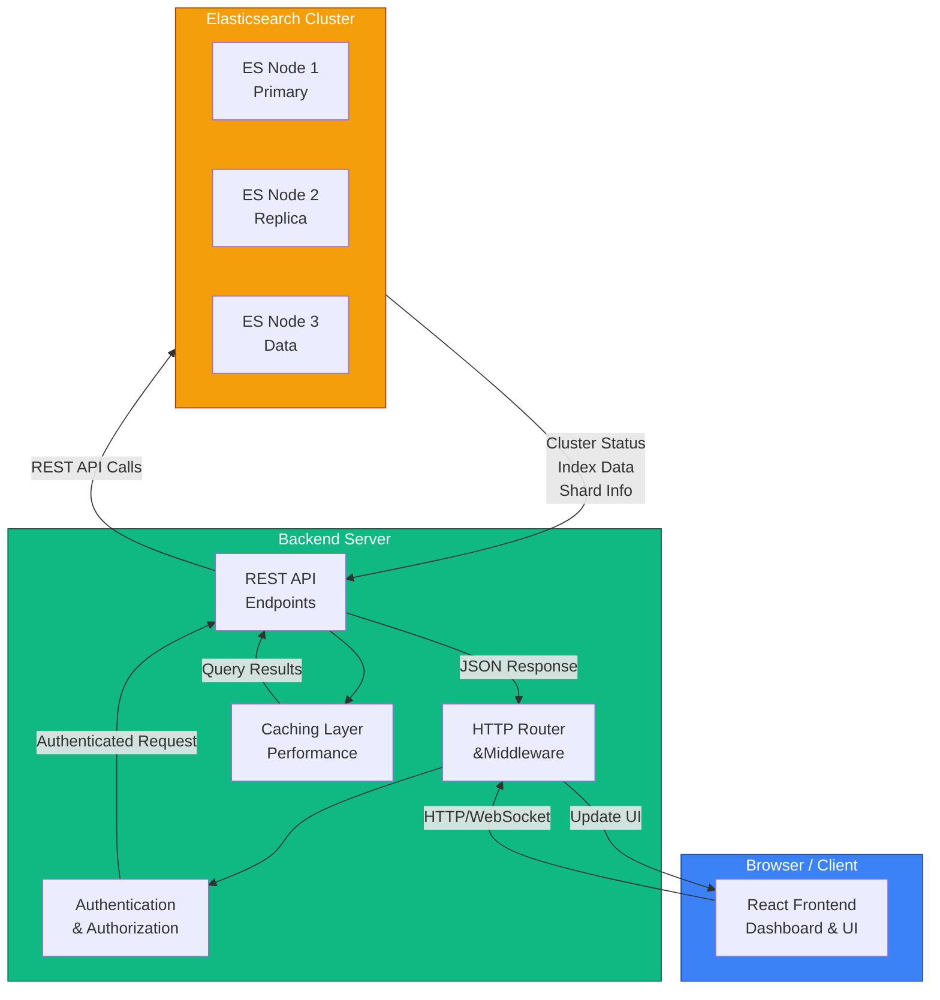

## System Architecture

Secan follows a modern client-server architecture designed for efficient Elasticsearch cluster management.

## Component Breakdown

### Frontend (React)

* **Dashboard**: Visual overview of cluster health and metrics
* **Cluster Management**: View and manage cluster settings
* **Index Management**: Create, delete, and configure indices
* **Shard Management**: Monitor and manage shard allocation
* **REST Console**: Interactive API exploration tool

### Backend (Rust)

* **HTTP Server**: High-performance Actix-web server
* **Authentication**: Support for multiple auth methods (Basic, OAuth, API Keys)
* **Request Routing**: Intelligent routing to appropriate handlers
* **Caching**: Intelligent caching for frequently accessed data
* **API Proxying**: Secure communication with Elasticsearch clusters

### Elasticsearch Cluster

* **Nodes**: Multiple nodes for redundancy and scalability
* **Shards**: Distributed data storage and processing
* **Replicas**: Data redundancy and fault tolerance
* **Indices**: Organized data structures for efficient querying

## Data Flow

1. **User Interaction**: User interacts with React frontend
2. **HTTP Request**: Frontend sends HTTP request to backend
3. **Authentication**: Backend validates user credentials/tokens
4. **Request Processing**: Backend routes request to appropriate handler
5. **Elasticsearch Query**: Backend queries Elasticsearch cluster
6. **Response Processing**: Backend processes and caches response
7. **UI Update**: Frontend receives response and updates UI

## Security Architecture

* **Authentication Layer**: Protects backend endpoints
* **Encryption**: HTTPS for data in transit
* **Token-based Auth**: Support for JWT and API keys
* **Request Validation**: Input validation on all endpoints
* **Audit Logging**: Track all administrative actions

## Scalability Features

* **Stateless Backend**: Easy horizontal scaling
* **Connection Pooling**: Efficient resource utilization
* **Request Caching**: Reduced load on Elasticsearch
* **Multi-cluster Support**: Manage multiple Elasticsearch clusters
* **Async Processing**: Non-blocking operations for better throughput
