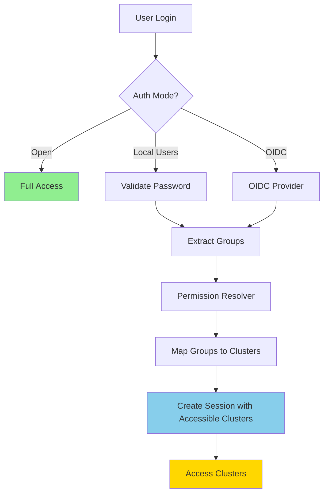
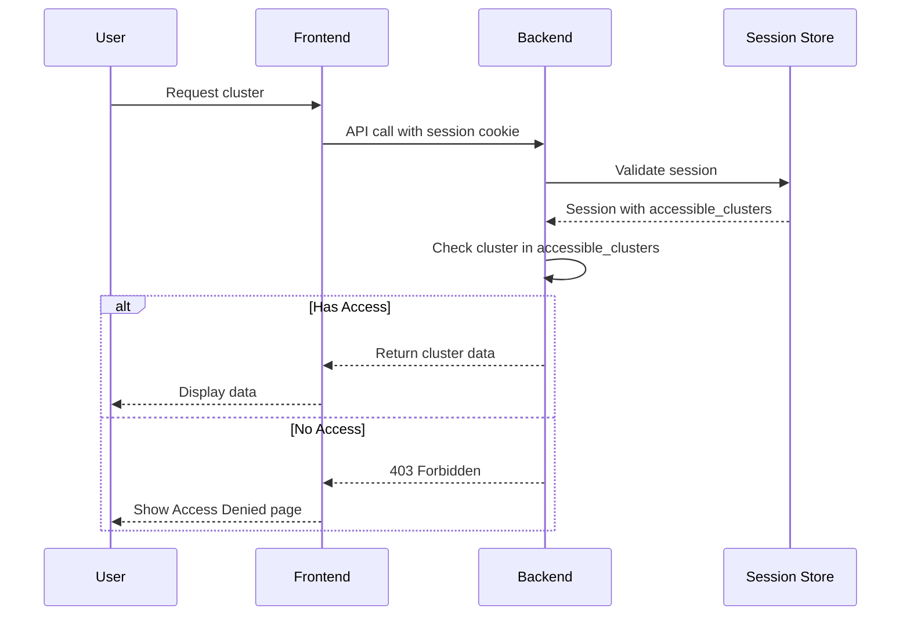

# Authentication & Authorization

Secan provides a comprehensive authentication and authorization system that supports multiple authentication methods and fine-grained access control to Elasticsearch clusters.

## Overview

Secan's security system consists of two main components:

1. **Authentication** - Verifies who you are (identity)
2. **Authorization** - Determines what clusters you can access (permissions)

The system supports three authentication modes and uses group-based access control to restrict cluster access.



## Authentication Modes

Secan supports three authentication modes configured via `auth.mode`:

### Open Mode

**Default mode.** No authentication required. All users have full access to all clusters.

```yaml
auth:
  mode: open
```

**Use cases:**
- Local development and testing
- Internal networks with existing network-level security
- Quick setup without authentication overhead

**Security considerations:**
- Anyone with network access can use Secan
- No audit trail of user actions
- Not recommended for production environments

### Local Users Mode

Authenticate users with locally managed credentials stored in the configuration file.

```yaml
auth:
  mode: local_users
  session_timeout_minutes: 60
  local_users:
    - username: "admin"
      password_hash: "$2b$12$..." # bcrypt hash
      groups:
        - "admin"
    - username: "viewer"
      password_hash: "$2b$12$..."
      groups:
        - "viewer"
```

**Features:**
- Passwords stored as bcrypt hashes
- Session-based authentication
- Configurable session timeout
- Group-based access control

**Use cases:**
- Small teams with simple user management
- Self-contained deployments without external auth services
- Organizations without existing identity providers

### OIDC Mode

Authenticate users through an OpenID Connect provider (Keycloak, Auth0, Okta, etc.).

```yaml
auth:
  mode: oidc
  session_timeout_minutes: 60
  oidc:
    discovery_url: "https://auth.example.com/.well-known/openid-configuration"
    client_id: "secan"
    client_secret: "secret123"
    redirect_uri: "https://secan.example.com/api/auth/oidc/redirect"
    groups_claim_key: "groups"
```

**Configuration fields:**
- `discovery_url` - OpenID Connect discovery endpoint URL
- `client_id` - OAuth2 client ID from your provider
- `client_secret` - OAuth2 client secret (use environment variables)
- `redirect_uri` - Callback URL for authentication response
- `groups_claim_key` - Claim name containing user groups (default: "groups")

**Use cases:**
- Enterprise deployments with centralized authentication
- Integration with existing identity providers
- Teams requiring Single Sign-On (SSO)
- Organizations with compliance and audit requirements

## Authorization System

### Group-Based Access Control

Secan uses group-based access control to determine which clusters a user can access. Groups are assigned to users and mapped to cluster permissions.

```mermaid
graph LR
    A[User] --> B[Groups]
    B --> C[Permission Mappings]
    C --> D[Accessible Clusters]
    
    B -->|"admin"| C
    B -->|"developer"| C
    
    C -->|"admin" → "*"| D
    C -->|"developer" → "dev-*"| D
    
    style A fill:#FFE4B5
    style B fill:#98FB98
    style C fill:#87CEFA
    style D fill:#DDA0DD
```

### Permission Mappings

Permission mappings define which groups can access which clusters. Configure these in the `auth.permissions` section:

```yaml
auth:
  permissions:
    - group: "admin"
      clusters:
        - "*"  # All clusters
    - group: "developer"
      clusters:
        - "dev-cluster-1"
        - "dev-cluster-2"
    - group: "viewer"
      clusters:
        - "prod-cluster-1"
        - "staging-cluster"
```

**Special patterns:**
- `"*"` - Wildcard for all clusters (full access)
- Cluster IDs must match exactly (no glob patterns currently)
- Users can belong to multiple groups (access is cumulative)

### Access Resolution

When a user authenticates, Secan:

1. Extracts groups from user configuration (local) or OIDC token
2. Looks up permission mappings for each group
3. Combines all accessible cluster IDs
4. Stores accessible clusters in session
5. Enforces access on each cluster request

**Example:**
```yaml
# User configuration
username: "alice"
groups:
  - "admin"
  - "developer"

# Permission mappings
permissions:
  - group: "admin"
    clusters: ["*"]
  - group: "developer"
    clusters: ["dev-1", "dev-2"]

# Result: Alice can access ALL clusters (admin wildcard)
```

## Session Management

### Session Lifecycle

1. **Login** - User authenticates, session created with accessible clusters
2. **Active Use** - Session renewed on each request
3. **Timeout** - Session expires after inactivity
4. **Logout** - Session explicitly invalidated

### Configuration

```yaml
auth:
  session_timeout_minutes: 60  # Default: 60 minutes
```

### Session Storage

- Sessions stored in memory by default
- Session token sent via secure HTTP-only cookie
- Session includes:
  - User ID and username
  - User groups
  - Accessible cluster IDs
  - Creation and expiration timestamps

## System Behavior

### Access Control Flow



### Error Responses

**403 Forbidden - Cluster Access Denied**
```json
{
  "error": "access_denied",
  "message": "Access denied to cluster: prod-cluster-1"
}
```

**Frontend behavior:**
- Redirects to `/access-denied/:clusterName` page
- Shows clear message about lack of access
- Provides link back to cluster list

### Empty Access State

When a user has no accessible clusters:
- Cluster list shows empty state (not an error)
- Message explains user has no cluster access
- Guidance to contact administrator
- User identity still visible in UI

## Configuration Examples

### Basic Multi-User Setup

```yaml
auth:
  mode: local_users
  session_timeout_minutes: 60
  local_users:
    - username: "admin"
      password_hash: "$2b$12$..."
      groups:
        - "admin"
    - username: "developer"
      password_hash: "$2b$12$..."
      groups:
        - "developer"
  
  permissions:
    - group: "admin"
      clusters:
        - "*"
    - group: "developer"
      clusters:
        - "dev-cluster"
```

### OIDC with Custom Groups Claim

```yaml
auth:
  mode: oidc
  session_timeout_minutes: 120
  oidc:
    discovery_url: "https://keycloak.example.com/realms/myrealm/.well-known/openid-configuration"
    client_id: "secan"
    client_secret: "${SECAN_OIDC_SECRET}"
    redirect_uri: "https://secan.example.com/api/auth/oidc/redirect"
    groups_claim_key: "departments"  # Custom claim name
  
  permissions:
    - group: "engineering"
      clusters:
        - "dev-cluster"
        - "staging-cluster"
    - group: "ops"
      clusters:
        - "*"
```

### Using Placeholders for Secrets

Store sensitive values like client secrets in environment variables and use placeholders in your config:

```yaml
auth:
  mode: oidc
  session_timeout_minutes: 120
  oidc:
    discovery_url: "https://auth.example.com/.well-known/openid-configuration"
    client_id: "secan"
    client_secret: "${AUTH_CLIENT_SECRET}"
    redirect_uri: "https://secan.example.com/api/auth/oidc/redirect"
    groups_claim_key: "groups"
```

Then set the environment variable:

```bash
export AUTH_CLIENT_SECRET="your-secret-here"
```

## Groups vs Roles Terminology

**Important:** Secan uses **groups** (not roles) for access control.

- **Groups** - Represent team/organizational membership (e.g., "admin", "developer", "ops")
- **Roles** - Legacy term, now called "groups" for clarity

If migrating from older configurations:
- Old `roles` field → New `groups` field
- Old `roles` in permission mappings → New `permissions` with `group` field

## Best Practices

### Security

1. **Use OIDC for production** - Centralized auth is easier to manage and audit
2. **Enable TLS** - Always use HTTPS in production
3. **Rotate secrets** - Update passwords and client secrets regularly
4. **Principle of least privilege** - Grant minimum necessary access
5. **Regular audits** - Review permission mappings periodically

### Configuration

1. **Use environment variables** for secrets
2. **Version control** configuration (except secrets)
3. **Document mappings** - Keep permission mappings clear and commented
4. **Test changes** - Verify access in staging before production

### Operations

1. **Monitor failed logins** - Watch for brute force attempts
2. **Session timeout** - Balance security with user experience
3. **Backup configs** - Keep secure backups of user configurations
4. **Plan for turnover** - Document process for removing users

## Troubleshooting

### Common Issues

**User can't access expected cluster:**
1. Verify user's groups in configuration/token
2. Check permission mappings for typos
3. Ensure cluster IDs match exactly
4. Check for wildcard ("*") conflicts

**OIDC authentication fails:**
1. Verify discovery URL is accessible
2. Check client_id and client_secret
3. Ensure redirect_uri matches exactly
4. Verify groups claim exists in token

**Session expires too quickly:**
1. Check `session_timeout_minutes` setting
2. Verify session cookie isn't being cleared
3. Check browser cookie settings

### Debug Mode

Enable debug logging for authentication:

```yaml
logging:
  level: debug
  # Or for auth-specific logging
  auth: debug
```

Check logs for:
- Authentication attempts
- Session creation/validation
- Permission resolution
- Access denied events
