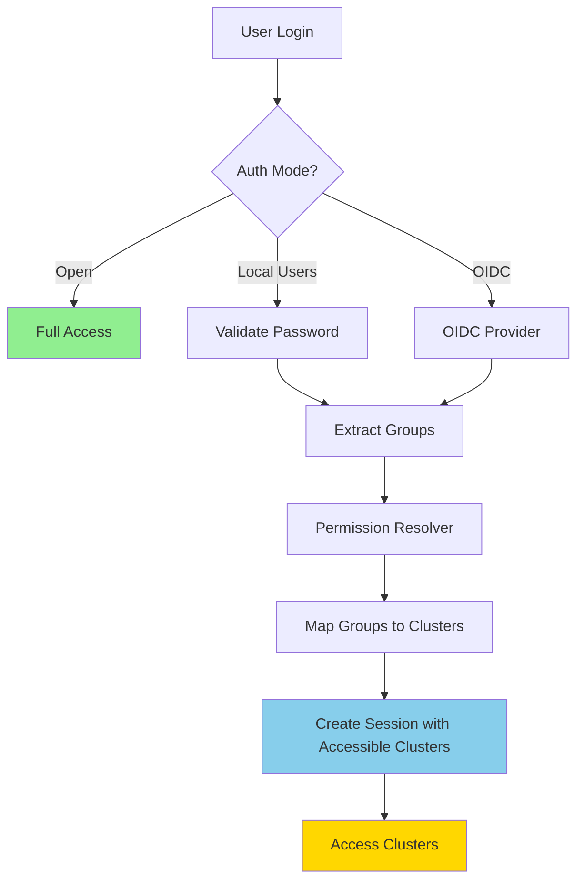
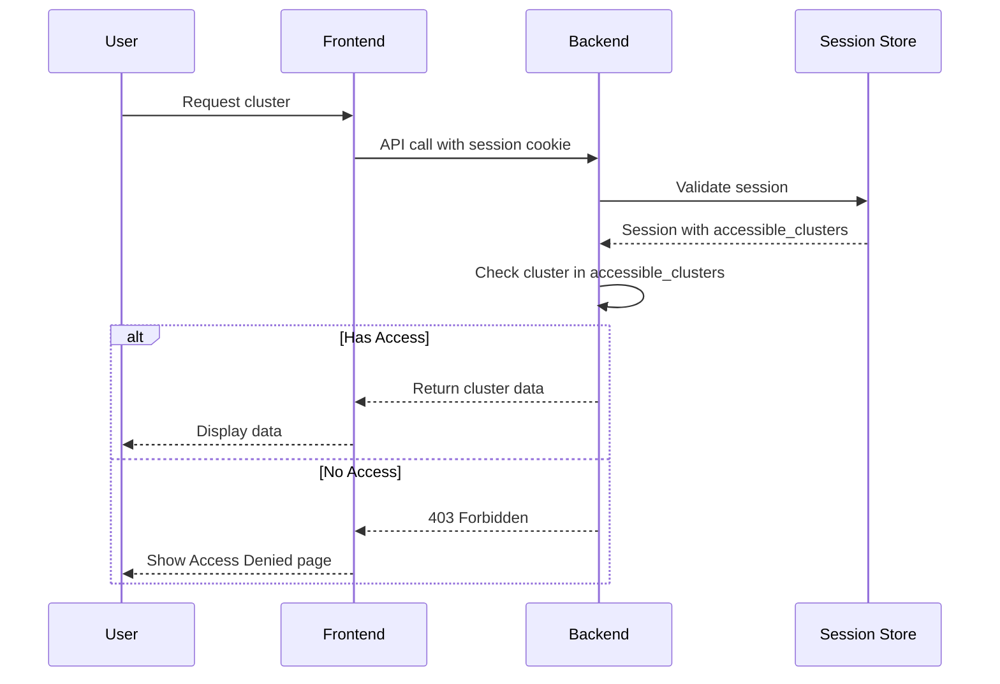

# Authentication & Authorization

Secan provides a comprehensive authentication and authorization system that supports multiple authentication methods and fine-grained access control to Elasticsearch clusters.

## Overview

Secan's security system consists of two main components:

1. **Authentication** - Verifies who you are (identity)
2. **Authorization** - Determines what clusters you can access (permissions)

The system supports three authentication modes and uses group-based access control to restrict cluster access.


```mermaid
graph TD
    A[User Login] --> B{Auth Mode?}
    B -->|Open| C[Full Access]
    B -->|Local Users| D[Validate Password]
    B -->|OIDC| E[OIDC Provider]
    
    D --> F[Extract Groups]
    E --> F
    
    F --> G[Permission Resolver]
    G --> H[Map Groups to Clusters]
    H --> I[Create Session with Accessible Clusters]
    I --> J[Access Clusters]
    
    style C fill:#90EE90
    style I fill:#87CEEB
    style J fill:#FFD700
```

## Authentication Modes

Secan supports four authentication modes configured via `auth.mode`:

### Open Mode

**Default mode.** No authentication required. All users have full access to all clusters.

```yaml
auth:
  mode: open
```

**Use cases:**
- Local development and testing
- Internal networks with existing network-level security
- Quick setup without authentication overhead

**Security considerations:**
- Anyone with network access can use Secan
- No audit trail of user actions
- Not recommended for production environments

### Local Users Mode

Authenticate users with locally managed credentials stored in the configuration file.

```yaml
auth:
  mode: local_users
  session_timeout_minutes: 60
  local_users:
    - username: "admin"
      password_hash: "$2b$12$..." # bcrypt hash
      groups:
        - "admin"
    - username: "viewer"
      password_hash: "$2b$12$..."
      groups:
        - "viewer"
```

**Features:**
- Passwords stored as bcrypt hashes
- Session-based authentication
- Configurable session timeout
- Group-based access control

**Use cases:**
- Small teams with simple user management
- Self-contained deployments without external auth services
- Organizations without existing identity providers

### OIDC Mode

Authenticate users through an OpenID Connect provider (Keycloak, Auth0, Okta, etc.).

```yaml
auth:
  mode: oidc
  session_timeout_minutes: 60
  oidc:
    discovery_url: "https://auth.example.com/.well-known/openid-configuration"
    client_id: "secan"
    client_secret: "secret123"
    redirect_uri: "https://secan.example.com/api/auth/oidc/callback"
    groups_claim_key: "groups"
```

**Configuration fields:**
- `discovery_url` - OpenID Connect discovery endpoint URL
- `client_id` - OAuth2 client ID from your provider
- `client_secret` - OAuth2 client secret (use environment variables)
- `redirect_uri` - Callback URL for authentication response
- `groups_claim_key` - Claim name containing user groups (default: "groups")

**OIDC Login Flow:**

1. User navigates to Secan login page
2. Secan detects OIDC is enabled
3. Login page shows "Redirecting to OIDC provider..." with loading indicator
4. User automatically redirected to OIDC provider
5. User authenticates with OIDC provider
6. OIDC provider redirects back to Secan with authorization code
7. Secan exchanges code for tokens and creates session
8. Session token set as HTTP-only cookie
9. User redirected to dashboard

**Manual Fallback:**
If automatic redirect fails, the login page provides a "Go to OIDC Provider" button for manual navigation.

**Use cases:**
- Enterprise deployments with centralized authentication
- Integration with existing identity providers
- Teams requiring Single Sign-On (SSO)
- Organizations with compliance and audit requirements

### LDAP Mode

Authenticate users through an LDAP directory server (Active Directory, OpenLDAP, FreeIPA, etc.).

```yaml
auth:
  mode: ldap
  session_timeout_minutes: 60
  ldap:
    server_url: "ldap://ldap.example.com:389"
    bind_dn: "cn=service-account,dc=example,dc=com"
    bind_password: "service-account-password"
    search_base: "ou=users,dc=example,dc=com"
    search_filter: "(uid={username})"
    group_search_base: "ou=groups,dc=example,dc=com"
    group_search_filter: "(member={user_dn})"
    required_groups:
      - "app-users"
    tls_mode: starttls
```

**Configuration fields:**
- `server_url` - LDAP server URL (ldap:// or ldaps://)
- `bind_dn` - Service account Distinguished Name for searching
- `bind_password` - Service account password (use environment variables)
- `search_base` - Base DN where user searches begin
- `search_filter` - LDAP filter for finding users (e.g., "(uid={username})")
- `group_search_base` - Base DN for group searches (optional)
- `group_search_filter` - LDAP filter for finding groups (optional)
- `required_groups` - Groups required for access (empty = allow all)
- `tls_mode` - TLS mode: "none", "starttls", or "ldaps"

**LDAP Login Flow:**

1. User enters username and password on login page
2. Secan binds to LDAP server with service account
3. Secan searches for user in directory
4. Secan authenticates user by binding with their credentials
5. Secan queries user's group memberships
6. Secan validates user is in required groups (if configured)
7. Session created with user information and accessible clusters
8. User redirected to dashboard

**Security features:**
- TLS/StartTLS support for encrypted connections
- LDAP injection prevention through input sanitization
- Generic error messages to prevent information disclosure
- Rate limiting integration to prevent brute force attacks
- Service account with minimal read-only permissions

**Use cases:**
- Organizations with existing LDAP infrastructure
- Active Directory environments
- OpenLDAP or FreeIPA deployments
- Enterprises requiring centralized user management
- Teams needing group-based access control

**Example configurations:**
See `config/examples/` directory for complete examples:
- `ldap-openldap.yaml` - OpenLDAP configuration
- `ldap-active-directory.yaml` - Active Directory configuration
- `ldap-freeipa.yaml` - FreeIPA configuration

## Authorization System

### Group-Based Access Control

Secan uses group-based access control to determine which clusters a user can access. Groups are assigned to users and mapped to cluster permissions.

```mermaid
graph LR
    A[User] --> B[Groups]
    B --> C[Permission Mappings]
    C --> D[Accessible Clusters]
    
    B -->|"admin"| C
    B -->|"developer"| C
    
    C -->|"admin" → "*"| D
    C -->|"developer" → "dev-*"| D
    
    style A fill:#FFE4B5
    style B fill:#98FB98
    style C fill:#87CEFA
    style D fill:#DDA0DD
```

### Permission Mappings

Permission mappings define which groups can access which clusters. Configure these in the `auth.permissions` section:

```yaml
auth:
  permissions:
    - group: "admin"
      clusters:
        - "*"  # All clusters
    - group: "developer"
      clusters:
        - "dev-cluster-1"
        - "dev-cluster-2"
    - group: "viewer"
      clusters:
        - "prod-cluster-1"
        - "staging-cluster"
```

**Special patterns:**
- `"*"` - Wildcard for all clusters (full access)
- Cluster IDs must match exactly (no glob patterns currently)
- Users can belong to multiple groups (access is cumulative)

### Access Resolution

When a user authenticates, Secan:

1. Extracts groups from user configuration (local) or OIDC token
2. Looks up permission mappings for each group
3. Combines all accessible cluster IDs
4. Stores accessible clusters in session
5. Enforces access on each cluster request

**Example:**
```yaml
# User configuration
username: "alice"
groups:
  - "admin"
  - "developer"

# Permission mappings
permissions:
  - group: "admin"
    clusters: ["*"]
  - group: "developer"
    clusters: ["dev-1", "dev-2"]

# Result: Alice can access ALL clusters (admin wildcard)
```

## Session Management

### Session Lifecycle

1. **Login** - User authenticates, session created with accessible clusters
2. **Active Use** - Session renewed on each request
3. **Timeout** - Session expires after inactivity
4. **Logout** - Session explicitly invalidated

### Configuration

```yaml
auth:
  session_timeout_minutes: 60  # Default: 60 minutes
```

### Session Storage

- Sessions stored in memory by default
- Session token sent via secure HTTP-only cookie
- Session includes:
  - User ID and username
  - User groups
  - Accessible cluster IDs
  - Creation and expiration timestamps

## System Behavior

### Access Control Flow


```mermaid
sequenceDiagram
    participant U as User
    participant F as Frontend
    participant B as Backend
    participant S as Session Store
    
    U->>F: Request cluster
    F->>B: API call with session cookie
    B->>S: Validate session
    S-->>B: Session with accessible_clusters
    B->>B: Check cluster in accessible_clusters
    alt Has Access
        B-->>F: Return cluster data
        F-->>U: Display data
    else No Access
        B-->>F: 403 Forbidden
        F-->>U: Show Access Denied page
    end
```

### Error Responses

**403 Forbidden - Cluster Access Denied**
```json
{
  "error": "access_denied",
  "message": "Access denied to cluster: prod-cluster-1"
}
```

**Frontend behavior:**
- Redirects to `/access-denied/:clusterName` page
- Shows clear message about lack of access
- Provides link back to cluster list

### Empty Access State

When a user has no accessible clusters:
- Cluster list shows empty state (not an error)
- Message explains user has no cluster access
- Guidance to contact administrator
- User identity still visible in UI

## LDAP Configuration Guide

### Overview

LDAP authentication allows Secan to authenticate users against enterprise directory services. This section provides detailed configuration guidance for common LDAP servers.

### Basic Configuration

Minimal LDAP configuration requires:

```yaml
auth:
  mode: ldap
  ldap:
    server_url: "ldap://ldap.example.com:389"
    bind_dn: "cn=service-account,dc=example,dc=com"
    bind_password: "service-account-password"
    search_base: "ou=users,dc=example,dc=com"
    search_filter: "(uid={username})"
```

### Configuration Parameters

#### Required Parameters

| Parameter | Description | Example |
|-----------|-------------|---------|
| `server_url` | LDAP server URL | `ldap://ldap.example.com:389` |
| `bind_dn` | Service account DN | `cn=service,dc=example,dc=com` |
| `bind_password` | Service account password | `password123` |
| `search_base` | User search base DN | `ou=users,dc=example,dc=com` |
| `search_filter` | User search filter | `(uid={username})` |

#### Optional Parameters

| Parameter | Description | Default | Example |
|-----------|-------------|---------|---------|
| `user_dn_pattern` | Direct bind DN pattern | None | `uid={username},ou=users,dc=example,dc=com` |
| `group_search_base` | Group search base DN | None | `ou=groups,dc=example,dc=com` |
| `group_search_filter` | Group search filter | None | `(member={user_dn})` |
| `group_member_attribute` | Group member attribute | None | `member` |
| `user_group_attribute` | User group attribute | None | `memberOf` |
| `required_groups` | Required groups for access | `[]` | `["app-users"]` |
| `connection_timeout_seconds` | Connection timeout | `10` | `30` |
| `tls_mode` | TLS mode | `none` | `starttls`, `ldaps` |
| `tls_skip_verify` | Skip TLS verification | `false` | `true` (testing only) |
| `username_attribute` | Username attribute | `uid` | `sAMAccountName` |
| `email_attribute` | Email attribute | `mail` | `mail` |
| `display_name_attribute` | Display name attribute | `cn` | `displayName` |

### TLS Configuration

#### TLS Modes

**none** (default): Unencrypted LDAP connection
- **Use only for development/testing**
- Port: 389
- Example: `server_url: "ldap://ldap.example.com:389"`

**starttls**: Upgrade connection to TLS after connecting
- **Recommended for production**
- Port: 389
- Example: `server_url: "ldap://ldap.example.com:389"` with `tls_mode: starttls`

**ldaps**: TLS from the start
- **Alternative for production**
- Port: 636
- Example: `server_url: "ldaps://ldap.example.com:636"` with `tls_mode: ldaps`

#### Certificate Verification

```yaml
ldap:
  tls_mode: starttls
  tls_skip_verify: false  # Always false in production
```

**Production**: Always set `tls_skip_verify: false` (default)
**Testing**: Can set `tls_skip_verify: true` to skip certificate verification
**Best practice**: Install your LDAP server's CA certificate on the application server

### Group Mapping

#### Direct Group Membership Query

Search for groups where the user is a member:

```yaml
ldap:
  group_search_base: "ou=groups,dc=example,dc=com"
  group_search_filter: "(member={user_dn})"
  group_member_attribute: "member"
```

#### Reverse Group Membership Query

Extract groups from user's attributes:

```yaml
ldap:
  user_group_attribute: "memberOf"
```

#### Required Groups

Restrict access to users in specific groups:

```yaml
ldap:
  required_groups:
    - "app-users"
    - "app-admins"
```

- Users must be a member of **at least one** required group
- Leave empty (`[]`) to allow all authenticated users
- Use group CN (common name), not full DN

### Server-Specific Configuration

#### OpenLDAP

```yaml
auth:
  mode: ldap
  ldap:
    server_url: "ldap://ldap.example.com:389"
    bind_dn: "cn=service-account,dc=example,dc=com"
    bind_password: "service-password"
    search_base: "ou=users,dc=example,dc=com"
    search_filter: "(uid={username})"
    group_search_base: "ou=groups,dc=example,dc=com"
    group_search_filter: "(member={user_dn})"
    group_member_attribute: "member"
    tls_mode: starttls
    username_attribute: "uid"
    email_attribute: "mail"
    display_name_attribute: "cn"
```

**Common OpenLDAP attributes:**
- User object class: `inetOrgPerson`, `organizationalPerson`
- Username attribute: `uid`
- Group object class: `groupOfNames`, `posixGroup`
- Group member attribute: `member`, `memberUid`

#### Active Directory

```yaml
auth:
  mode: ldap
  ldap:
    server_url: "ldap://dc1.corp.example.com:389"
    bind_dn: "CN=Service Account,CN=Users,DC=corp,DC=example,DC=com"
    bind_password: "service-password"
    search_base: "CN=Users,DC=corp,DC=example,DC=com"
    search_filter: "(sAMAccountName={username})"
    group_search_base: "DC=corp,DC=example,DC=com"
    group_search_filter: "(member:1.2.840.113556.1.4.1941:={user_dn})"
    user_group_attribute: "memberOf"
    tls_mode: starttls
    username_attribute: "sAMAccountName"
    email_attribute: "mail"
    display_name_attribute: "displayName"
```

**Common Active Directory attributes:**
- User object class: `user`
- Username attribute: `sAMAccountName`, `userPrincipalName`
- Group object class: `group`
- Group member attribute: `member`
- User group attribute: `memberOf`

**Active Directory specific:**
- Nested groups: Use `LDAP_MATCHING_RULE_IN_CHAIN` (1.2.840.113556.1.4.1941)
- Multiple bind DN formats supported (DN, UPN, down-level)

#### FreeIPA

```yaml
auth:
  mode: ldap
  ldap:
    server_url: "ldap://ipa.example.com:389"
    bind_dn: "uid=service-account,cn=users,cn=accounts,dc=example,dc=com"
    bind_password: "service-password"
    search_base: "cn=users,cn=accounts,dc=example,dc=com"
    search_filter: "(uid={username})"
    group_search_base: "cn=groups,cn=accounts,dc=example,dc=com"
    group_search_filter: "(member={user_dn})"
    user_group_attribute: "memberOf"
    tls_mode: starttls
    username_attribute: "uid"
    email_attribute: "mail"
    display_name_attribute: "cn"
```

**Common FreeIPA attributes:**
- User object class: `inetOrgPerson`, `posixAccount`, `krbPrincipalAux`
- Username attribute: `uid`
- Group object class: `groupOfNames`, `posixGroup`
- Group member attribute: `member`
- User group attribute: `memberOf`

### Security Best Practices

1. **Always use TLS in production**
   - Set `tls_mode: starttls` or use `ldaps://` URL
   - Never set `tls_skip_verify: true` in production

2. **Use a dedicated service account**
   - Create a service account with minimal permissions
   - Grant read-only access to users and groups
   - Do not use a user account or admin account

3. **Store passwords securely**
   - Use environment variables instead of config files
   - Example: `bind_password: "${LDAP_BIND_PASSWORD}"`
   - Never commit passwords to version control

4. **Enable required groups**
   - Restrict access to specific groups
   - Use the principle of least privilege
   - Regularly review group memberships

5. **Monitor authentication logs**
   - Set logging level to INFO or DEBUG
   - Monitor for failed authentication attempts
   - Alert on suspicious activity

### Troubleshooting

#### Connection Issues

**Problem:** Cannot connect to LDAP server

**Solutions:**
- Verify server URL is correct
- Check network connectivity: `telnet ldap.example.com 389`
- Verify firewall rules allow LDAP traffic
- Check LDAP server is running and accessible

#### Authentication Failures

**Problem:** Users cannot authenticate

**Solutions:**
- Verify service account credentials are correct
- Test service account bind: `ldapsearch -x -D "bind_dn" -W -b "search_base"`
- Verify user search filter is correct
- Check user exists in LDAP: `ldapsearch -x -D "bind_dn" -W -b "search_base" "(uid=username)"`
- Verify user password is correct
- Check user account is not disabled or locked

#### Group Membership Issues

**Problem:** Users cannot access application (required groups)

**Solutions:**
- Verify group search configuration is correct
- Test group search: `ldapsearch -x -D "bind_dn" -W -b "group_search_base" "(member=user_dn)"`
- Check user is a member of required groups
- Verify group names match exactly (case-sensitive)
- Check group_member_attribute is correct for your LDAP schema

#### TLS Issues

**Problem:** TLS connection fails

**Solutions:**
- Verify TLS mode is correct (starttls vs ldaps)
- Check certificate is valid and not expired
- Install LDAP server's CA certificate on application server
- Temporarily set `tls_skip_verify: true` to test (development only)
- Check LDAP server TLS configuration

### Testing LDAP Configuration

#### Using ldapsearch Command

Test service account bind:
```bash
ldapsearch -x -H "ldap://ldap.example.com" \
  -D "cn=service-account,dc=example,dc=com" \
  -W -b "dc=example,dc=com" \
  "(objectClass=*)"
```

Test user search:
```bash
ldapsearch -x -H "ldap://ldap.example.com" \
  -D "cn=service-account,dc=example,dc=com" \
  -W -b "ou=users,dc=example,dc=com" \
  "(uid=testuser)"
```

Test group search:
```bash
ldapsearch -x -H "ldap://ldap.example.com" \
  -D "cn=service-account,dc=example,dc=com" \
  -W -b "ou=groups,dc=example,dc=com" \
  "(member=uid=testuser,ou=users,dc=example,dc=com)"
```

#### Using Application Logs

Enable DEBUG logging to see LDAP queries:

```yaml
logging:
  level: DEBUG
  component_levels:
    ldap: DEBUG
```

Check logs for:
- LDAP connection attempts
- Service account bind results
- User search queries and results
- User bind attempts
- Group membership queries
- Authentication success/failure

### Environment Variables

You can use environment variables for sensitive configuration:

```yaml
ldap:
  server_url: "${LDAP_SERVER_URL}"
  bind_dn: "${LDAP_BIND_DN}"
  bind_password: "${LDAP_BIND_PASSWORD}"
```

Set environment variables:
```bash
export LDAP_SERVER_URL="ldap://ldap.example.com:389"
export LDAP_BIND_DN="cn=service-account,dc=example,dc=com"
export LDAP_BIND_PASSWORD="service-account-password"
```

## Configuration Examples

### Basic Multi-User Setup

```yaml
auth:
  mode: local_users
  session_timeout_minutes: 60
  local_users:
    - username: "admin"
      password_hash: "$2b$12$..."
      groups:
        - "admin"
    - username: "developer"
      password_hash: "$2b$12$..."
      groups:
        - "developer"
  
  permissions:
    - group: "admin"
      clusters:
        - "*"
    - group: "developer"
      clusters:
        - "dev-cluster"
```

### OIDC with Custom Groups Claim

```yaml
auth:
  mode: oidc
  session_timeout_minutes: 120
  oidc:
    discovery_url: "https://keycloak.example.com/realms/myrealm/.well-known/openid-configuration"
    client_id: "secan"
    client_secret: "${SECAN_OIDC_SECRET}"
    redirect_uri: "https://secan.example.com/api/auth/oidc/redirect"
    groups_claim_key: "departments"  # Custom claim name
  
  permissions:
    - group: "engineering"
      clusters:
        - "dev-cluster"
        - "staging-cluster"
    - group: "ops"
      clusters:
        - "*"
```

### Using Placeholders for Secrets

Store sensitive values like client secrets in environment variables and use placeholders in your config:

```yaml
auth:
  mode: oidc
  session_timeout_minutes: 120
  oidc:
    discovery_url: "https://auth.example.com/.well-known/openid-configuration"
    client_id: "secan"
    client_secret: "${AUTH_CLIENT_SECRET}"
    redirect_uri: "https://secan.example.com/api/auth/oidc/redirect"
    groups_claim_key: "groups"
```

Then set the environment variable:

```bash
export AUTH_CLIENT_SECRET="your-secret-here"
```

### LDAP with Group-Based Access

```yaml
auth:
  mode: ldap
  session_timeout_minutes: 60
  ldap:
    server_url: "ldap://ldap.example.com:389"
    bind_dn: "cn=service-account,dc=example,dc=com"
    bind_password: "${LDAP_BIND_PASSWORD}"
    search_base: "ou=users,dc=example,dc=com"
    search_filter: "(uid={username})"
    group_search_base: "ou=groups,dc=example,dc=com"
    group_search_filter: "(member={user_dn})"
    required_groups:
      - "elasticsearch-users"
      - "elasticsearch-admins"
    tls_mode: starttls
    username_attribute: "uid"
    email_attribute: "mail"
    display_name_attribute: "cn"
  
  permissions:
    - group: "elasticsearch-admins"
      clusters:
        - "*"
    - group: "elasticsearch-users"
      clusters:
        - "dev-cluster"
        - "staging-cluster"
```

### LDAP with Active Directory

```yaml
auth:
  mode: ldap
  session_timeout_minutes: 60
  ldap:
    server_url: "ldap://dc1.corp.example.com:389"
    bind_dn: "CN=Service Account,CN=Users,DC=corp,DC=example,DC=com"
    bind_password: "${LDAP_BIND_PASSWORD}"
    search_base: "CN=Users,DC=corp,DC=example,DC=com"
    search_filter: "(sAMAccountName={username})"
    group_search_base: "DC=corp,DC=example,DC=com"
    group_search_filter: "(member:1.2.840.113556.1.4.1941:={user_dn})"
    user_group_attribute: "memberOf"
    required_groups:
      - "Elasticsearch-Users"
    tls_mode: starttls
    username_attribute: "sAMAccountName"
    email_attribute: "mail"
    display_name_attribute: "displayName"
  
  permissions:
    - group: "Elasticsearch-Admins"
      clusters:
        - "*"
    - group: "Elasticsearch-Users"
      clusters:
        - "prod-cluster"
```

## Groups vs Roles Terminology

**Important:** Secan uses **groups** (not roles) for access control.

- **Groups** - Represent team/organizational membership (e.g., "admin", "developer", "ops")
- **Roles** - Legacy term, now called "groups" for clarity

If migrating from older configurations:
- Old `roles` field → New `groups` field
- Old `roles` in permission mappings → New `permissions` with `group` field

## Best Practices

### Security

1. **Use OIDC for production** - Centralized auth is easier to manage and audit
2. **Enable TLS** - Always use HTTPS in production
3. **Rotate secrets** - Update passwords and client secrets regularly
4. **Principle of least privilege** - Grant minimum necessary access
5. **Regular audits** - Review permission mappings periodically

### Configuration

1. **Use environment variables** for secrets
2. **Version control** configuration (except secrets)
3. **Document mappings** - Keep permission mappings clear and commented
4. **Test changes** - Verify access in staging before production

### Operations

1. **Monitor failed logins** - Watch for brute force attempts
2. **Session timeout** - Balance security with user experience
3. **Backup configs** - Keep secure backups of user configurations
4. **Plan for turnover** - Document process for removing users

## Troubleshooting

### Common Issues

**User can't access expected cluster:**
1. Verify user's groups in configuration/token
2. Check permission mappings for typos
3. Ensure cluster IDs match exactly
4. Check for wildcard ("*") conflicts

**OIDC authentication fails:**
1. Verify discovery URL is accessible
2. Check client_id and client_secret
3. Ensure redirect_uri matches exactly
4. Verify groups claim exists in token

**Session expires too quickly:**
1. Check `session_timeout_minutes` setting
2. Verify session cookie isn't being cleared
3. Check browser cookie settings

### Debug Mode

Enable debug logging for authentication:

```yaml
logging:
  level: debug
  # Or for auth-specific logging
  auth: debug
```

Check logs for:
- Authentication attempts
- Session creation/validation
- Permission resolution
- Access denied events

**LDAP authentication fails:**
1. Verify LDAP server URL is correct and accessible
2. Check service account bind_dn and bind_password
3. Test service account bind with ldapsearch
4. Verify user search filter matches your LDAP schema
5. Check user exists in LDAP directory
6. Ensure user password is correct
7. Verify TLS configuration if using TLS

**LDAP connection timeout:**
1. Check network connectivity to LDAP server
2. Increase connection_timeout_seconds
3. Verify LDAP server is not overloaded
4. Check firewall rules allow LDAP traffic

**LDAP group membership issues:**
1. Verify group search configuration is correct
2. Test group search with ldapsearch
3. Check user is member of required groups
4. Verify group names match exactly (case-sensitive)
5. Ensure group_member_attribute matches your schema

### LDAP Testing Tools

Use `ldapsearch` to test LDAP connectivity and queries:

```bash
# Test service account bind
ldapsearch -x -H "ldap://ldap.example.com" \
  -D "cn=service-account,dc=example,dc=com" \
  -W -b "dc=example,dc=com" "(objectClass=*)"

# Test user search
ldapsearch -x -H "ldap://ldap.example.com" \
  -D "cn=service-account,dc=example,dc=com" \
  -W -b "ou=users,dc=example,dc=com" "(uid=testuser)"

# Test group search
ldapsearch -x -H "ldap://ldap.example.com" \
  -D "cn=service-account,dc=example,dc=com" \
  -W -b "ou=groups,dc=example,dc=com" \
  "(member=uid=testuser,ou=users,dc=example,dc=com)"
```

## Additional Resources

### Example Configurations

Complete LDAP configuration examples are available in the `config/examples/` directory:

- **ldap-openldap.yaml** - OpenLDAP configuration with detailed comments
- **ldap-active-directory.yaml** - Active Directory configuration with AD-specific features
- **ldap-freeipa.yaml** - FreeIPA configuration with Kerberos integration notes
- **README.md** - Comprehensive guide to LDAP configuration parameters and troubleshooting

### LDAP Standards

- RFC 4510: LDAP Technical Specification Road Map
- RFC 4511: LDAP Protocol
- RFC 4515: LDAP Search Filters
- RFC 4516: LDAP URLs

### Security Resources

- OWASP LDAP Injection Prevention
- CWE-90: LDAP Injection
