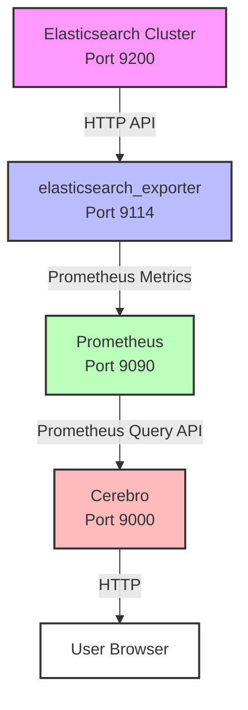

# Elasticsearch Exporter Integration

This guide provides comprehensive documentation for integrating [elasticsearch_exporter](https://github.com/prometheus-community/elasticsearch_exporter) with Cerebro to enable Prometheus-based metrics monitoring for your Elasticsearch clusters.

## Table of Contents

- [Overview](#overview)
- [Architecture](#architecture)
- [Installation and Setup](#installation-and-setup)
- [Cerebro Configuration](#cerebro-configuration)
- [Metrics Reference](#metrics-reference)
- [UI Display Locations](#ui-display-locations)
- [Troubleshooting](#troubleshooting)
- [Code Examples](#code-examples)
- [Reference Links](#reference-links)

## Overview

### What is elasticsearch_exporter?

The [elasticsearch_exporter](https://github.com/prometheus-community/elasticsearch_exporter) is a Prometheus exporter maintained by the prometheus-community that collects metrics from Elasticsearch clusters and exposes them in Prometheus format. It acts as a bridge between Elasticsearch and Prometheus, enabling time-series monitoring and alerting capabilities.

### Why Use Prometheus Metrics?

Using Prometheus metrics through elasticsearch_exporter provides several benefits over direct Elasticsearch API queries:

- **Historical Data**: Prometheus stores time-series data, allowing you to view historical trends and patterns
- **Reduced Load**: Offloads metrics collection from Elasticsearch, reducing query load on your cluster
- **Unified Monitoring**: Integrates with existing Prometheus infrastructure for centralized monitoring
- **Alerting**: Leverage Prometheus alerting capabilities for proactive monitoring
- **Performance**: Faster metrics retrieval through Prometheus's optimized time-series database
- **Scalability**: Better suited for monitoring multiple clusters at scale

### Component Relationship

The integration involves four main components working together:

1. **Elasticsearch Cluster**: The source of metrics data
2. **elasticsearch_exporter**: Queries Elasticsearch and exposes metrics in Prometheus format
3. **Prometheus**: Scrapes and stores metrics from the exporter
4. **Cerebro**: Queries Prometheus to display metrics in the UI

## Architecture

### Component Interaction Diagram



### Data Flow

1. **Elasticsearch → elasticsearch_exporter**: The exporter periodically queries Elasticsearch cluster stats and node stats APIs (typically every 15-30 seconds)
2. **elasticsearch_exporter → Prometheus**: Prometheus scrapes the exporter's `/metrics` endpoint at configured intervals
3. **Prometheus → Cerebro**: Cerebro queries Prometheus API to retrieve current and historical metrics data
4. **Cerebro → User**: Cerebro displays metrics in the nodes list view and cluster overview sections

### Ports and Protocols

| Component | Default Port | Protocol | Purpose |
|-----------|-------------|----------|---------|
| Elasticsearch | 9200 | HTTP/HTTPS | Cluster API |
| elasticsearch_exporter | 9114 | HTTP | Metrics endpoint |
| Prometheus | 9090 | HTTP | Query API |
| Cerebro | 9000 | HTTP | Web UI |

## Installation and Setup

### Installing elasticsearch_exporter

#### Docker Installation

The easiest way to run elasticsearch_exporter is using Docker:

```bash
docker run -d \
  --name elasticsearch-exporter \
  -p 9114:9114 \
  quay.io/prometheuscommunity/elasticsearch-exporter:latest \
  --es.uri=http://elasticsearch:9200 \
  --es.all \
  --es.indices \
  --es.cluster_settings
```

#### Binary Installation

Download the latest release from the [GitHub releases page](https://github.com/prometheus-community/elasticsearch_exporter/releases):

```bash
# Download and extract
wget https://github.com/prometheus-community/elasticsearch_exporter/releases/download/v1.6.0/elasticsearch_exporter-1.6.0.linux-amd64.tar.gz
tar xvfz elasticsearch_exporter-1.6.0.linux-amd64.tar.gz
cd elasticsearch_exporter-1.6.0.linux-amd64

# Run the exporter
./elasticsearch_exporter --es.uri=http://localhost:9200
```

#### Kubernetes Installation

Deploy using a Kubernetes manifest:

```yaml
apiVersion: apps/v1
kind: Deployment
metadata:
  name: elasticsearch-exporter
spec:
  replicas: 1
  selector:
    matchLabels:
      app: elasticsearch-exporter
  template:
    metadata:
      labels:
        app: elasticsearch-exporter
    spec:
      containers:
      - name: elasticsearch-exporter
        image: quay.io/prometheuscommunity/elasticsearch-exporter:latest
        args:
          - '--es.uri=http://elasticsearch:9200'
          - '--es.all'
          - '--es.indices'
          - '--es.cluster_settings'
        ports:
        - containerPort: 9114
          name: metrics
---
apiVersion: v1
kind: Service
metadata:
  name: elasticsearch-exporter
spec:
  selector:
    app: elasticsearch-exporter
  ports:
  - port: 9114
    targetPort: 9114
    name: metrics
```

### elasticsearch_exporter Configuration

The exporter supports various command-line flags for configuration:

```bash
# Basic configuration
--es.uri=http://elasticsearch:9200    # Elasticsearch endpoint
--es.timeout=30s                       # Request timeout
--es.all                               # Export all cluster metrics
--es.indices                           # Export index-level metrics
--es.cluster_settings                  # Export cluster settings

# Authentication (if required)
--es.username=elastic                  # Basic auth username
--es.password=changeme                 # Basic auth password

# TLS configuration (if using HTTPS)
--es.ca=/path/to/ca.crt               # CA certificate
--es.client-cert=/path/to/client.crt  # Client certificate
--es.client-key=/path/to/client.key   # Client key
```

### Prometheus Configuration

Configure Prometheus to scrape metrics from elasticsearch_exporter by adding a scrape configuration:

```yaml
# prometheus.yml
global:
  scrape_interval: 30s      # How often to scrape targets
  evaluation_interval: 30s  # How often to evaluate rules

scrape_configs:
  # Elasticsearch exporter scrape configuration
  - job_name: 'elasticsearch'
    static_configs:
      - targets: ['elasticsearch-exporter:9114']
        labels:
          cluster: 'production'
          environment: 'prod'
    scrape_interval: 30s
    scrape_timeout: 10s
```

For multiple Elasticsearch clusters, add multiple targets:

```yaml
scrape_configs:
  - job_name: 'elasticsearch'
    static_configs:
      - targets: ['es-prod-exporter:9114']
        labels:
          cluster: 'production'
          environment: 'prod'
      - targets: ['es-staging-exporter:9114']
        labels:
          cluster: 'staging'
          environment: 'staging'
```

### Verification Steps

After installation, verify each component is working:

1. **Verify elasticsearch_exporter is running**:
   ```bash
   curl http://localhost:9114/metrics
   ```
   You should see Prometheus-formatted metrics output.

2. **Verify Prometheus is scraping**:
   - Open Prometheus UI at `http://localhost:9090`
   - Navigate to Status → Targets
   - Verify the `elasticsearch` job shows as "UP"

3. **Test a sample query**:
   ```promql
   elasticsearch_cluster_health_status
   ```
   This should return health status metrics.

## Cerebro Configuration

### Basic Configuration

To enable Prometheus metrics in Cerebro, configure your cluster with the `metrics` section:

```yaml
# config.yaml
clusters:
  - name: "Production Cluster"
    host: "http://elasticsearch:9200"
    metrics:
      source: "prometheus"
      url: "http://prometheus:9090"
```

### Complete Configuration Example

Here's a complete working example with all options:

```yaml
# config.yaml
server:
  port: 9000
  host: "0.0.0.0"

clusters:
  - name: "Production Cluster"
    host: "http://elasticsearch-prod:9200"
    # Optional: Basic authentication for Elasticsearch
    auth:
      username: "elastic"
      password: "changeme"
    # Prometheus metrics configuration
    metrics:
      source: "prometheus"              # Use Prometheus as metrics source
      url: "http://prometheus:9090"     # Prometheus endpoint
      # Optional: Additional query parameters
      job_name: "elasticsearch"         # Filter by Prometheus job name
      labels:                           # Additional label filters
        cluster: "production"
        environment: "prod"
```

### Multi-Cluster Configuration

Configure multiple clusters, each with their own Prometheus metrics:

```yaml
clusters:
  - name: "Production Cluster"
    host: "http://elasticsearch-prod:9200"
    metrics:
      source: "prometheus"
      url: "http://prometheus:9090"
      labels:
        cluster: "production"
  
  - name: "Staging Cluster"
    host: "http://elasticsearch-staging:9200"
    metrics:
      source: "prometheus"
      url: "http://prometheus:9090"
      labels:
        cluster: "staging"
  
  - name: "Development Cluster"
    host: "http://elasticsearch-dev:9200"
    # This cluster uses internal Elasticsearch metrics
    metrics:
      source: "internal"
```

### Configuration Hierarchy

The metrics configuration belongs under each cluster definition:

```
clusters:
  └── [cluster]:
      ├── name
      ├── host
      ├── auth (optional)
      └── metrics:
          ├── source: "prometheus" | "internal"
          ├── url: <prometheus_endpoint>
          ├── job_name: <optional_job_filter>
          └── labels: <optional_label_filters>
```

### Authentication and Security

If your Prometheus instance requires authentication, configure it in the metrics section:

```yaml
clusters:
  - name: "Production Cluster"
    host: "http://elasticsearch:9200"
    metrics:
      source: "prometheus"
      url: "http://prometheus:9090"
      # Basic authentication for Prometheus
      auth:
        username: "prometheus_user"
        password: "secure_password"
      # Or use bearer token authentication
      bearer_token: "your_bearer_token_here"
```

## Metrics Reference

### Overview

Cerebro queries specific metrics from Prometheus to display cluster and node health information. All metrics are collected by elasticsearch_exporter and stored in Prometheus.

### CPU Metrics

| Metric Name | Description | Type | Labels |
|-------------|-------------|------|--------|
| `elasticsearch_os_cpu_percent` | CPU usage percentage | Gauge | cluster, node, name |

**Usage in Cerebro**: Displayed in the nodes list view to show current CPU utilization for each node.

### Load Average Metrics

| Metric Name | Description | Type | Labels |
|-------------|-------------|------|--------|
| `elasticsearch_os_load1` | 1-minute load average | Gauge | cluster, node, name |
| `elasticsearch_os_load5` | 5-minute load average | Gauge | cluster, node, name |
| `elasticsearch_os_load15` | 15-minute load average | Gauge | cluster, node, name |

**Usage in Cerebro**: Displayed in the nodes list view to show system load averages, helping identify nodes under stress.

### Memory Metrics

| Metric Name | Description | Type | Labels |
|-------------|-------------|------|--------|
| `elasticsearch_os_mem_free_bytes` | Free memory in bytes | Gauge | cluster, node, name |
| `elasticsearch_os_mem_used_bytes` | Used memory in bytes | Gauge | cluster, node, name |
| `elasticsearch_os_mem_actual_free_bytes` | Actual free memory in bytes (excluding buffers/cache) | Gauge | cluster, node, name |
| `elasticsearch_os_mem_actual_used_bytes` | Actual used memory in bytes (excluding buffers/cache) | Gauge | cluster, node, name |

**Usage in Cerebro**: Displayed in the nodes list view to show memory utilization for each node.

### Understanding Memory Metrics

The difference between regular and "actual" memory metrics:

- **Regular metrics** (`mem_free_bytes`, `mem_used_bytes`): Include buffers and cache memory
  - `mem_free_bytes`: Memory that is completely unused
  - `mem_used_bytes`: All memory in use, including buffers and cache

- **Actual metrics** (`mem_actual_free_bytes`, `mem_actual_used_bytes`): Exclude buffers and cache
  - `mem_actual_free_bytes`: Memory available for applications (includes reclaimable cache)
  - `mem_actual_used_bytes`: Memory actively used by applications (excludes cache)

**Recommendation**: Use "actual" metrics for a more accurate view of memory pressure, as buffers and cache can be reclaimed when needed.

### Metric Labels

All metrics include labels for filtering and identification:

- **cluster**: Cluster name or identifier
- **node**: Node ID (UUID)
- **name**: Human-readable node name

Example Prometheus query using labels:

```promql
elasticsearch_os_cpu_percent{cluster="production", name="es-node-1"}
```

## UI Display Locations

### Nodes List View

The primary location for metrics display is the **Nodes List View**, accessible from the cluster overview page.

**Displayed Metrics**:
- **CPU Usage**: Shows current CPU percentage for each node
- **Load Average**: Displays 1-minute, 5-minute, and 15-minute load averages
- **Memory Usage**: Shows memory utilization (used/total) for each node

**Per-Node Display**:
Each node in the list shows its individual metrics, allowing you to quickly identify:
- Nodes with high CPU usage
- Nodes experiencing high load
- Nodes with memory pressure

### Cluster Overview Section

The **Cluster Overview** section displays aggregated metrics:

**Aggregated Metrics**:
- **Average CPU Usage**: Mean CPU usage across all nodes
- **Average Load**: Mean load average across all nodes
- **Total Memory**: Sum of memory usage across all nodes
- **Memory Pressure**: Percentage of nodes with high memory usage

### Metrics Visualization

Metrics are displayed with visual indicators:

- **Color Coding**:
  - Green: Normal operation (< 70% utilization)
  - Yellow: Warning (70-90% utilization)
  - Red: Critical (> 90% utilization)

- **Trend Indicators**:
  - Up arrow: Metric increasing
  - Down arrow: Metric decreasing
  - Horizontal line: Metric stable

### Real-Time Updates

Metrics are refreshed automatically:
- **Default refresh interval**: 30 seconds
- **Configurable**: Can be adjusted in Cerebro settings
- **Manual refresh**: Click the refresh button to update immediately

## Troubleshooting

### Verifying elasticsearch_exporter

**Check if the exporter is running**:

```bash
# Test the metrics endpoint
curl http://localhost:9114/metrics

# Expected output: Prometheus-formatted metrics
# HELP elasticsearch_cluster_health_status ...
# TYPE elasticsearch_cluster_health_status gauge
# elasticsearch_cluster_health_status{cluster="my-cluster"} 1
```

**Check exporter logs**:

```bash
# Docker
docker logs elasticsearch-exporter

# Systemd
journalctl -u elasticsearch-exporter -f
```

**Common issues**:
- **Connection refused**: Exporter not running or wrong port
- **Empty metrics**: Exporter can't connect to Elasticsearch
- **Authentication errors**: Check Elasticsearch credentials

### Verifying Prometheus Scraping

**Check Prometheus targets**:

1. Open Prometheus UI: `http://localhost:9090`
2. Navigate to **Status → Targets**
3. Find the `elasticsearch` job
4. Verify status is **UP** (green)

**If status is DOWN**:
- Check network connectivity between Prometheus and exporter
- Verify the target address is correct
- Check firewall rules allow port 9114

**Test a manual query**:

```promql
# Query for cluster health
elasticsearch_cluster_health_status

# Query for node CPU
elasticsearch_os_cpu_percent
```

If queries return no data:
- Exporter may not be exposing metrics
- Scrape interval may not have occurred yet
- Check Prometheus logs for scrape errors

### Verifying Cerebro Connection

**Check Cerebro logs**:

```bash
# Look for Prometheus connection errors
grep -i prometheus /var/log/cerebro/application.log
```

**Test Prometheus endpoint manually**:

```bash
# Test connectivity from Cerebro host
curl http://prometheus:9090/api/v1/query?query=up

# Expected response:
# {"status":"success","data":{"resultType":"vector","result":[...]}}
```

**Common connection issues**:
- **DNS resolution**: Verify hostname resolves correctly
- **Network connectivity**: Check firewall rules
- **Authentication**: Verify credentials if Prometheus requires auth
- **URL format**: Ensure URL includes protocol (http:// or https://)

### Common Error Messages

**"Failed to connect to Prometheus"**:
- Verify `prometheus_url` in Cerebro configuration
- Check network connectivity: `curl http://prometheus:9090/api/v1/query?query=up`
- Verify Prometheus is running: `systemctl status prometheus`

**"No metrics data available"**:
- Verify elasticsearch_exporter is running and accessible
- Check Prometheus is scraping the exporter (Status → Targets)
- Verify metrics exist: Query `elasticsearch_os_cpu_percent` in Prometheus UI
- Check label filters in Cerebro configuration match Prometheus labels

**"Metrics query timeout"**:
- Prometheus may be overloaded or slow
- Increase timeout in Cerebro configuration
- Optimize Prometheus queries or add more resources

### Network and Firewall Requirements

**Required connectivity**:

```
Elasticsearch ← elasticsearch_exporter
    Port 9200 (HTTP/HTTPS)

elasticsearch_exporter ← Prometheus
    Port 9114 (HTTP)

Prometheus ← Cerebro
    Port 9090 (HTTP)

Cerebro ← User Browser
    Port 9000 (HTTP)
```

**Firewall rules**:
- Allow inbound on port 9114 for Prometheus to scrape exporter
- Allow inbound on port 9090 for Cerebro to query Prometheus
- Allow inbound on port 9000 for users to access Cerebro

### Debugging Missing Metrics

**Step 1: Verify exporter has metrics**:

```bash
curl http://localhost:9114/metrics | grep elasticsearch_os_cpu_percent
```

**Step 2: Verify Prometheus has scraped metrics**:

```promql
# In Prometheus UI
elasticsearch_os_cpu_percent
```

**Step 3: Verify labels match**:

```promql
# Check what labels exist
elasticsearch_os_cpu_percent{cluster="production"}
```

**Step 4: Check Cerebro configuration**:
- Ensure `job_name` matches Prometheus scrape job
- Ensure `labels` match the labels in Prometheus
- Verify `url` points to correct Prometheus instance

## Code Examples

### elasticsearch_exporter Configuration

**Docker Compose example**:

```yaml
version: '3.8'

services:
  elasticsearch-exporter:
    image: quay.io/prometheuscommunity/elasticsearch-exporter:latest
    container_name: elasticsearch-exporter
    command:
      - '--es.uri=http://elasticsearch:9200'
      - '--es.all'                    # Export all cluster metrics
      - '--es.indices'                # Export index-level metrics
      - '--es.cluster_settings'       # Export cluster settings
      - '--es.timeout=30s'            # Request timeout
    ports:
      - "9114:9114"
    networks:
      - monitoring
    restart: unless-stopped

networks:
  monitoring:
    driver: bridge
```

### Prometheus Scrape Configuration

**Complete prometheus.yml example**:

```yaml
# prometheus.yml
global:
  scrape_interval: 30s              # Default scrape interval
  evaluation_interval: 30s          # How often to evaluate rules
  external_labels:
    monitor: 'elasticsearch-monitor'

# Scrape configurations
scrape_configs:
  # Elasticsearch metrics via elasticsearch_exporter
  - job_name: 'elasticsearch'
    static_configs:
      - targets: ['elasticsearch-exporter:9114']
        labels:
          cluster: 'production'
          environment: 'prod'
          region: 'us-east-1'
    scrape_interval: 30s
    scrape_timeout: 10s
    metrics_path: '/metrics'

  # Multiple clusters example
  - job_name: 'elasticsearch-staging'
    static_configs:
      - targets: ['es-staging-exporter:9114']
        labels:
          cluster: 'staging'
          environment: 'staging'
```

### Cerebro Configuration with Prometheus

**Complete config.yaml example**:

```yaml
# config.yaml
server:
  port: 9000
  host: "0.0.0.0"

# Authentication (optional)
auth:
  type: basic
  settings:
    username: admin
    password: changeme

# Cluster configurations
clusters:
  - name: "Production Cluster"
    host: "http://elasticsearch-prod:9200"
    auth:
      username: "elastic"
      password: "prod_password"
    metrics:
      source: "prometheus"
      url: "http://prometheus:9090"
      job_name: "elasticsearch"
      labels:
        cluster: "production"
        environment: "prod"
  
  - name: "Staging Cluster"
    host: "http://elasticsearch-staging:9200"
    auth:
      username: "elastic"
      password: "staging_password"
    metrics:
      source: "prometheus"
      url: "http://prometheus:9090"
      job_name: "elasticsearch-staging"
      labels:
        cluster: "staging"
```

### Example Prometheus Queries

**Test metrics availability**:

```promql
# Check if metrics are being collected
up{job="elasticsearch"}

# Get current CPU usage for all nodes
elasticsearch_os_cpu_percent

# Get CPU usage for specific cluster
elasticsearch_os_cpu_percent{cluster="production"}

# Get memory usage percentage
(elasticsearch_os_mem_used_bytes / (elasticsearch_os_mem_used_bytes + elasticsearch_os_mem_free_bytes)) * 100

# Get nodes with high CPU (> 80%)
elasticsearch_os_cpu_percent > 80

# Average CPU across all nodes
avg(elasticsearch_os_cpu_percent)

# Maximum load average across cluster
max(elasticsearch_os_load1)
```

### Example curl Commands

**Test elasticsearch_exporter endpoint**:

```bash
# Get all metrics
curl http://localhost:9114/metrics

# Filter for specific metrics
curl http://localhost:9114/metrics | grep elasticsearch_os_cpu

# Check exporter health
curl http://localhost:9114/health
```

**Test Prometheus API**:

```bash
# Query current CPU usage
curl 'http://localhost:9090/api/v1/query?query=elasticsearch_os_cpu_percent'

# Query with label filter
curl 'http://localhost:9090/api/v1/query?query=elasticsearch_os_cpu_percent{cluster="production"}'

# Query time range (last hour)
curl 'http://localhost:9090/api/v1/query_range?query=elasticsearch_os_cpu_percent&start=2024-01-01T00:00:00Z&end=2024-01-01T01:00:00Z&step=60s'

# Check Prometheus health
curl http://localhost:9090/-/healthy
```

## Reference Links

### elasticsearch_exporter Resources

- **GitHub Repository**: [prometheus-community/elasticsearch_exporter](https://github.com/prometheus-community/elasticsearch_exporter)
- **Metrics Documentation**: [elasticsearch_exporter Metrics Reference](https://github.com/prometheus-community/elasticsearch_exporter#metrics)
- **Docker Images**: [Quay.io Repository](https://quay.io/repository/prometheuscommunity/elasticsearch-exporter)

### Prometheus Resources

- **Official Documentation**: [Prometheus Documentation](https://prometheus.io/docs/)
- **Query Language (PromQL)**: [PromQL Documentation](https://prometheus.io/docs/prometheus/latest/querying/basics/)
- **Configuration**: [Prometheus Configuration](https://prometheus.io/docs/prometheus/latest/configuration/configuration/)
- **Best Practices**: [Prometheus Best Practices](https://prometheus.io/docs/practices/)

### Elasticsearch Resources

- **Monitoring Guide**: [Elasticsearch Monitoring Documentation](https://www.elastic.co/guide/en/elasticsearch/reference/current/monitor-elasticsearch-cluster.html)
- **Cluster APIs**: [Elasticsearch Cluster APIs](https://www.elastic.co/guide/en/elasticsearch/reference/current/cluster.html)
- **Node Stats API**: [Elasticsearch Node Stats](https://www.elastic.co/guide/en/elasticsearch/reference/current/cluster-nodes-stats.html)

### Related Cerebro Documentation

- [Prometheus Metrics Integration](/features/prometheus-metrics) - Cerebro's Prometheus integration overview
- [Configuration Guide](/configuration/clusters) - Cluster configuration reference
- [Getting Started](/getting-started/installation) - Initial Cerebro setup

---

**Last Updated**: 2024
**Version**: 1.0
